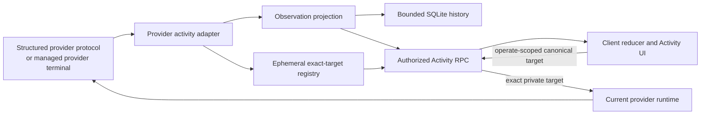

# Activity observation

Activity is the bounded observation and capability-gated targeted control view
of provider work shown in the **Subagents** and **Background Tasks** surfaces.
It is not globally read-only. Observation is separate from chat rendering and
terminal output: provider adapters emit only activity they can attribute, while
the server owns projection, persistence, authorization, stream recovery, and
targeted cancellation policy.

## Canonical model and invariants

The canonical wire model lives in
[`packages/contracts/src/activity.ts`](../../packages/contracts/src/activity.ts):

- A **scope** is either one provider chat thread or one managed provider terminal
  within a thread. Its current generation has a `scopeId`, provider identity,
  capability set, section health, observation state, and revision.
- An **actor** is a provider-attributed agent. It may reference a parent actor in
  the same scope.
- A **work item** is a provider-attributed background unit. It may reference its
  owning actor in the same scope.
- An **entry** is immutable detail attributed to an actor or work item:
  commentary, tool, command, result, error, state, or completion.

Parent and owner references must exist in the same scope, actor cycles are
rejected, and the provider may not emit records for a capability it did not
negotiate. Lifecycle states are `starting`, `running`, `waiting`, `unknown`,
`completed`, `failed`, `cancelled`, and `interrupted`. The last four are
terminal and require `terminalAt`; non-terminal records must not have it.

Terminal-state monotonicity currently differs by layer:

- The Codex tracker can authoritatively reopen a terminal actor from an
  object-form `Active` status or descendant snapshot whose provider timestamp is
  equal to or newer than the terminal update. It rejects an older `Active`
  signal.
- The repository rejects a terminal-to-non-terminal update only when its
  `updatedAt` is strictly older than the stored terminal update. Equal or newer
  updates are accepted.
- The client incremental reducer rejects every terminal-to-non-terminal summary
  update while still accepting the containing delta revision. That delta does
  not itself trigger recovery, so the client can show the terminal summary until
  a later authoritative snapshot replaces it.

Interruption on teardown is also topology-specific. The Claude terminal
observer explicitly marks tracked active records `interrupted` when its worker
ends. Codex and OpenCode observer workers do not directly close every unresolved
record. When the terminal manager tears down their generation, it cancels the
observer and then invalidates further publication. Separately, repository
startup cleanup interrupts unresolved records in persisted terminal scopes, and
replacing the current generation for the same terminal interrupts active
records in the prior scope.

## Protocol v2, revisions, control overlays, and resync

The server advertises `activityProtocolVersion: 2` in environment capabilities.
The client subscribes only when that exact feature is advertised; `null` means
the activity protocol is unavailable. This server/client negotiation is
independent of provider CLI probing. See
[`packages/contracts/src/environment.ts`](../../packages/contracts/src/environment.ts)
and [`packages/client-runtime/src/state/activity.ts`](../../packages/client-runtime/src/state/activity.ts).

Every subscription starts with a full `ActivitySnapshot` whose
`protocolVersion` is `2`. Effective observation changes are journaled as
contiguous deltas: `previousRevision` must equal the accepted observation
snapshot revision and `revision` is the next value. A large mutation batch may
be split into multiple deltas of at most 256 changes. Duplicate and net-no-op
provider events do not consume an observation revision.

The server replaces the stream with a fresh snapshot when the current scope
generation changes, a non-contiguous delta is observed, or the broadcast
receiver lags. The client discards old-scope and duplicate data. On a client-side
gap—including a change that cannot safely refill a capped page—it keeps the last
snapshot as stale and issues `activity.getSnapshot`; reconnecting creates a new
subscription and therefore a new authoritative snapshot. The server rules are
in [`apps/server/src/activity/rpc.rs`](../../apps/server/src/activity/rpc.rs);
the client rules are in
[`packages/client-runtime/src/state/activityReducer.ts`](../../packages/client-runtime/src/state/activityReducer.ts).

Targeted cancellation control is an independent ephemeral overlay. It has its
own contiguous revision stream and joins durable actor summaries only at the
snapshot, roster, and detail RPC boundaries. The overlay retains at most 200
actor and operation records, and a delta contains at most 256 changes. It is
never written to SQLite: after a server restart, historical actors remain
`unsupported` until the current runtime proves an exact native target. Provider
native target IDs never cross contracts, persistence, or diagnostic logs.
The current runtime registration owns its overlay generation. Lifecycle cleanup
publishes one bounded removal delta and leaves a bounded, target-free in-memory
tombstone for the stable public scope. The tombstone retains only monotonic
scope and actor-fence counters; it contains no provider target, operation, or
SQLite state. At most 200 inactive scope tombstones are retained. Within each
scope, at most 200 inactive actor counters are retained in addition to the
existing 200-active-actor bound. A scope or actor recreated after bounded
tombstone eviction is seeded above a registry-local high-water mark.
Replacement targets therefore cannot reuse pre-restart control revisions, an
already-open stream can consume the replacement delta or recover its
intentional revision gap, and a superseded registration still cannot remove
its replacement.

Observation and control revisions are independent monotonic domains. An
observation delta cannot fill a control gap, and a control delta cannot advance
observation history. The client recovers a gap in either domain from a fresh
server snapshot while retaining the other domain's last accepted data as
stale. Cancellation operations and their residual sets are therefore
reconnect-visible during one live server runtime, but they are intentionally
not restart-resumable. Every public operation revision comes from one checked,
registry-lifetime monotonic allocator rather than a scope- or operation-local
counter. Replacing or evicting a stable scope therefore cannot make an old
same-root retry fence valid for replacement work. Exhaustion fails closed
before provider I/O, and the allocator is runtime-only rather than SQLite
state.

`requested` control records and the UI label **Stopping** express
server-authoritative cancellation intent. They never manufacture a terminal
actor lifecycle. Only provider observation can move an actor to `cancelled`,
`interrupted`, `completed`, or `failed`; terminal observation also removes the
actor from any residual set. A partial operation may be retried only with its
current operation revision, and the server dispatches only active residuals and
late descendants already admitted beneath the original cancellation fence.
Every admitted operation also owns one non-polling ten-second finalizer. If
active residuals remain after that deadline—even when the exact target was
unavailable or provider delivery produced no terminal event—the generation- and
deadline-identity-fenced finalizer publishes `partial` without inventing a
provider lifecycle. Its private deadline identity remains stable when ordinary
provider reconciliation changes coverage, residuals, or the public operation
revision, so those updates do not postpone or disable the original ten-second
window. Absorption creates a new owner and deadline; retry starts a fresh full
window and identity. Terminal observation, replacement, and teardown remove the
operation and cancel its timer. Retry re-dispatches only targets whose prior
provider attempt failed plus newly targetable residuals; successfully delivered
targets remain fenced until provider lifecycle changes.

Claude targeted dispatch is provisional for a runtime generation only when its
bounded compatibility probe proves both required hook switches and the private
hook sink starts. An exact current `ClaudeTask` handle dispatches one correlated
`stop_task` control request; foreign target variants, root, foreground, and
unmapped actors fail before provider I/O, and root interrupt is never a
fallback. The response router is bounded and request-ID correlated. Only
Claude's exact unsupported-control protocol response authoritatively downgrades
the current generation. That transition clears every exact target and pending
operation, publishes targeted cancellation as unsupported, and cancels and
reaps in-flight dispatch work before returning. Later clicks in the same
generation fail before provider I/O; timeout, connection close, and generic
provider failures do not downgrade. A replaced or re-enabled runtime begins a
fresh provisional generation and must prove its targets again.

Structured provider batches install and reconcile their private control handles
after validating the native event identity and before projecting display
mutations. Any cancellation jobs discovered for late descendants start only
after control observation and display projection have released their locks. The
long-lived event pump reads the generation from the exact registration used for
each observation; it does not retain a launch-time generation across Activity
disablement and re-enablement. Late-job batches then cross a dedicated bounded
handoff whose capacity matches the provider supervisor queue, with at most 256
jobs per batch and no more active aggregate dispatch tasks than that configured
capacity. A full handoff backpressures the event pump and session or shutdown
cancellation abandons the pending send without orphaning provider I/O. Each
aggregate task has a stable session-owned ID. Its bounded priority completion
removes and awaits that exact handle, so capacity is released even when the
completion message is observed before Tokio marks the handle finished; stale
generation and duplicate completion IDs cannot remove current work.
Terminal display mutations reconcile the overlay even when the provider sends
no control updates, so completed descendants cannot remain as cancellation
residuals. If durable display projection rejects a batch after control
observation, the provider supervisor invalidates the exact observed generation,
suppresses every returned dispatch job, and cancels and reaps its queued or
in-flight targeted work before ordinary event handling continues. Restart,
disablement, session stop, and shutdown use the same cancel-before-cleanup
ownership rule, so no late dispatch task outlives its session.

Each snapshot negotiates provider capabilities separately: actors, attributed
entries, background work, history recovery (`full`, `bounded`, or `none`), and
terminal observation. Per-section health (`unsupported`, `live`, `stale`, or
`error`) can downgrade one surface without inventing records or hiding valid
data from another surface.

## Structured chat and provider-terminal topology

Structured chat activity comes from the provider runtime's typed protocol.
Provider-terminal observation is a separate opt-in path attached only to a
provider terminal launched by BiBCode. It requires explicit enablement before
that terminal is launched (or reopened), and it does not scrape arbitrary PTY
text.

## Independent activity controls

Each environment has separate Chat and AI Terminal activity gates. Chat defaults
on and owns `thread` scopes. AI Terminal defaults off and owns `terminal` scopes.
RPC admission, generation fencing, projection, cleanup, and observer lifecycle
are selected from the request scope; changing one gate does not transition the
other. Legacy `enableAgentActivity` values migrate only to Chat.

### Codex structured recovery

Codex structured recovery merges validated, bounded live and root/child-history
`subAgentActivity` hints with descendants returned by `thread/list`. Hinted
child IDs are direct-read under the current activity generation. A read response
is accepted only when its thread ID matches the requested child ID and its
parent is the root or an already verified actor. Bounded root, live, list, and
nested recovery repairs reconnect topology. An empty successful list neither
erases known actors nor suppresses hinted actors and their direct reads.
Malformed, out-of-scope, self-referential, or cyclic hints are ignored.

For structured chat only, a verified descendant becomes cancellable while the
tracker can prove one current active turn for that native child thread. Live
`turn/started` and bounded child-history reconciliation install the same private
thread/turn handle; matching completion removes it. Conflicting turns,
provisional hints, malformed or oversized IDs, terminal turns, and stale
completion for an older turn fail closed. Dispatch revalidates that exact
handle against the current tracker state and sends `turn/interrupt` with the
child `threadId` and `turnId`. Equality with the root provider thread is rejected
before provider I/O; the composer interrupt and background-terminal or process
cleanup paths are never used as targeted fallbacks.

Every accepted terminal actor transition revokes any retained native turn
target in the same tracker update; a later status-only actor reopen cannot
restore that completed handle. Reconciliation passes capture the live-control
revision at pass start, coalesce staged updates by canonical actor/work subject,
and discard a staged subject when newer live evidence has published. Child
recovery results for a superseded subject are fenced under the same activity
state lock before any tracker mutation, retained for a bounded fresh-pass
retry, and never allowed to erase a newer live turn or reinstall a completed
one. Root and nested history hints apply the same pre-mutation fence to every
validated receiver rather than only to the history owner; superseded receivers
remain queued for bounded recovery while unrelated hinted receivers in that
pass continue to reconcile normally.

Epoch and cancellation fences cancel recovery when activity is disabled, the
root is replaced, or the runtime disconnects or shuts down; late results and
old-root mutations are discarded. Mutations already accepted into the current
root's tracker are staged under the same activity lock until a current
reconciliation event is queued successfully, so a transient failure or
same-root reconnect cannot acknowledge recovery data that was never published.
The bounded staging buffer coalesces superseded actor and work-item states,
preserves each actor's retained state order, and dependency-orders every
retained parent state before the child or reparent state that needs it. Cyclic
or otherwise unsortable staged topology remains pending and produces a runtime
warning instead of an invalid activity event. Oversized valid recovery is
published as repository-sized chunks. Scope and section health lead the first
chunk; each chunk is removed from staging only after its event is queued, and
remaining chunks are queued immediately without waiting for provider history to
change.
The staged buffer is cleared when activity or the root is replaced. History
recovery is `full` only for
`supported`/`supported`, `none` only for `unsupported`/`unsupported`, and
`bounded` for every other list/read pair, including unknown or unproven pairs.
These recovery downgrades do not disable ordinary Codex chat.

Claude structured control normally joins native task identity only through the
complete same-session, same-generation Agent/Task `tool_use_id` chain: root
tool invocation, authenticated asynchronous PostToolUse `agentId`, an exact
`task_started` `task_id` whose optional `task_type` is absent, `local_agent`, or
`remote_agent`, and verified `SubagentStart` `agent_id`. Other task types fail
closed. This exact PostToolUse path remains authoritative: it can promote a
pending nested fallback to an exact target or contradict it and retire the
candidate.

For nested invocations only, an authenticated `PreToolUse` from the already
verified parent opens a parent-owned pending interval when a matching
PostToolUse result is not available. The fallback admits a target only when the
stream parent tool, one accepted nested `task_started` candidate, and one
verified unassigned child lineage all agree on that active parent. Both
parent-local candidate sets must have cardinality one. Ambiguity is observable
but unsupported and performs zero provider I/O; semantic text, timing, order,
proximity, transcript reads, polling, and timers are never correlation inputs.
Pending state is generation-owned and bounded to 200 correlations. Terminal
events, runtime replacement, and Activity disablement retire or clear pending
and installed fallback state.

The bounded correlator fails closed on conflicts, malformed identity, duplicate
assignment, stale generation, or saturation. Accepted effect facts always carry
opaque event keys; target updates share the provider event batch with the
canonical actor mutation, and native identities remain private and redacted.
`task_notification(stopped)` monotonically cancels the mapped actor and retires
its handle, so later hook completion cannot rewrite cancellation. When targeted
dispatch is provisionally supported, an admitted handle maps to the Claude
stream-JSON `stop_task` control subtype. Authoritative unsupported responses
revoke all such handles for that runtime generation without changing ordinary
Claude chat or observation.

| Provider | Structured chat activity                                                                                              | Provider-terminal observation                                                                                                              | Recovery and truthful downgrade                                                                                                                                                                                                                                                                                                                                                                                                                                                                |
| -------- | --------------------------------------------------------------------------------------------------------------------- | ------------------------------------------------------------------------------------------------------------------------------------------ | ---------------------------------------------------------------------------------------------------------------------------------------------------------------------------------------------------------------------------------------------------------------------------------------------------------------------------------------------------------------------------------------------------------------------------------------------------------------------------------------------- |
| Codex    | Supported: actors and attributed entries; background work is enabled only when its reconciliation method is accepted. | Supported when capability probes prove a Unix App Server listener and remote TUI.                                                          | Structured recovery combines bounded validated hints, list discovery, and direct reads; the exact `full`/`bounded`/`none` guarantees are above. The terminal path publishes only after root resume and keeps known data when an optional bounded reconciliation request has no usable response.                                                                                                                                                                                                |
| Claude   | Supported when the launch probe proves both hook-event switches; actors and attributed entries only.                  | Supported when settings composition, authenticated HTTP hooks, additive merge semantics, and a safe private executable pin are all proven. | No background-work capability. Recovery moves from `none` to `bounded` only after correlated transcript recovery; unproven hook support leaves activity unsupported.                                                                                                                                                                                                                                                                                                                           |
| OpenCode | Supported after the child-session endpoint and root correlation are proven; actors and attributed entries only.       | Supported after authenticated serve/attach preparation and owned-root correlation.                                                         | Structured chat reports no activity when the child endpoint is unsupported, `bounded` recovery when child discovery works without both status and history, and `full` when all three work; transient fetch failure marks the scope stale while retrying. The terminal path instead publishes `full` after owned-root correlation and currently skips later child/status/message request failures without downgrading that capability. Failed correlation publishes no terminal activity scope. |
| Cursor   | Unsupported in activity protocol v2; ordinary Cursor provider chat still works.                                       | Unsupported in v2.                                                                                                                         | No structured activity or activity dock is claimed.                                                                                                                                                                                                                                                                                                                                                                                                                                            |

Codex provider-terminal observation remains list-based. A terminal-scope
`subAgentActivity` item can wake the bounded reconciliation pass, but it does
not materialize a provisional actor or enqueue a direct hinted-child read; an
actor is published there only after `thread/list` verifies its topology.

The terminal supervisor validates the enabled provider instance and executable,
then chooses only the Codex, Claude, or OpenCode observer factory. Before
spawning, an unavailable observer, rejected probe, preparation failure, or
preparation timeout passes through the original executable, arguments, and
environment. A collision between the launch environment and a prepared
observer's reserved environment key is instead a hard terminal error, as is
failure to spawn the selected prepared command. Neither path retries the
original command. If the prepared PTY starts but its observer is not ready
immediately before `on_spawned`, the manager discards that uncommitted PTY and
respawns the original command. If the bounded `on_spawned` callback times out or
panics, the manager instead cancels the observer and invalidates further
activity publication, then continues creating and registering the prepared PTY
as the running terminal. It does not respawn the original command.

Provider root correlation is asynchronous after `on_spawned`. A correlation or
later observer failure does not replace the running prepared command with the
original command. Until correlation succeeds, no activity scope is published.
After publication there is no universal observer-failure state transition:
Claude explicitly interrupts tracked active records when its observer ends;
Codex does not directly terminalize them; and OpenCode retries its event stream
but skips failed reconciliation requests without changing its advertised
terminal history capability. The terminal remains independent of its read-only
terminal Activity surface.

See the ownership and fallback paths in
[`apps/server/src/provider_terminal/supervisor.rs`](../../apps/server/src/provider_terminal/supervisor.rs)
and [`apps/server/src/terminal/manager.rs`](../../apps/server/src/terminal/manager.rs).
Cross-provider semantics and handshakes are covered by
[`apps/server/tests/activity_provider_conformance.rs`](../../apps/server/tests/activity_provider_conformance.rs),
[`apps/server/tests/fixtures/activity-conformance/canonical-scenarios.json`](../../apps/server/tests/fixtures/activity-conformance/canonical-scenarios.json),
and [`apps/server/tests/provider_terminal_supervisor.rs`](../../apps/server/tests/provider_terminal_supervisor.rs).

## Bounds, retention, authorization, and data policy

The v2 contract limits IDs and labels to 256 UTF-16 units, summaries to 2,048,
details to 16,384, cursors to 512, snapshot/page results to 200 records, and a
delta to 256 changes. Provider payload decoders, probe output, hook bodies,
queues, reconciliation passes, and observer workers have additional local
bounds.

Repository retention targets 2,000 summary records per scope, 200 entries per
record, and 5,000 journal/idempotency rows per scope. Eligible terminal records
older than 30 days are pruned. Work is incremental (normally 128 rows per
transaction), and active or still-referenced records are retained even if that
temporarily leaves the scope above its target. Exact rules are in
[`apps/server/src/activity/repository.rs`](../../apps/server/src/activity/repository.rs).

Snapshot, roster, detail, and subscription reads—including replacement
snapshots—need the authenticated environment session's `orchestration:read`
scope. `activity.cancelSubtree` and `activity.retrySubtreeCancellation` are
mutations and require `orchestration:operate`; maintenance admission closes
both with the other environment mutations. Roster and detail requests bind the
requested scope reference to the current `scopeId`, while cancellation also
fences the actor or operation revision before provider I/O. Terminal scopes are
read-only. Before persistence, display text is bounded, control characters are
normalized, and common authorization, cookie, password, secret, token, and
API-key assignments are redacted. Operational logs and typed errors never
include provider-native cancellation targets or provider payload bodies.

Raw hidden reasoning is never activity commentary. Codex can publish the
provider's completed reasoning **summary**, but not its raw reasoning content.
Claude thinking deltas and recovered thinking blocks, and OpenCode reasoning
parts, are excluded from activity entries. Provider coverage is in
[`apps/server/tests/provider_codex.rs`](../../apps/server/tests/provider_codex.rs),
[`apps/server/tests/provider_claude.rs`](../../apps/server/tests/provider_claude.rs),
and [`apps/server/tests/provider_opencode.rs`](../../apps/server/tests/provider_opencode.rs).

## Troubleshooting states

| State            | Meaning                                                                                                                                                                           | Operator response                                                                                                                                 |
| ---------------- | --------------------------------------------------------------------------------------------------------------------------------------------------------------------------------- | ------------------------------------------------------------------------------------------------------------------------------------------------- |
| **Live**         | The scope or section is current and contiguous revisions are applying.                                                                                                            | No action.                                                                                                                                        |
| **Reconnecting** | If emitted, the scope says its observer is attempting to re-establish provider state. A client transport reconnect separately keeps the last snapshot stale until resubscription. | Wait for a replacement snapshot; inspect provider connectivity if it persists.                                                                    |
| **Stale**        | Previously valid data is retained, but reconciliation or transport recovery has not established that it is current.                                                               | Treat the data as historical and resolve the reported provider/connection condition.                                                              |
| **Error**        | A scope's bare `observationState` is `error`, or a section health object is `error`. Only section health has `message` and `retryable` fields.                                    | For a section, inspect its message and retryability. For a scope, use operational logs plus reconnect, resubscribe, and snapshot-resync evidence. |
| **Interrupted**  | A record—not the scope—reached the terminal `interrupted` lifecycle through a provider-specific transition or repository cleanup.                                                 | Treat that work as ended; start a new provider operation if needed.                                                                               |

An absent dock is also meaningful: protocol v2 may be unavailable, the provider
may be unsupported, or a terminal handshake may not have established correlated
activity. None of those states changes whether the provider itself can run.
