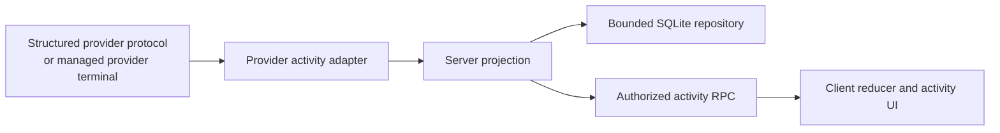

# Activity observation

Activity observation is the bounded, read-only view of provider work shown in
the **Subagents** and **Background Tasks** surfaces. It is separate from chat
rendering and terminal output: provider adapters emit only activity they can
attribute, while the server owns projection, persistence, authorization, and
stream recovery.

## Canonical model and invariants

The canonical wire model lives in
[`packages/contracts/src/activity.ts`](../../packages/contracts/src/activity.ts):

- A **scope** is either one provider chat thread or one managed provider terminal
  within a thread. Its current generation has a `scopeId`, provider identity,
  capability set, section health, observation state, and revision.
- An **actor** is a provider-attributed agent. It may reference a parent actor in
  the same scope.
- A **work item** is a provider-attributed background unit. It may reference its
  owning actor in the same scope.
- An **entry** is immutable detail attributed to an actor or work item:
  commentary, tool, command, result, error, state, or completion.

Parent and owner references must exist in the same scope, actor cycles are
rejected, and the provider may not emit records for a capability it did not
negotiate. Lifecycle states are `starting`, `running`, `waiting`, `unknown`,
`completed`, `failed`, `cancelled`, and `interrupted`. The last four are
terminal and require `terminalAt`; non-terminal records must not have it.

Terminal-state monotonicity currently differs by layer:

- The Codex tracker can authoritatively reopen a terminal actor from an
  object-form `Active` status or descendant snapshot whose provider timestamp is
  equal to or newer than the terminal update. It rejects an older `Active`
  signal.
- The repository rejects a terminal-to-non-terminal update only when its
  `updatedAt` is strictly older than the stored terminal update. Equal or newer
  updates are accepted.
- The client incremental reducer rejects every terminal-to-non-terminal summary
  update while still accepting the containing delta revision. That delta does
  not itself trigger recovery, so the client can show the terminal summary until
  a later authoritative snapshot replaces it.

Interruption on teardown is also topology-specific. The Claude terminal
observer explicitly marks tracked active records `interrupted` when its worker
ends. Codex and OpenCode observer workers do not directly close every unresolved
record. When the terminal manager tears down their generation, it cancels the
observer and then invalidates further publication. Separately, repository
startup cleanup interrupts unresolved records in persisted terminal scopes, and
replacing the current generation for the same terminal interrupts active
records in the prior scope.

## Protocol v1, revisions, and resync

The server advertises `activityProtocolVersion: 1` in environment capabilities.
The client subscribes only when that exact feature is advertised; `null` means
the activity protocol is unavailable. This server/client negotiation is
independent of provider CLI probing. See
[`packages/contracts/src/environment.ts`](../../packages/contracts/src/environment.ts)
and [`packages/client-runtime/src/state/activity.ts`](../../packages/client-runtime/src/state/activity.ts).

Every subscription starts with a full `ActivitySnapshot` whose
`protocolVersion` is `1`. Effective changes are journaled as contiguous deltas:
`previousRevision` must equal the accepted snapshot revision and `revision` is
the next value. A large mutation batch may be split into multiple deltas of at
most 256 changes. Duplicate and net-no-op provider events do not consume a
revision.

The server replaces the stream with a fresh snapshot when the current scope
generation changes, a non-contiguous delta is observed, or the broadcast
receiver lags. The client discards old-scope and duplicate data. On a client-side
gap—including a change that cannot safely refill a capped page—it keeps the last
snapshot as stale and issues `activity.getSnapshot`; reconnecting creates a new
subscription and therefore a new authoritative snapshot. The server rules are
in [`apps/server/src/activity/rpc.rs`](../../apps/server/src/activity/rpc.rs);
the client rules are in
[`packages/client-runtime/src/state/activityReducer.ts`](../../packages/client-runtime/src/state/activityReducer.ts).

Each snapshot negotiates provider capabilities separately: actors, attributed
entries, background work, history recovery (`full`, `bounded`, or `none`), and
terminal observation. Per-section health (`unsupported`, `live`, `stale`, or
`error`) can downgrade one surface without inventing records or hiding valid
data from another surface.

## Structured chat and provider-terminal topology

Structured chat activity comes from the provider runtime's typed protocol.
Provider-terminal observation is a separate opt-in path attached only to a
provider terminal launched by BiBCode. It requires explicit enablement before
that terminal is launched (or reopened), and it does not scrape arbitrary PTY
text.

The terminal manager is the sole owner of each observer generation's worker
registry. Provider observer workers receive only a lightweight observation
lease containing generation identity, publication fencing, and cancellation;
that lease cannot retain the registry that owns the worker future or invalidate
the generation. Only the manager-owned generation exposes lifecycle mutation.
Explicit teardown cancels and drains the registry before invalidating
publication. If the final manager generation owner is instead dropped,
registry drop publishes cancellation without blocking and transfers its workers
to a retained runtime cleanup task for the same bounded graceful-then-abort
policy. Each transferred worker record also synchronously requests abort when
dropped, so discarding that cleanup task during runtime shutdown cannot strand
a noncooperative worker. The process-wide join reaper continues to own each
worker thread and permit until joining proves the OS thread exited, so a worker
that retains its observation lease cannot form an ownership cycle or
permanently consume observer capacity.

OpenCode helper cleanup is owned by the system helper launcher. Before a
foreground cleanup waiter can block, the launcher transfers the exact child,
reserved process-group identity, and one of sixteen cleanup permits into its
retained reaper registry. The cleanup permit is acquired before the helper
process is spawned. Retained submission synchronously inserts a pending
registration before it spawns the Tokio reaper task, then promotes that exact
entry to running without an await or other cancellation point. Pending and
running entries and the active drain epoch share one registry mutex, so
shutdown treats an in-flight submission as live work.

The foreground TERM/grace/KILL/wait budget remains bounded; a timed-out child
stays registry-owned until `Child::wait` completes. An `Interrupted` wait is
retried immediately. Any other wait failure keeps the same child,
process-group guard, stdout ownership, and permit in that task and retries
after a fixed 100 ms delay. The first shutdown of a non-empty registry phase
publishes a snapshot drain epoch that permits one immediate retry per retained
task. A task promoted after that publication reads the current snapshot and
cannot miss the epoch. Concurrent and repeated shutdown callers, including
replacements after an earlier caller is cancelled, reuse the active epoch and
cannot repeatedly bypass the delay. A repeated failure cannot publish reap
completion, disarm the guard, or release capacity.

Shutdown removes completed running entries, creates or reuses the phase epoch,
and decides whether it may return while holding the same registry mutex. When
the last entry is removed, epoch reset and the empty-state shutdown return
linearize under that lock; a later submission belongs to a distinct phase.
Process waits, stdout joins, task joins, timers, logging, and notification
waits all run after the mutex is released. Each completed task keeps its join
handle in a shared async owner reachable from the registry. Shutdown callers
serialize on that owner and await the handle by mutable reference, so
cancelling one caller cannot detach the handle or make a replacement drain see
an empty registry. Only a successful join permits removal. Normal reservation
also prunes finished, successfully joined terminal records synchronously, so a
long-running server cannot accumulate records beyond the live cleanup
capacity; it never detaches a running task epilogue to do so. A persistent
platform wait error therefore keeps shutdown pending at a finite retry cadence
rather than discarding the exact owner or hot-looping, while repeated shutdown
after an empty-state linearization is inert.

Terminal-manager shutdown first cancels and drains observer generations and
sessions, then calls the launch-preparer/factory shutdown hook to drain this
registry while the production Tokio runtime is still live. Other provider
factories use the hook's no-op default. This makes waiter cancellation safe,
bounds live helper/reaper ownership, and prevents runtime teardown from
discarding an unreaped OpenCode child.

## Independent activity controls

Each environment has separate Chat and AI Terminal activity gates. Chat defaults
on and owns `thread` scopes. AI Terminal defaults off and owns `terminal` scopes.
RPC admission, generation fencing, projection, cleanup, and observer lifecycle
are selected from the request scope; changing one gate does not transition the
other. Legacy `enableAgentActivity` values migrate only to Chat.

### Codex structured recovery

Codex structured recovery merges validated, bounded live and root/child-history
`subAgentActivity` hints with descendants returned by `thread/list`. Hinted
child IDs are direct-read under the current activity generation. A read response
is accepted only when its thread ID matches the requested child ID and its
parent is the root or an already verified actor. Bounded root, live, list, and
nested recovery repairs reconnect topology. An empty successful list neither
erases known actors nor suppresses hinted actors and their direct reads.
Malformed, out-of-scope, self-referential, or cyclic hints are ignored.

Epoch and cancellation fences cancel recovery when activity is disabled, the
root is replaced, or the runtime disconnects or shuts down; late results and
old-root mutations are discarded. Mutations already accepted into the current
root's tracker are staged under the same activity lock until a current
reconciliation event is queued successfully, so a transient failure or
same-root reconnect cannot acknowledge recovery data that was never published.
The bounded staging buffer coalesces superseded actor and work-item states,
preserves each actor's retained state order, and dependency-orders every
retained parent state before the child or reparent state that needs it. Cyclic
or otherwise unsortable staged topology remains pending and produces a runtime
warning instead of an invalid activity event. Oversized valid recovery is
published as repository-sized chunks. Scope and section health lead the first
chunk; each chunk is removed from staging only after its event is queued, and
remaining chunks are queued immediately without waiting for provider history to
change.
The staged buffer is cleared when activity or the root is replaced. History
recovery is `full` only for
`supported`/`supported`, `none` only for `unsupported`/`unsupported`, and
`bounded` for every other list/read pair, including unknown or unproven pairs.
These recovery downgrades do not disable ordinary Codex chat.

| Provider | Structured chat activity                                                                                              | Provider-terminal observation                                                                                                              | Recovery and truthful downgrade                                                                                                                                                                                                                                                                                                                                                                                                                                                                |
| -------- | --------------------------------------------------------------------------------------------------------------------- | ------------------------------------------------------------------------------------------------------------------------------------------ | ---------------------------------------------------------------------------------------------------------------------------------------------------------------------------------------------------------------------------------------------------------------------------------------------------------------------------------------------------------------------------------------------------------------------------------------------------------------------------------------------- |
| Codex    | Supported: actors and attributed entries; background work is enabled only when its reconciliation method is accepted. | Supported when capability probes prove a Unix App Server listener and remote TUI.                                                          | Structured recovery combines bounded validated hints, list discovery, and direct reads; the exact `full`/`bounded`/`none` guarantees are above. The terminal path publishes only after root resume and keeps known data when an optional bounded reconciliation request has no usable response.                                                                                                                                                                                                |
| Claude   | Supported when the launch probe proves both hook-event switches; actors and attributed entries only.                  | Supported when settings composition, authenticated HTTP hooks, additive merge semantics, and a safe private executable pin are all proven. | No background-work capability. Recovery moves from `none` to `bounded` only after correlated transcript recovery; unproven hook support leaves activity unsupported.                                                                                                                                                                                                                                                                                                                           |
| OpenCode | Supported after the child-session endpoint and root correlation are proven; actors and attributed entries only.       | Supported after authenticated serve/attach preparation and owned-root correlation.                                                         | Structured chat reports no activity when the child endpoint is unsupported, `bounded` recovery when child discovery works without both status and history, and `full` when all three work; transient fetch failure marks the scope stale while retrying. The terminal path instead publishes `full` after owned-root correlation and currently skips later child/status/message request failures without downgrading that capability. Failed correlation publishes no terminal activity scope. |
| Cursor   | Unsupported in activity protocol v1; ordinary Cursor provider chat still works.                                       | Unsupported in v1.                                                                                                                         | No structured activity or activity dock is claimed.                                                                                                                                                                                                                                                                                                                                                                                                                                            |

Codex provider-terminal observation remains list-based. A terminal-scope
`subAgentActivity` item can wake the bounded reconciliation pass, but it does
not materialize a provisional actor or enqueue a direct hinted-child read; an
actor is published there only after `thread/list` verifies its topology.

The terminal supervisor validates the enabled provider instance and executable,
then chooses only the Codex, Claude, or OpenCode observer factory. Before
spawning, an unavailable observer, rejected probe, preparation failure, or
preparation timeout passes through the original executable, arguments, and
environment. A collision between the launch environment and a prepared
observer's reserved environment key is instead a hard terminal error, as is
failure to spawn the selected prepared command. Neither path retries the
original command. If the prepared PTY starts but its observer is not ready
immediately before `on_spawned`, the manager discards that uncommitted PTY and
respawns the original command. If the bounded `on_spawned` callback times out or
panics, the manager instead cancels the observer and invalidates further
activity publication, then continues creating and registering the prepared PTY
as the running terminal. It does not respawn the original command.

Provider root correlation is asynchronous after `on_spawned`. A correlation or
later observer failure does not replace the running prepared command with the
original command. Until correlation succeeds, no activity scope is published.
After publication there is no universal observer-failure state transition:
Claude explicitly interrupts tracked active records when its observer ends;
Codex does not directly terminalize them; and OpenCode retries its event stream
but skips failed reconciliation requests without changing its advertised
terminal history capability. The terminal remains independent of the read-only
activity surface.

See the ownership and fallback paths in
[`apps/server/src/provider_terminal/supervisor.rs`](../../apps/server/src/provider_terminal/supervisor.rs)
and [`apps/server/src/terminal/manager.rs`](../../apps/server/src/terminal/manager.rs).
Cross-provider semantics and handshakes are covered by
[`apps/server/tests/activity_provider_conformance.rs`](../../apps/server/tests/activity_provider_conformance.rs),
[`apps/server/tests/fixtures/activity-conformance/canonical-scenarios.json`](../../apps/server/tests/fixtures/activity-conformance/canonical-scenarios.json),
and [`apps/server/tests/provider_terminal_supervisor.rs`](../../apps/server/tests/provider_terminal_supervisor.rs).

## Bounds, retention, authorization, and data policy

The v1 contract limits IDs and labels to 256 UTF-16 units, summaries to 2,048,
details to 16,384, cursors to 512, snapshot/page results to 200 records, and a
delta to 256 changes. Provider payload decoders, probe output, hook bodies,
queues, reconciliation passes, and observer workers have additional local
bounds.

Repository retention targets 2,000 summary records per scope, 200 entries per
record, and 5,000 journal/idempotency rows per scope. Eligible terminal records
older than 30 days are pruned. Work is incremental (normally 128 rows per
transaction), and active or still-referenced records are retained even if that
temporarily leaves the scope above its target. Exact rules are in
[`apps/server/src/activity/repository.rs`](../../apps/server/src/activity/repository.rs).

All four activity RPCs—including replacement snapshots on a subscription—need
the authenticated environment session's `orchestration:read` scope. Roster and
detail requests must bind the requested scope reference to the current
`scopeId`, so a stale or different scope generation cannot be paged. Before
persistence, display text is bounded, control characters are normalized, and
common authorization, cookie, password, secret, token, and API-key assignments
are redacted. Operational logs record activity metadata such as mutation
counts, not provider-native payload bodies.

Raw hidden reasoning is never activity commentary. Codex can publish the
provider's completed reasoning **summary**, but not its raw reasoning content.
Claude thinking deltas and recovered thinking blocks, and OpenCode reasoning
parts, are excluded from activity entries. Provider coverage is in
[`apps/server/tests/provider_codex.rs`](../../apps/server/tests/provider_codex.rs),
[`apps/server/tests/provider_claude.rs`](../../apps/server/tests/provider_claude.rs),
and [`apps/server/tests/provider_opencode.rs`](../../apps/server/tests/provider_opencode.rs).

## Troubleshooting states

| State            | Meaning                                                                                                                                                                           | Operator response                                                                                                                                 |
| ---------------- | --------------------------------------------------------------------------------------------------------------------------------------------------------------------------------- | ------------------------------------------------------------------------------------------------------------------------------------------------- |
| **Live**         | The scope or section is current and contiguous revisions are applying.                                                                                                            | No action.                                                                                                                                        |
| **Reconnecting** | If emitted, the scope says its observer is attempting to re-establish provider state. A client transport reconnect separately keeps the last snapshot stale until resubscription. | Wait for a replacement snapshot; inspect provider connectivity if it persists.                                                                    |
| **Stale**        | Previously valid data is retained, but reconciliation or transport recovery has not established that it is current.                                                               | Treat the data as historical and resolve the reported provider/connection condition.                                                              |
| **Error**        | A scope's bare `observationState` is `error`, or a section health object is `error`. Only section health has `message` and `retryable` fields.                                    | For a section, inspect its message and retryability. For a scope, use operational logs plus reconnect, resubscribe, and snapshot-resync evidence. |
| **Interrupted**  | A record—not the scope—reached the terminal `interrupted` lifecycle through a provider-specific transition or repository cleanup.                                                 | Treat that work as ended; start a new provider operation if needed.                                                                               |

An absent dock is also meaningful: protocol v1 may be unavailable, the provider
may be unsupported, or a terminal handshake may not have established correlated
activity. None of those states changes whether the provider itself can run.
