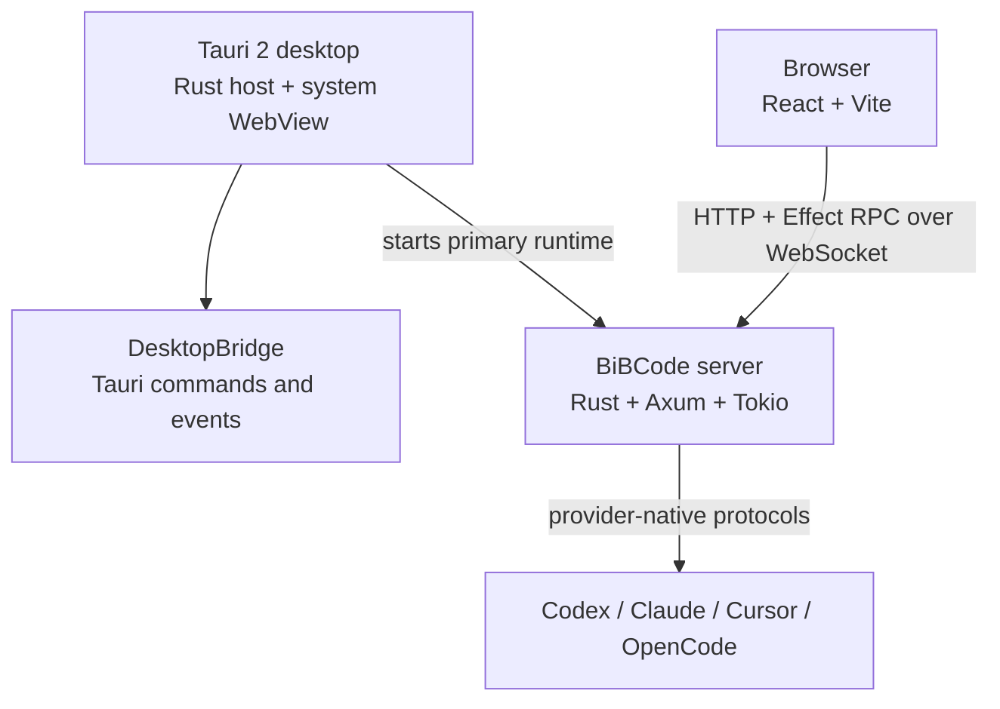
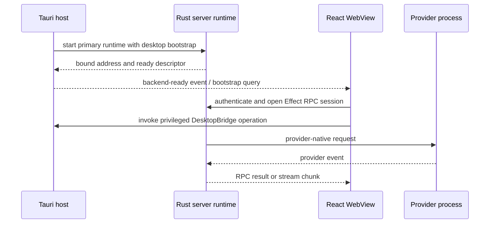

# Architecture

BiBCode has one React/Vite frontend and one native Rust backend. Browser mode
connects to a running `bibcode` server. Desktop mode runs the same frontend in
Tauri 2 and starts the primary Axum/Tokio server in-process. Native shell
capabilities cross a narrow `DesktopBridge`; application traffic uses the same
typed HTTP and WebSocket RPC boundaries in both modes.



## Components

- **Tauri host (`apps/desktop`)** owns native windows, menus, dialogs, updates,
  WSL and SSH launch, the desktop connection catalog, and backend lifecycle.
  Windows protects the catalog with DPAPI. Atomic compare-only and
  compare-and-write transitions cross privileged bridge commands and are
  serialized by the native catalog owner across all WebViews in that host. A
  protected bridge collapses a legacy renderer catalog into native storage
  before publication, then uses native storage exclusively. macOS and Linux
  advertise that native protection is unavailable and use the renderer's
  transactional IndexedDB catalog instead; any legacy renderer value is
  atomically migrated into that single source before it is cleared.
- **React app (`apps/web`)** owns the user interface and client-side state. It
  uses hash history in desktop mode and browser history on the web. Preview
  content is hosted in Tauri child webviews; preview automation is brokered by
  the Rust server and consumed by the React host.
- **Desktop adapter (`apps/web/src/tauriDesktopBridge.ts`)** installs
  `window.desktopBridge` only when Tauri globals are present. Tauri commands and
  events implement privileged operations; browser fallbacks are limited to
  explicitly safe capabilities.
- **Server (`apps/server`)** is both a Rust library and the native `bibcode`
  binary. It owns HTTP/WebSocket RPC, authentication, SQLite persistence,
  orchestration, providers, terminals, Git, files, diagnostics, relay access,
  and process supervision. Its worktree catalog joins bounded live Git and
  filesystem observations with durable project and canonical-thread
  projections. An authoritative `project_repository_claims` row admits at most
  one active project for a verified Git common-directory identity in this
  environment. Claim acquisition, the project event, and its permanent Main
  event commit together; project deletion releases the claim in its
  authoritative transaction. A separate nullable project repository-key pin
  is stored outside the rebuildable projection, established only by a trusted
  primary-checkout scan, and joined into project reads; generic projection
  writes cannot change it, and projection rewind/replay preserves it. It fences
  later fallback anchors and is not a persisted live catalog. Repository-level
  observation remains keyed by verified identity, while the claim prevents two
  active project views in one environment from owning that identity. Catalog
  views retain the last authoritative arrays through degraded observations and
  cancel pending poll, Git, and probe work after their final subscriber before
  bounded idle eviction. Project and repository lifecycle epochs make poller
  initialization transferable across subscriber aborts and prevent canceled
  prior-lifecycle work from publishing into an immediate reattachment.
  For an already trusted repository, Focus may reuse that observation when two
  bounded, no-follow Git-admin fingerprint passes match the proof captured
  before its last successful real scan. Unknown or changed proofs fail open to
  Git; Explicit requests always scan; and Focus reconciles with real inventory
  at exactly five minutes from the last successful real-scan completion. Reuse
  still rebuilds the project join, suppressions, availability, generation, and
  healthy-publication effects. Managed create, retarget, and removal invalidate
  the shared proof only after their terminal durable settlement, while managed
  creation retains its bounded path suppression.
  VCS status has one server-owned coordination entry per canonical worktree.
  Local and full reads are shared independently, each caller retains its own
  cancellation lease, and only final-lease release or a lifecycle/mutation
  fence cancels the physical read. A read gate and checked mutation epoch
  prevent work admitted before or during a mutation from publishing afterward;
  post-fetch remote reads and pull-request enrichment carry that same epoch
  through their final internal publication or delivery check without changing
  public status schemas. Cached remote state additionally carries its producing
  ref identity; an external ref change clears it and resets branch-specific
  client remote fields before reconciliation;
  the final idle transition across a queued mutation burst requests one
  coalesced trailing local refresh before reopening the gate. The local fallback
  scheduler remains independent from remote reconciliation, so a slow fetch or
  remote probe cannot delay editor-save status publication.

  Active status subscriptions resolve the canonical worktree, Git directory,
  and common directory in one bounded Git read, then install execution-host
  native watches before the initial local snapshot read. Working-tree and Git
  metadata signals collapse at a 125 ms trailing edge, with exactly one trailing
  read retained when signals arrive during a physical read. Overflow, watcher
  loss, and setup unavailability are sticky fallback states; they preserve the
  subscription and cannot be cleared by a later ordinary event. Active
  subscriptions also retain a completion-based safety read after the greater of
  60 seconds or four times the last completed read duration, capped at 300
  seconds. Explicit mutation, workspace, focus/menu catch-up, and structured
  terminal-process exit invalidations remain immediate; automatic fetch and
  post-fetch remote reconciliation remain independent. There is no periodic
  `symbolic-ref` worker; watcher and safety local observations carry branch
  identity in their porcelain result.

  Final status-subscriber release retires the worktree epoch, scheduler,
  watcher, reads, and lifecycle tasks before an immediate reattachment may
  create a fresh watcher generation. Server shutdown closes subscription and
  read admission and awaits owned setup, physical reads, and lifecycle tasks.
  A completed terminal launched as a structured BiBCode command notifies the
  deepest active canonical worktree ancestor after terminal exit publication;
  provider, session, and delivery events do not. Commands typed inside a
  persistent interactive shell have no structured completion boundary and
  therefore converge through native watcher events or the safety read. Native
  watching covers only filesystem paths visible to the server execution host;
  remote-host changes outside that boundary require an explicit invalidation or
  safety convergence.

  One status observation reads porcelain-v2 branch and file state once and runs
  staged or unstaged numstat only for areas that are present. A failed porcelain
  read becomes the compatible non-repository result only after the existing
  repository probe confirms that state; malformed metadata, permissions,
  cancellation, and other actionable failures remain errors. Status and
  background-observation Git reads set `GIT_OPTIONAL_LOCKS=0`; fetch and
  mutations keep the ordinary Git environment.

  Passive VCS summaries use a separate latest-value producer per canonical
  worktree. One porcelain-v2 status read supplies repository, named/detached or
  unborn identity, and dirty state without numstat or file-row materialization;
  the existing bounded origin-provider read and pull-request service add
  provider and matching named-branch PR state. Each producer cycle publishes
  its fresh base before optional PR enrichment. A PR completed in cycle N may
  be carried only into cycle N+1 for the same ref and provider while that
  cycle's enrichment is pending or fails; the publication keeps the PR's
  original `observedAt` and sets `stale: true`, then expires it in cycle N+2
  unless enrichment refreshed it. The carried value is only the prior PR, not
  necessarily the exact prior summary: current local and provider base fields
  still come from the fresh cycle. Missing provider configuration and an empty
  provider PR list are successful absence. An operational Git or provider-
  discovery failure before a fresh base retains the exact prior summary and
  observation time as stale. Subscribers share the producer, refresh after 30
  seconds, and cancel and await in-flight Git or provider work when the final
  subscriber leaves. This path never starts automatic fetch.

  Automatic fetch has a separate owner per canonical Git common directory. A
  subscribed worktree resolves that identity with one bounded read for its
  lifecycle. Each interval performs at most one repository-wide upstream
  discovery and one exact single- or multi-remote fetch, then signals every
  attached worktree to compute its own branch, upstream, default-ref, provider,
  and pull-request result. The default interval is 180 seconds; live changes,
  bounded failure backoff, and `0 = disabled` remain supported. The client keeps
  serial mutation ordering but runs
  `vcs.refreshStatus` on a separate latest-per-environment/worktree lane, so
  focus, visible-document, menu-open, and post-action freshness cannot queue a
  mutation behind an active read.
  Shared observations never bypass per-caller anchor validation, and final
  view/repository ownership release is atomic against concurrent attachment. A
  scan leader moves the repository single-flight guard into repository-owned
  work, while its project-view caller waits with view cancellation. Detaching
  that view therefore releases its refresh lock immediately; an alias may keep
  the exact-anchor observation alive within the current repository lifecycle.
  Mutation invalidations overwrite one per-view pending epoch and are drained
  by at most one lifecycle-owned worker. When that worker queues behind a
  pre-mutation scan, it alone may recover from the stored stale result with one
  current-epoch scan; ordinary waiters still receive the identical stale error.
  Invalidations before the recovery fence coalesce into that scan, while a
  later mutation produces at most the next serialized recovery step. Final
  detach cancels, aborts, and clears the worker slot, releasing its project
  refresh lock even if a dependency await is not cancellation-aware. A
  reattachment cannot inherit that project-view work or result, though it may
  coalesce with an exact-anchor observation still owned by an aliased
  repository lifecycle. External-checkout adoption is serialized by stable
  project and physical-repository identity, revalidates live Git membership,
  and persists canonical ordinary workspace ownership atomically without
  creating Git state. Ownership uses the catalog's host-path identity key, so
  lexical aliases retain one owner across replay even when the checkout is
  missing. Public adoption receipts bind the canonical opaque payload and an
  immutable result. Only healthy authoritative catalog observations may
  reconcile durable adopted-thread branch metadata.
  The standalone `bibcode` binary may perform a final sweep of descendants
  rooted at its own process after its managed owners shut down. Reusable
  in-process runtimes—including the desktop server—share their host PID and
  therefore skip that sweep: provider and terminal owners still stop their
  registered processes, while host-owned children remain under the host
  lifecycle.

- **Contracts (`packages/contracts`)** contains Effect schemas and TypeScript
  contracts only. It defines persisted models, RPC methods, HTTP APIs, desktop
  bridge values, and provider events without application runtime logic.
- **Client runtime (`packages/client-runtime`)** owns environment registration,
  connection supervision, authorization, RPC sessions, and shared client state.
  It is used by browser and desktop clients.
- **Shared runtime (`packages/shared`)** contains runtime utilities used by
  multiple packages through explicit subpath exports.

## Project-data ownership and identity

The Rust server is the source of truth for the requested and effective data
root, state kind, store classification, storage-instance marker, SQLite
database, verified backups, and offline recovery. The desktop host does not
invent a path or manipulate those files through renderer input. It resolves a
native or WSL environment from its authoritative launch plan and coordinates
privileged multi-backend inspection, update protection, stop, recovery, and
exact-plan restart around the server-owned persistence operations.

The resolved base root defaults to the current user's `~/.bibcode`. An explicit
CLI `--base-dir` takes precedence, followed by `BIBCODE_HOME`, followed by the
desktop bootstrap root. Development and installed desktop builds use that same
base root by default but intentionally select different state kinds: `dev` and
`userdata`. Changing the account, home/profile, explicit root, drive, mount, or
the target of a symlink/junction therefore selects a different effective
store; it is not evidence that the previous store was deleted. Recovery and
diagnostics always report both the requested root and the canonical effective
root so that alias changes are visible.

`environmentId` is a random, server-owned UUID persisted in `environment-id`.
It is the durable logical identity that scopes every project, thread, terminal,
route, cache key, and navigation reference. `storageInstanceId` is the distinct
persistent UUID of the prepared store in `storage-instance-id`. The client
records the first accepted storage identity for an environment and blocks a
different identity before synchronization or cache consumption. Host names,
WSL distro names, SSH targets, labels, CLI flags, and client input are locators
or presentation only; none may choose either UUID.

The server classifies its persistent SQLite store before opening it for normal
read/write traffic. The absence of `state.sqlite`, `environment-id`, and
`storage-instance-id` is the only automatic first-run case. Under the existing
data-root operation lock, a legacy store that has only `environment-id` moves
that exact UUID to `storage-instance-id` and publishes a new random
`environment-id`; interrupted states are retried without replacing either
published marker.
An existing unmarked database is adopted only after a read-only integrity,
migration-ledger, and required-table check recognizes it as a BiBCode store;
missing, malformed, corrupt, or unrelated state is preserved and startup fails
closed without creating or replacing either file. Validation opens the source
read-only and uses SQLite's online-backup API to build a coherent in-memory
snapshot, then inspects only that snapshot. Backup work runs on a blocking
worker in bounded positive-page batches and yields after progress or contention
so a live writer or checkpoint can proceed. One absolute deadline begins before
the source is opened and governs both backup and post-backup inspection. The
in-memory snapshot installs a SQLite progress handler that checks the same
cancellation token and deadline during `quick_check`, migration-ledger reads,
and required-table queries. Dropping startup therefore cancels a queued worker
before source open, or interrupts a running backup or inspection query, and
releases SQLite state before marker publication or migration. This remains
coherent while another server commits or checkpoints and never materializes a
full store copy in a temporary directory. Classification does not mutate
persistent database, WAL, or marker bytes and entries. SQLite may create or
update `state.sqlite-shm` as volatile WAL-index coordination; SHM contains no
database content and is not required for crash recovery. Once validation
succeeds, normal SQLite locking continues to support sequential or simultaneous
server processes sharing that established store. Graceful server join sends an
explicit close through the bounded SQLite queue after previously admitted jobs.
The worker then closes even if a stale cloned database handle remains; those
handles reject later calls as unavailable. Join still waits for the worker's
positive close notification before returning.

Desktop development and installed builds use the same resolved base data root
by default, but select separate `dev` and `userdata` state kinds. Rust desktop
unit tests are forbidden from resolving that real default root: every Tauri
mock that reaches persistence must install an explicit per-test temporary data
root. This boundary is enforced in the shared desktop root resolver so test
cleanup, mock backend lifecycle, window-state fixtures, and IPC fixtures cannot
read, replace, or recursively remove a developer's or installed application's
store on Windows, macOS, or Linux.

After store preparation succeeds, the runtime copies both prepared identities
into runtime-only server configuration. Current environment descriptors publish
strict UUID `environmentId` and `storageInstanceId` fields plus the supported
protocol range, platform, server version, and bounded capabilities. A clean
restart of the same root reports both UUIDs unchanged. In-place restore
preserves both identities; explicit start-empty creates new identities. Normal
environment descriptors never include the requested or effective data root,
alias diagnostics, or any other local filesystem path.

First-run creation initializes a randomized same-directory staged SQLite file,
closes it without retained journal sidecars, and publishes it at `state.sqlite`
with an atomic no-replace hard link. Platform file identity checks bind cleanup
and the final reopen to that staged filesystem object, so a competing or
replacement final path is never configured, migrated, removed, or overwritten.

Every startup acquires the effective root's cross-process
`.bibcode-storage.lock` on a bounded blocking worker before store
classification. The guard remains held through validation, non-mutating
migration inspection, any required backup, the migration transaction, and the
normal database open. It is released when preparation returns, so established
servers retain SQLite's supported multi-process read/write behavior. A
read-only inspection connection determines the pending migration suffix without
creating the migration ledger or changing persistent pragmas or user bytes. A
genuinely new empty store applies its initial migrations without a redundant
backup. The reusable guard API also requires an explicit timeout and
cancellation token; dropping a waiter cancels its blocking worker so it cannot
become a hidden lock owner later.

An existing store with pending migrations must publish a verified generation
under
`<effective-root>/backups/<userdata-or-dev>/<storage-instance-id>/<backup-id>/`
before the migration transaction begins. SQLite's online backup API copies the
live connection, including committed WAL data, in bounded cancellable page
batches into a same-filesystem staging directory. The server then closes and
checks the staged database, records its pre-migration ledger version, hashes it
with SHA-256, writes a path-free manifest that binds the environment and storage
identities, flushes both files and supported directories, atomically renames the
generation, and reloads it for checksum and `quick_check` verification. Unix
backup directories and files use `0700` and
`0600`; Windows generations inherit the private data-root ACL. Only after that
publication is verified may migration start or retention remove older verified
generations. Every backup ancestor is identity-bound beneath the effective root,
and symlink, junction, or reparse ancestors are rejected before generation
writes. Verified generations contain exactly one singly-linked `state.sqlite`
and one singly-linked `manifest.json`; their manifest ledger version must match
an exact migration prefix recognized by the running binary, and their canonical
UTC creation time must agree with the generation's filesystem publication time.
Retention keeps the newest three for the store and state kind, ordered by that
filesystem time with a backup-ID tie-break. It reopens and revalidates each
expired generation, deletes only the two bound files, and removes the now-empty
directory without recursive deletion. Staging entries, extra or linked content,
malformed manifests, location or identity mismatches, future-schema ledgers,
implausible timestamps, and failed verification are reported and never selected
for deletion. Newly created backup ancestors and their parents are flushed
before the next descendant is created on platforms that support directory
syncing.

Offline recovery is explicit and state-kind scoped. `bibcode storage inspect`
classifies the resolved store and inventories verified backups without changing
database, WAL, marker, or catalog bytes. `bibcode storage restore --backup-id`
accepts only a selected generation whose manifest, location, storage identity,
checksum, SQLite integrity, and migration prefix verify for that same state
kind. Restore reopens the verified database through a no-follow, read-capable
file handle before copying it into recovery staging; on Windows, directories
remain attributes-only while database files explicitly request generic read
access. `bibcode storage start-empty` is the separate destructive choice. Both
mutating commands first acquire an exclusive runtime lock and the storage
operation lock, write and flush a recovery journal, and preserve every existing
database, WAL, SHM, and marker entry in a private recovery generation before
installing a verified database or allowing the next startup to create a new
store. Normal server handles hold the runtime lock shared, so multiple
established servers remain supported while offline recovery fails closed if any
server owns the root. Startup refuses to create or open SQLite while a recovery
journal or strict recovery-staging entry remains. A crash or cancellation after
preservation therefore leaves recoverable files and an explicit incomplete
operation instead of silently converting the root into a first-run store.

## Desktop project-data recovery

The desktop host exposes inspection and recovery only through privileged,
desktop-only bridge commands. The renderer supplies an environment identifier
and, for restore, a verified backup identifier; it never supplies a filesystem
path, executable, distro command, or shell text. Rust resolves the selected
environment from the authoritative backend launch plan before inspecting or
mutating its store. Native environments call the server persistence library
directly. A WSL plan records one validated absolute Linux data root when it is
created, sends that exact root as `bibcodeHome` in the server bootstrap, and
reuses it for recovery. This preserves an explicit WSL `BIBCODE_HOME`; recovery
does not guess `$HOME/.bibcode`. WSL inspection and recovery invoke the bundled
`bibcode storage inspect|restore|start-empty` CLI with an argument vector and a
bounded output/time budget, never a shell command string.

Inspection is read-only and happens before a backend is stopped. A selected
restore generation must verify before the desktop enters its serialized
project-data operation. The operation prevents concurrent update or backend
start coordination, stops only the selected environment, commits the server's
journaled restore or start-empty workflow, and restarts the exact registered
launch plan only after a committed result. If restart fails, the result still
reports the committed recovery and carries the separate restart error; a
failed validation does not stop or restart the backend. The dialog's retry
action starts that exact plan when it is stopped and then re-inspects it;
retrying an already-running target is inert. Opening a store path and exporting
redacted diagnostics also resolve the path inside Rust rather than accepting
renderer-controlled paths.

If a desktop-owned backend fails after its launch plan has been resolved, the
supervisor retains that exact plan as a stopped recovery target while
withholding its connection bootstrap. The host emits only a
`desktop:project-data-status-changed` invalidation containing the environment
identifier. On mount and after each invalidation, the renderer re-reads the
Rust-owned status classification through `getProjectDataStatuses`; it never
infers recovery from an HTTP error or trusts the event as a classification,
path, storage identifier, or diagnostic source. This closes both startup races:
a failure recorded before the WebView mounts and one recorded immediately
after it subscribes.

The recovery dialog opens automatically only for a recovery-required local
desktop environment and remains available manually for a storage-identity
change. Restore requires an explicit backup selection and confirmation.
Start-empty has a separate confirmation which states that the prior store is
preserved rather than deleted; after commit, adopting the replacement storage
identity remains a distinct explicit action before connection retry. Desktop
storage adoption uses the native dialog boundary and performs no transition
when confirmation is cancelled or unavailable; browser mode retains its
browser-dialog fallback through the same local API. Remote
environments cannot invoke this local privileged recovery surface. Existing
T4Code files are neither scanned nor migrated: if they overlap a current root,
the same current-store classifier and recovery rules apply without a
compatibility alias or fallback.

## Runtime topology

The desktop WebView loads the bundled `apps/web` build (`frontendDist`) or the
Vite development URL. Separately, the Tauri host starts the primary backend
through `BackendSupervisor` and publishes its ready descriptor to the renderer.
The renderer then establishes the normal HTTP/WebSocket connection.



The primary backend uses `BackendLaunchTarget::InProcess`. Optional WSL
backends use `BackendLaunchTarget::ExternalProcess`, so not every desktop
environment shares the host process. SSH forwarding is owned by the Tauri host;
provider, terminal, and managed relay processes are supervised by the server.
Neither path introduces a production Node server or packaged helper sidecar.

When WSL-only mode is selected, that intent is authoritative even if an older
persisted document has a stale disabled-backend flag. WSL planning and primary
startup fail closed as a tagged `wsl-primary-unavailable` desktop state. The
host does not substitute the native Windows backend or publish a fallback
bootstrap. Retry and distro selection keep WSL as the primary target;
**Switch to Windows** atomically clears the WSL-only/backend flags and follows
the normal backend restart.

A failure of an optional secondary WSL backend remains non-blocking for a
native Windows primary, but does not remove that secondary from desired
topology. The host publishes a stable configured identity and a tagged
`wsl-secondary-unavailable` error with null endpoints and no credential. The
renderer keeps the environment registration and cached shell/thread data while
the resolver rejects connection attempts before creating a transport or
session. Explicit disable or distro replacement is what removes that desired
identity and clears its environment cache.

The desktop provisions a missing or incompatible WSL runtime only after a
fresh `Running`-distro probe and explicit one-use consent. A signed manifest
selects the exact Linux architecture/version record; the desktop verifies its
compiled Minisign trust anchor, size, signature, and SHA-256 before streaming,
then WSL verifies SHA-256 again. Installation uses a per-user version directory
and atomically replaces only
`$HOME/.local/share/bibcode/server/current`. The prior target is retained until
the restarted loopback descriptor proves version, platform, protocol,
environment identity, and storage identity. Any cancellation, startup failure,
or identity mismatch rolls the link back. Backend planning prefers the managed
path and retains the explicit/source-built binary fallback used by development
worktrees.

## Desktop update protection

The Tauri host coordinates update installation across the complete local
backend topology. It atomically snapshots the running primary and secondary
backends, prevents a new backend start from entering that snapshot, and keeps
configured-but-unavailable secondaries visible as unprotected. The primary is
always required. A user may proceed past a failed secondary only by selecting
that exact environment in the typed protection dialog; the primary can never
be excluded.

Each included backend exposes an authenticated maintenance API only in desktop
mode. Native desktop runtimes must be loopback-bound. An external WSL runtime
also binds only distro loopback. The Tauri host publishes a separate Windows
loopback listener and forwards each accepted byte stream through one supervised
`wsl.exe ... bibcode transport stdio-forward` child. No WSL bootstrap flag can
authorize wildcard plaintext. The maintenance owner admits status and other
read traffic, rejects new mutating HTTP and WebSocket RPC operations, and keeps
a permit until every admitted mutation has committed or failed. Preparation
then drains existing mutation permits with a bound, quiesces runtime-owned
writers, queues, providers, terminals, and background tasks, checkpoints
SQLite's WAL, and publishes and reloads a verified `PreUpdate` backup while
holding the store-operation lock.

Each in-process server runtime owns a distinct bounded process-attribution
registry shared by its provider, terminal, provider-helper, and managed-endpoint
owners. Runtime quiesce closes
that registry to new roots and captures its exact `(pid, creation-time)`
identities before either manager shuts down. A provider or PTY that finishes
spawning after this fence is rejected with the typed shutdown outcome and its
uncommitted owner terminates and reaps it before returning. Existing provider
process-group or Windows Job owners, terminal PTY owners, independently spawned
provider helpers, and the managed endpoint tunnel perform their
normal cleanup first; a final native sample kills only residual identities in
the captured runtime-owned closure, including descendants forked after the
initial sample. It never sweeps every descendant of the shared application
PID, so shutting down one embedded runtime cannot terminate a sibling
runtime's provider, terminal, helper, or tunnel children. PID reuse is excluded by creation-time
identity checks, registry entries leave with their process owners, and shutdown
is idempotent without awaiting while the registry lock is held.

Preparation is single-flight and returns a lease-bound identifier. Commit and
cancel must present that identifier. Commit sends its HTTP response before the
backend exits cleanly; cancellation, preparation failure, and lease expiry also
exit instead of resuming a partially quiesced runtime. The host marks those
exits as expected, stops every backend from the captured running set, and does
not invoke the platform installer until every included backend has committed
and stopped. A prepare, cancel, commit, stop, or installer failure attempts to
restart the exact prior running set before update coordination is released.
Stopping the primary in-process backend never sweeps descendants of the shared
desktop PID; doing so would terminate the system WebView before the installer
can take ownership of application restart.

The WebView engine is the operating system's, so it differs per platform:
WKWebView on macOS, WebKitGTK on Linux, and WebView2 on Windows. Browser API
support therefore varies between desktop hosts, and between desktop and browser
mode. The frontend feature-detects optional APIs and supplies its own fallback
rather than assuming the Chromium behavior that browser mode and Windows
happen to share.

Center chat-panel creation reserves and activates its client surface before the
server command settles. A confirmed command failure removes that reservation;
an interrupted result is ambiguous because durable thread creation may already
have committed, so the surface remains visible instead of silently orphaning a
valid panel thread. The reservation is renderer-local and remains protected
from older authoritative snapshots until a snapshot actually observes the new
thread; normal remote-deletion reconciliation resumes after that observation.
Authoritative thread removal later clears every surface that references that
thread. This ordering is shared by browser and all desktop hosts; it does not
depend on a WebView-specific scheduling delay.

The terminal's WebGL renderer is the current instance. xterm keeps its canvas
backing store aligned to the exact device-pixel box by observing
`ResizeObserver`'s `device-pixel-content-box`; WebKit does not implement that
box and throws from `observe`, leaving the backing store misaligned with its
CSS box on any non-integer device pixel ratio, which rescales every glyph.
[`terminalDevicePixelCorrection.ts`](../../apps/web/src/components/terminalDevicePixelCorrection.ts)
restores the correction from `getBoundingClientRect` where the native box is
unavailable, and stays inert where it is. The fallback applies each corrected
backing-store size through xterm's WebGL resize layers so the drawing viewport
and glyph shader resolution change atomically with the canvas; resizing the
canvas alone is not a valid renderer state during center-panel splits.

A terminal session may keep running after its center panel stops rendering. The
per-terminal input scheduler therefore survives renderer unmounts so an
immediate replacement can preserve ordering, but its retained writer is
created outside the renderer effect's closure and captures only the command and
terminal identity. Teardown detaches the transcript and disposes xterm and
WebGL without abandoning input already accepted by the scheduler. A later
renderer retargets error presentation, while the retained writer cannot keep
the departed renderer or its terminal buffers reachable.

## Request and event flow

1. The client runtime resolves a connection target and obtains any required
   bearer, DPoP, relay, or SSH authorization.
2. `RpcSessionFactory` opens a WebSocket and synchronizes `server.getConfig`.
3. Effect RPC schemas encode requests and decode unary results or streams.
4. The Rust `RpcRegistry` authorizes and routes each method.
5. Orchestration commands are admitted and persisted before provider delivery.
6. Provider runtimes translate commands to provider-native protocols and feed
   normalized events back into durable projections.

See [RPC and orchestration](./rpc-and-orchestration.md) and
[Connection runtime](./connection-runtime.md) for the detailed boundaries.

## Environment-owned presentation

The renderer projects normalized environment aggregates as one navigation-only
ARIA tree: `Environment -> Project -> Main/threads`. Environment, project, and
thread identity remain present in every selected route and cache key. Search
may filter descendants, but it retains matching ownership ancestors; live
status never changes manual row order. The tree virtualizes rows without
changing logical level, position, set size, focus, or stable row identity.

Environment overview and administration belong to center workspaces, not to a
second sidebar tab or detail panel. The center route owns aliases, pin/manual
order, connections, service state, security, projects/storage, updates,
diagnostics, platform capabilities, and removal consequences. Offline project
and thread snapshots are read-only. No mutating project, Git, filesystem,
terminal, or provider command is queued for a later reconnect.

Disconnect, Hide, Forget, remote service uninstall, and remote data purge are
distinct transitions. Only Forget is the normalized client-catalog deletion
transaction described by the connection runtime. Remote uninstall or purge
requires an explicit versioned plan plus a trusted host-authority channel and
reports independently from local removal; an offline force-Forget cannot
claim or schedule remote cleanup.

## Boundaries and invariants

```text
Environment identity scopes every project/thread reference.
Repository claims are environment-local and use Git common-directory identity.
Main is permanent; worktree-backed workspace threads still use the worktree catalog.
```

- React does not import Rust or native-host implementation details.
- Privileged desktop behavior crosses `DesktopBridge` commands and events.
- Whole-catalog renderer updates use fresh reads and exact compare-and-set.
  Compare-only transitions validate the same fresh raw revision without a
  document write. In browser and unprotected desktop modes each transition owns
  one IndexedDB `readwrite` transaction; on a protected desktop host both own
  the same native catalog-owner lock and are never emulated with separate
  JavaScript bridge calls. Before protected bridge publication, a native-null
  host adopts a non-blank legacy catalog by CAS and confirms the authoritative
  native winner before clearing the renderer copy. A failure preserves both
  sources and leaves catalog operations fail-closed. Unprotected legacy
  migration preserves an existing valid IndexedDB winner and uses exact CAS
  before replacing corrupt IndexedDB bytes with the only valid legacy catalog.
  Outside that migration, a corrupt authoritative catalog is never rewritten
  as empty: it is quarantined when supported, publishes redacted
  recovery-required health, blocks mutation, and requires an explicit
  exact-revision reset. The shell cannot confirm an empty project list while
  this health is active.
- Accepted storage-identity decisions are atomic catalog transitions: the
  decision is recomputed after every conflict and returned only from the
  winning revision. Keep decisions compare without writing; Set decisions use
  CAS. Both the prepared HTTP descriptor and the WebSocket session's
  initial configuration must pass that owner before synchronization, live
  publication, or cache consumption.
- Project count is never used as an availability signal. The client retains
  accepted cached shell snapshots through reconnect and blocked states, and
  only a successful live shell snapshot can replace those rows or confirm an
  empty project catalog. Catalog loading, zero desired environments, and any
  non-live desired environment remain explicitly non-authoritative.
- Desktop catalog capability is fail-closed and tri-state. Only bridge version
  3 with an explicit protected/unprotected flag may select native compare-only,
  native CAS, or IndexedDB migration; rejected, older, or incomplete metadata
  and failed protected-source collapse perform no IndexedDB write, native
  overwrite, or renderer clear.
- WSL-only desktop startup never falls back to a native Windows backend.
  Planning and primary-start failures remain tagged through the desktop bridge;
  only an explicit settings action switches the primary runtime to Windows.
- Forced linked-worktree deletion is admitted only after the server verifies
  the persisted workspace-thread owner, fences the canonical target path plus
  every server-known terminal under it, closes their current processes, and
  blocks open, attach, and restart for the duration of the VCS operation. The
  server persists a removal receipt keyed by the workspace thread and binds it
  to a random identity stored durably in both the linked worktree's Git
  administrative directory and its root. The repository revalidates that
  administrative `.git` file, backlink, and identity inside the removal
  transaction, then atomically renames that exact checkout through its bound
  filesystem handle on Windows to a deterministic nonce-bound quarantine. A
  tiny verified tombstone, atomically created with its bound handle on Windows,
  occupies the registered
  path while the server atomically moves the nonce-verified administrative
  directory out of Git's `worktrees` namespace. No path-based Git delete can
  race with a replacement. Recursive cleanup begins only after deregistration,
  holds the checkout, tombstone, and Git-administration leases continuously,
  pins the verified filesystem object against rebinding, verifies descendant
  identities, rejects Windows reparse points at the root and descendants, and deletes the empty
  root through its handle. An empty registered path without the transaction
  marker fails closed. A Windows process that still owns the checkout as its
  current directory therefore makes the initial rename fail before any file is
  deleted. The receipt and deterministic quarantine make interrupted cleanup
  safely retryable across client and server restarts. Once cleanup completes,
  the receipt makes a stale retry a no-op even if another worktree later reuses
  that path. Compatibility cleanup of a
  previously deregistered directory is limited to a normal directory without a
  `.git` entry whose canonical parent is exactly BiBCode's computed
  per-repository worktree namespace; primary checkouts and arbitrary paths are
  never pre-cleaned.
- Configured secondary WSL planning/start failures remain desired, unavailable
  topology with stable identity and no endpoint/session. They do not remove
  cached project/thread state; explicit disable or distro replacement does.
- Desktop update installation requires a verified pre-update backup for the
  primary and every non-excluded running secondary, stops the captured running
  set before invoking the installer, and restarts that exact set on failure.
  In-process backend shutdown preserves desktop-owned WebView descendants.
- Normal application traffic uses HTTP and WebSocket RPC in every host.
- `packages/contracts` remains schema-only.
- Rust owns all production backend behavior. TypeScript is limited to clients,
  contracts, shared utilities, relay infrastructure, and development tooling.
- Git worktree registration, directory availability, and path ownership are
  resolved by the server catalog. Clients do not infer recovery from directory
  existence or treat a degraded observation as an authoritative empty set.
  Persisted thread projections resolve ordinary and panel aliases to the same
  physical workspace, and short-lived server admission leases serialize new
  durable/process publication against authoritative loss and bounded cleanup.
  Loss cancellation remains attached to queued engine work after an RPC caller
  disconnects. Each queued durable turn also carries an owned synchronous
  finalization fence into the SQLite worker: authoritative loss either rejects
  the transaction before commit or waits for the local commit to finish before
  publishing the guard. The runtime starts canonical cleanup immediately under
  one five-second deadline while resolving any persisted aliases in parallel.
- Capability negotiation controls optional behavior such as activity and
  preview automation; clients must downgrade when a server cannot prove support.
- Host WebView engines differ by platform, so optional browser APIs are
  feature-detected and given a frontend fallback rather than assumed present.
- Activity observation is bounded, authorized, and independent for structured
  provider chat and managed provider terminals. See
  [Activity observation](./activity-observation.md).

## Performance

The Tauri/Rust migration retained the React frontend while removing the bundled
Chromium/Electron shell and Node server process. Historical measurements and
the repeatable capture commands are recorded in the
[Desktop Performance Baseline](./desktop-performance-baseline.md).
