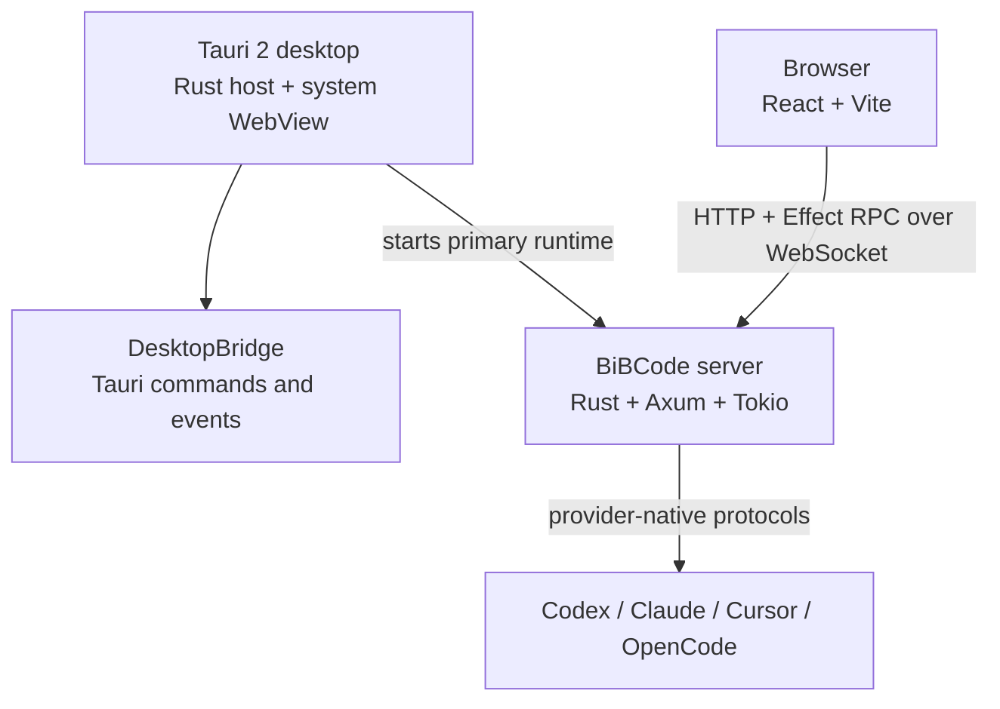
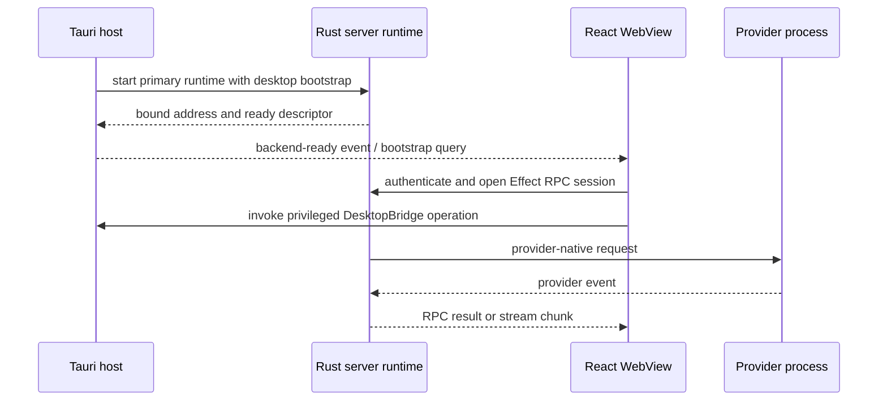

# Architecture

BiBCode has one React/Vite frontend and one native Rust backend. Browser mode
connects to a running `bibcode` server. Desktop mode runs the same frontend in
Tauri 2 and starts the primary Axum/Tokio server in-process. Native shell
capabilities cross a narrow `DesktopBridge`; application traffic uses the same
typed HTTP and WebSocket RPC boundaries in both modes.

## Components

- **Tauri host (`apps/desktop`)** owns native windows, menus, dialogs, updates,
  WSL and SSH launch, the desktop connection catalog, and backend lifecycle.
  Windows protects the catalog with DPAPI. Other platforms currently fall back
  to renderer storage because OS-backed protection is not implemented there.
- **React app (`apps/web`)** owns the user interface and client-side state. It
  uses hash history in desktop mode and browser history on the web. Preview
  content is hosted in Tauri child webviews; preview automation is brokered by
  the Rust server and consumed by the React host.
- **Desktop adapter (`apps/web/src/tauriDesktopBridge.ts`)** installs
  `window.desktopBridge` only when Tauri globals are present. Tauri commands and
  events implement privileged operations; browser fallbacks are limited to
  explicitly safe capabilities.
- **Server (`apps/server`)** is both a Rust library and the native `bibcode`
  binary. It owns HTTP/WebSocket RPC, authentication, SQLite persistence,
  orchestration, providers, terminals, Git, files, diagnostics, relay access,
  and process supervision. Its worktree catalog joins bounded live Git and
  filesystem observations with durable project and canonical-thread
  projections. A nullable project repository-key pin is stored outside the
  rebuildable projection, established only by a trusted primary-checkout scan,
  and joined into project reads; generic projection writes cannot change it,
  and projection rewind/replay preserves it. It fences later fallback anchors
  and is not a persisted live catalog. Projects sharing a repository may share Git
  observation, but retain isolated latest-value snapshots, streams, thread
  joins, subscribers, suppressions, and mutation epochs. Catalog views retain
  the last authoritative arrays through degraded observations and cancel
  pending poll, Git, and probe work after their final subscriber before bounded
  idle eviction. Project and repository lifecycle epochs make poller
  initialization transferable across subscriber aborts and prevent canceled
  prior-lifecycle work from publishing into an immediate reattachment.
  Shared observations never bypass per-caller anchor validation, and final
  view/repository ownership release is atomic against concurrent attachment.
- **Contracts (`packages/contracts`)** contains Effect schemas and TypeScript
  contracts only. It defines persisted models, RPC methods, HTTP APIs, desktop
  bridge values, and provider events without application runtime logic.
- **Client runtime (`packages/client-runtime`)** owns environment registration,
  connection supervision, authorization, RPC sessions, and shared client state.
  It is used by browser and desktop clients.
- **Shared runtime (`packages/shared`)** contains runtime utilities used by
  multiple packages through explicit subpath exports.

## Runtime topology

The desktop WebView loads the bundled `apps/web` build (`frontendDist`) or the
Vite development URL. Separately, the Tauri host starts the primary backend
through `BackendSupervisor` and publishes its ready descriptor to the renderer.
The renderer then establishes the normal HTTP/WebSocket connection.

The primary backend uses `BackendLaunchTarget::InProcess`. Optional WSL
backends use `BackendLaunchTarget::ExternalProcess`, so not every desktop
environment shares the host process. SSH forwarding is owned by the Tauri host;
provider, terminal, and managed relay processes are supervised by the server.
Neither path introduces a production Node server or packaged helper sidecar.

The WebView engine is the operating system's, so it differs per platform:
WKWebView on macOS, WebKitGTK on Linux, and WebView2 on Windows. Browser API
support therefore varies between desktop hosts, and between desktop and browser
mode. The frontend feature-detects optional APIs and supplies its own fallback
rather than assuming the Chromium behavior that browser mode and Windows
happen to share.

The terminal's WebGL renderer is the current instance. xterm keeps its canvas
backing store aligned to the exact device-pixel box by observing
`ResizeObserver`'s `device-pixel-content-box`; WebKit does not implement that
box and throws from `observe`, leaving the backing store misaligned with its
CSS box on any non-integer device pixel ratio, which rescales every glyph.
[`terminalDevicePixelCorrection.ts`](../../apps/web/src/components/terminalDevicePixelCorrection.ts)
restores the correction from `getBoundingClientRect` where the native box is
unavailable, and stays inert where it is. The fallback applies each corrected
backing-store size through xterm's WebGL resize layers so the drawing viewport
and glyph shader resolution change atomically with the canvas; resizing the
canvas alone is not a valid renderer state during center-panel splits.

## Request and event flow

1. The client runtime resolves a connection target and obtains any required
   bearer, DPoP, relay, or SSH authorization.
2. `RpcSessionFactory` opens a WebSocket and synchronizes `server.getConfig`.
3. Effect RPC schemas encode requests and decode unary results or streams.
4. The Rust `RpcRegistry` authorizes and routes each method.
5. Orchestration commands are admitted and persisted before provider delivery.
6. Provider runtimes translate commands to provider-native protocols and feed
   normalized events back into durable projections.

See [RPC and orchestration](./rpc-and-orchestration.md) and
[Connection runtime](./connection-runtime.md) for the detailed boundaries.

## Boundaries and invariants

- React does not import Rust or native-host implementation details.
- Privileged desktop behavior crosses `DesktopBridge` commands and events.
- Normal application traffic uses HTTP and WebSocket RPC in every host.
- `packages/contracts` remains schema-only.
- Rust owns all production backend behavior. TypeScript is limited to clients,
  contracts, shared utilities, relay infrastructure, and development tooling.
- Git worktree registration, directory availability, and path ownership are
  resolved by the server catalog. Clients do not infer recovery from directory
  existence or treat a degraded observation as an authoritative empty set.
- Capability negotiation controls optional behavior such as activity and
  preview automation; clients must downgrade when a server cannot prove support.
- Host WebView engines differ by platform, so optional browser APIs are
  feature-detected and given a frontend fallback rather than assumed present.
- Activity observation is bounded, authorized, and independent for structured
  provider chat and managed provider terminals. See
  [Activity observation](./activity-observation.md).

## Performance

The Tauri/Rust migration retained the React frontend while removing the bundled
Chromium/Electron shell and Node server process. Historical measurements and
the repeatable capture commands are recorded in the
[Desktop Performance Baseline](./desktop-performance-baseline.md).
