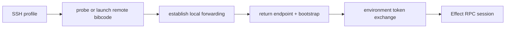

# Remote architecture

A BiBCode server represents one execution environment: the machine, filesystem,
credentials, provider processes, terminals, repositories, and durable server
state reached through that server. A client may retain several routes to that
same environment without duplicating its projects or changing its identity.
Exactly one verified route owns the live session at a time.

## Design rules

- One server process represents one environment.
- Access and launch are separate decisions. A route says how to connect; WSL
  and SSH may additionally launch or discover a server before creating a
  desktop-owned loopback forwarder.
- `environmentId` is the stable logical routing identity. URLs, tunnel
  hostnames, SSH ports, and labels may change without creating a new logical
  environment, but this ID alone does not identify its persistent store.
- Current servers expose the persistent store UUID as `storageInstanceId` on
  every descriptor. New clients decode an omitted field from an older or
  third-party server as `null`.
- Distro names, SSH host aliases, URLs, ports, labels, and discovery bindings
  are mutable locators, not environment identity.
- Remote clients use the same HTTP and Effect RPC APIs as local clients.
- Credentials are exchanged for bounded sessions; raw bootstrap credentials do
  not remain in WebSocket URLs.
- Plain non-loopback HTTP and WebSocket routes are forbidden. Direct network
  access is HTTPS/WSS; local, WSL, and SSH transports terminate at a
  desktop-owned loopback address.

## Environment catalog, bindings, and routes

The normalized connection catalog stores one `KnownEnvironment` with its
accepted `environmentId`, accepted `storageInstanceId`, last verified
descriptor, client-local presentation fields, discovery bindings, and routes.
The route schemas live in
[`connection/model.ts`](../../packages/client-runtime/src/connection/model.ts).

| Route                  | Use                                                                                 |
| ---------------------- | ----------------------------------------------------------------------------------- |
| `DesktopLoopbackRoute` | The desktop's in-process or same-host server through loopback HTTP/WebSocket.       |
| `DesktopWslRoute`      | A WSL server through a desktop-owned loopback forwarder and retained WSL binding.   |
| `SshTunnelRoute`       | A Linux, Windows, or macOS SSH host prepared and forwarded by the desktop.          |
| `DirectHttpsRoute`     | An explicitly configured HTTPS/WSS server using system trust or a pinned SPKI hash. |

A `DesktopPrimaryBinding` records the primary desktop slot. A
`DesktopWslBinding` records the mutable distro locator, discovery generation,
condition, and accepted identity once proved. Bindings may exist while stopped,
unavailable, or awaiting setup. They never authorize transport and never own
project data.

At most one route may be pinned. Eligible routes are tried sequentially by
pinned route, last active route, numeric priority, then stable route ID. A
blocked route does not prevent another eligible route from connecting. A late
attempt is fenced by both environment and route generation and cannot publish a
session after reconnect, route replacement, or Forget.

Pre-v3 primary, bearer, relay, SSH, and unavailable target classes remain only
as current compatibility inputs. The v1-to-v3 migration converts safe direct
and SSH entries into routes and discards Relay-only entries and remote DPoP
tokens. Once its receipt exists, startup reads normalized environments only.

## Advertised endpoints

An `AdvertisedEndpoint` is a connection candidate, not an environment. Its
contract records:

- provider kind: core, private network, tunnel, or manual;
- HTTP and derived WebSocket base URLs;
- reachability: loopback, LAN, private network, or public;
- hosted-HTTPS and desktop compatibility;
- source and availability status.

Contracts live in
[`remoteAccess.ts`](../../packages/contracts/src/remoteAccess.ts), and URL
normalization lives in
[`advertisedEndpoint.ts`](../../packages/shared/src/advertisedEndpoint.ts).
Desktop discovery can add host capabilities such as Tailscale endpoints. The
user's default is persisted by stable endpoint ID rather than by array position.

## Access methods

### Direct bearer access

Manual pairing produces a one-time bootstrap credential and advertised
endpoint. The onboarding flow exchanges the bootstrap, verifies both returned
environment and storage identity, stores the resulting credential behind an
opaque OS-secret reference, and publishes a `DirectHttpsRoute` only after those
steps succeed. A same-host desktop loopback enrollment uses the corresponding
loopback route. WebSocket authorization uses a short-lived ticket rather than
the bootstrap value.

Pairing links may carry a bootstrap in the URL fragment. Fragments are not sent
to the hosting web server. Compatibility parsing accepts older query-form links,
but newly generated links use the fragment form.

### BiBCode Connect

BiBCode Connect is a transitional pre-v3 compatibility path scheduled for
complete removal. While it remains executable, the signed-in client discovers
linked environments from the relay. To connect,
it exchanges a Clerk token and client DPoP proof for a relay DPoP token, asks
the relay for environment status or a connection bootstrap, then exchanges that
bootstrap with the environment for a DPoP-bound access token. HTTP requests use
that token and fresh DPoP proofs; the WebSocket URL contains only a short-lived
`wsTicket`.

The relay is a legacy control plane. It verifies user and DPoP authorization, stores
environment links, provisions the managed endpoint, and brokers signed health
and mint requests. It does not become the owner of environment sessions or
provider state. See [BiBCode Connect auth flow](../cloud/bibcode-connect-auth-flow.md).

### Desktop-managed SSH

The Tauri host owns SSH, not the server or React app. It validates the SSH
profile, probes or launches `bibcode` remotely, establishes local forwarding,
and returns a local HTTP/WSS bootstrap plus bearer credential to the connection
runtime. The resulting `SshConnectionTarget` enters the same authorization and
RPC pipeline as other targets.

SSH is a desktop capability. Browser clients cannot assume a local SSH binary,
process supervision, or access to the user's SSH configuration.

The desktop host creates an unpredictable private askpass directory only while
an SSH command or live forwarding tunnel owns it. Passwords are passed only in
the child environment and are never written into the static helper scripts.
Each child reserves bounded cleanup ownership before spawn; cancellation moves
the child and helper lease together into the manager's retained reaper. Desktop
shutdown closes new SSH child admission, terminates live tunnels, and awaits all
retained reaps before releasing the exact helper files. Cleanup never recursively
removes an unexpected foreign entry from an askpass directory.

## Access versus launch

Direct HTTPS routes expect a server to be reachable through an existing
endpoint. WSL and SSH routes can prepare both the server and the transport, but
those remain separate steps internally:

Keeping launch separate prevents connection code from assuming that every
endpoint can install software, start a process, or use SSH.

## Security boundaries

- Pairing credentials and access tokens are secrets; connection catalog labels
  and endpoint metadata are not authorization.
- Catalog rows persist only opaque secret references. Secret values cross the
  typed desktop bridge and remain in the operating-system credential store;
  renderer storage is not a credential fallback.
- Bearer or DPoP authentication is performed over HTTP before a WebSocket is
  opened. Only a single-purpose, short-lived `wsTicket` appears in the socket
  URL.
- DPoP binds compatibility Connect-issued relay and environment tokens to the
  client's proof key and the target HTTP request.
- Relay request proofs and environment health/mint responses are independently
  signed and scoped to their nonce and operation.
- A tunnel changes reachability, not the environment's authorization rules.
- The in-process runtime owns its managed tunnel as an exact per-runtime helper
  root with a dedicated Unix process group or Windows Job. Shutdown closes
  tunnel admission, drains that owner, and never signals a peer runtime's tunnel.
- Direct route schemas reject plain HTTP, credentials in URLs, query strings,
  and fragments. Loopback HTTP is limited to desktop-owned local forwarding.
- Remote descriptors expose storage identity but never requested/effective
  roots, alias diagnostics, or other server filesystem paths.

Storage-identity mismatch protection applies equally to direct HTTPS,
compatibility BiBCode Connect, WSL, and desktop-managed SSH routes: a different non-null
`storageInstanceId` is blocked before synchronization. The desktop project-data
recovery screen is intentionally narrower. It can inspect or mutate only a
desktop-owned native or WSL launch plan whose root the Rust host can resolve.
It cannot open, restore, start empty, or export local-path diagnostics for a
bearer, relay, or SSH remote environment. Recovery of a remote store must be
performed on the machine that owns that server and filesystem.

## Client lifecycle versus host lifecycle

Disconnect stops this client's active transport and retains the environment.
Hide is reversible presentation metadata and retains routes, bindings, secrets,
cache, and settings. Removing one route leaves the environment and its other
routes intact.

Forget first closes client admission, cancels and awaits the environment
supervisor, deletes this client's route and cache-key secrets, and atomically
removes its routes, bindings, UI state, cache, and environment metadata. A
redacted repair receipt keeps restart admission closed if cleanup is incomplete.
Forget does not stop or uninstall the remote server and does not delete remote
projects, repositories, worktrees, or data. Those host operations require a
separate explicit, online protocol; an offline client must report their outcome
as unknown rather than success.

## Current limitations

- OS-backed protection for the desktop connection catalog is implemented on
  Windows; other platforms currently use renderer storage fallback.
- The desktop SSH launcher and forwarding implementation exist, but fresh SSH
  setup is currently blocked: its pairing step invokes the removed
  `bibcode auth pairing create` command while the native CLI exposes only
  `start` and `serve`.
- Desktop SSH and some advertised endpoint providers are host capabilities and
  are unavailable in an ordinary browser.
- Endpoint availability is advisory. The connection supervisor still verifies
  identity, authentication, and initial RPC synchronization on every attempt.
