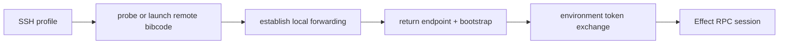

# Remote architecture

A BiBCode server represents one execution environment: the machine, filesystem,
credentials, provider processes, terminals, repositories, and durable server
state reached through that server. Clients may reach the same environment by a
direct endpoint, BiBCode Connect, or desktop-managed SSH without changing the
environment identity.

## Design rules

- One server process represents one environment.
- Access and launch are separate decisions. An endpoint says how to connect;
  SSH may additionally launch or discover a server before creating forwarding.
- `environmentId` is the stable logical routing identity. URLs, tunnel
  hostnames, SSH ports, and labels may change without creating a new logical
  environment, but this ID alone does not identify its persistent store.
- Current servers expose the persistent store UUID as `storageInstanceId` on
  direct and BiBCode Connect descriptors. New clients decode an omitted field
  from an older or third-party server as `null`.
- Remote clients use the same HTTP and Effect RPC APIs as local clients.
- Credentials are exchanged for bounded sessions; raw bootstrap credentials do
  not remain in WebSocket URLs.

## Client targets

The connection runtime defines four target types in
[`connection/model.ts`](../../packages/client-runtime/src/connection/model.ts).

| Target                    | Use                                                                                    |
| ------------------------- | -------------------------------------------------------------------------------------- |
| `PrimaryConnectionTarget` | The server supplied by the current browser or desktop host.                            |
| `BearerConnectionTarget`  | A manually saved HTTP/WSS endpoint plus a separately stored pairing credential.        |
| `RelayConnectionTarget`   | An environment discovered through BiBCode Connect and authorized with Clerk plus DPoP. |
| `SshConnectionTarget`     | A desktop-managed SSH profile that prepares a remote server and local forwarding.      |

Only bearer, relay, and SSH targets are persisted as saved connection targets.
`EnvironmentRegistry` creates one scoped supervisor per catalog entry and keeps
domain state keyed by environment.

## Advertised endpoints

An `AdvertisedEndpoint` is a connection candidate, not an environment. Its
contract records:

- provider kind: core, private network, tunnel, or manual;
- HTTP and derived WebSocket base URLs;
- reachability: loopback, LAN, private network, or public;
- hosted-HTTPS and desktop compatibility;
- source and availability status.

Contracts live in
[`remoteAccess.ts`](../../packages/contracts/src/remoteAccess.ts), and URL
normalization lives in
[`advertisedEndpoint.ts`](../../packages/shared/src/advertisedEndpoint.ts).
Desktop discovery can add host capabilities such as Tailscale endpoints. The
user's default is persisted by stable endpoint ID rather than by array position.

## Access methods

### Direct bearer access

Manual pairing produces a one-time bootstrap credential and advertised
endpoint. The onboarding flow saves the endpoint profile separately from the
credential, exchanges the bootstrap at `/oauth/token`, verifies the returned
environment identity, and obtains a WebSocket ticket from
`/api/auth/websocket-ticket`.

Pairing links may carry a bootstrap in the URL fragment. Fragments are not sent
to the hosting web server. Compatibility parsing accepts older query-form links,
but newly generated links use the fragment form.

### BiBCode Connect

The signed-in client discovers linked environments from the relay. To connect,
it exchanges a Clerk token and client DPoP proof for a relay DPoP token, asks
the relay for environment status or a connection bootstrap, then exchanges that
bootstrap with the environment for a DPoP-bound access token. HTTP requests use
that token and fresh DPoP proofs; the WebSocket URL contains only a short-lived
`wsTicket`.

The relay is a control plane. It verifies user and DPoP authorization, stores
environment links, provisions the managed endpoint, and brokers signed health
and mint requests. It does not become the owner of environment sessions or
provider state. See [BiBCode Connect auth flow](../cloud/bibcode-connect-auth-flow.md).

### Desktop-managed SSH

The Tauri host owns SSH, not the server or React app. It validates the SSH
profile, probes or launches `bibcode` remotely, establishes local forwarding,
and returns a local HTTP/WSS bootstrap plus bearer credential to the connection
runtime. The resulting `SshConnectionTarget` enters the same authorization and
RPC pipeline as other targets.

SSH is a desktop capability. Browser clients cannot assume a local SSH binary,
process supervision, or access to the user's SSH configuration.

## Access versus launch

Direct and relay targets expect a server to be reachable through an existing
endpoint. SSH can prepare both the server and the transport, but those remain
separate steps internally:

Keeping launch separate prevents connection code from assuming that every
endpoint can install software, start a process, or use SSH.

## Security boundaries

- Pairing credentials and access tokens are secrets; connection catalog labels
  and endpoint metadata are not authorization.
- Bearer or DPoP authentication is performed over HTTP before a WebSocket is
  opened. Only a single-purpose, short-lived `wsTicket` appears in the socket
  URL.
- DPoP binds Connect-issued relay and environment tokens to the client's proof
  key and the target HTTP request.
- Relay request proofs and environment health/mint responses are independently
  signed and scoped to their nonce and operation.
- A tunnel changes reachability, not the environment's authorization rules.
- The in-process runtime owns its managed tunnel as an exact per-runtime helper
  root with a dedicated Unix process group or Windows Job. Shutdown closes
  tunnel admission, drains that owner, and never signals a peer runtime's tunnel.
- Hosted HTTPS clients must not select plain-HTTP endpoints that browsers would
  block as mixed content.
- Remote descriptors expose storage identity but never requested/effective
  roots, alias diagnostics, or other server filesystem paths.

Storage-identity mismatch protection applies equally to direct bearer,
BiBCode Connect, and desktop-managed SSH targets: a different non-null
`storageInstanceId` is blocked before synchronization. The desktop project-data
recovery screen is intentionally narrower. It can inspect or mutate only a
desktop-owned native or WSL launch plan whose root the Rust host can resolve.
It cannot open, restore, start empty, or export local-path diagnostics for a
bearer, relay, or SSH remote environment. Recovery of a remote store must be
performed on the machine that owns that server and filesystem.

## Current limitations

- OS-backed protection for the desktop connection catalog is implemented on
  Windows; other platforms currently use renderer storage fallback.
- The desktop SSH launcher and forwarding implementation exist, but fresh SSH
  setup is currently blocked: its pairing step invokes the removed
  `bibcode auth pairing create` command while the native CLI exposes only
  `start` and `serve`.
- Desktop SSH and some advertised endpoint providers are host capabilities and
  are unavailable in an ordinary browser.
- Endpoint availability is advisory. The connection supervisor still verifies
  identity, authentication, and initial RPC synchronization on every attempt.
