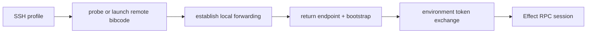

# Remote architecture

A BiBCode server represents one execution environment: the machine, filesystem,
credentials, provider processes, terminals, repositories, and durable server
state reached through that server. Clients may reach the same environment by a
direct endpoint, BiBCode Connect, or desktop-managed SSH without changing the
environment identity.

## Design rules

- One server process represents one environment.
- Access and launch are separate decisions. An endpoint says how to connect;
  SSH may additionally launch or discover a server before creating forwarding.
- `environmentId` is the stable logical routing identity. URLs, tunnel
  hostnames, SSH ports, and labels may change without creating a new logical
  environment, but this ID alone does not identify its persistent store.
- Current servers expose the persistent store UUID as `storageInstanceId` on
  direct and BiBCode Connect descriptors. New clients decode an omitted field
  from an older or third-party server as `null`.
- Remote clients use the same HTTP and Effect RPC APIs as local clients.
- Credentials are exchanged for bounded sessions; raw bootstrap credentials do
  not remain in WebSocket URLs.

## Client targets

The connection runtime defines four target types in
[`connection/model.ts`](../../packages/client-runtime/src/connection/model.ts).

| Target                    | Use                                                                                    |
| ------------------------- | -------------------------------------------------------------------------------------- |
| `PrimaryConnectionTarget` | The server supplied by the current browser or desktop host.                            |
| `BearerConnectionTarget`  | A manually saved HTTP/WSS endpoint plus a separately stored pairing credential.        |
| `RelayConnectionTarget`   | An environment discovered through BiBCode Connect and authorized with Clerk plus DPoP. |
| `SshConnectionTarget`     | A desktop-managed SSH profile that prepares a remote server and local forwarding.      |

Only bearer, relay, and SSH targets are persisted as saved connection targets.
`EnvironmentRegistry` creates one scoped supervisor per catalog entry and keeps
domain state keyed by environment.

## Advertised endpoints

An `AdvertisedEndpoint` is a connection candidate, not an environment. Its
contract records:

- provider kind: core, private network, tunnel, or manual;
- HTTP and derived WebSocket base URLs;
- reachability: loopback, LAN, private network, or public;
- hosted-HTTPS and desktop compatibility;
- source and availability status.

Contracts live in
[`remoteAccess.ts`](../../packages/contracts/src/remoteAccess.ts), and URL
normalization lives in
[`advertisedEndpoint.ts`](../../packages/shared/src/advertisedEndpoint.ts).
Desktop discovery can add host capabilities such as Tailscale endpoints. One
native address classifier owns usable-unicast admission, advertised reachability,
safe labeling, and default eligibility. Interface enumeration and default-route
ranking both call that classifier, so unspecified, loopback, multicast, and
link-local addresses fail closed. Until the desktop listener is dual-stack,
discovery emits IPv4 candidates only. It normalizes IPv4-mapped IPv6,
deduplicates by address, and ranks a usable private default-route address before
CGNAT/Tailscale and other private addresses. Native-managed sharing accepts only
private or CGNAT default-route addresses: while the native server is local-only,
public-only candidates are not actionable and the transition fails closed.
Public addresses may still be shown for an already externally managed topology,
but are never preselected and require an explicit public-address and firewall
warning. A public-only host must use an externally managed `bibcode serve`
listener or reverse proxy rather than asking the native exposure command to
infer public-listener authority. Tailscale CLI discovery checks the
packaged Windows, macOS, and Linux install paths before `PATH` and emits only
usable private IPv4 candidates. Stable endpoint IDs include the address and port,
and the user's default is persisted by stable ID rather than array position.

## Access methods

### Direct bearer access

Legacy manual pairing produces a one-time bootstrap credential and advertised
endpoint. A profile without a pinned host key saves the endpoint separately
from the credential, exchanges the bootstrap at `/oauth/token`, verifies the
returned environment identity, and obtains a WebSocket ticket from
`/api/auth/websocket-ticket`. This legacy route remains available for existing
profiles, but its connection presentation is `unencrypted` with guidance to
pair again.

Pairing links may carry a bootstrap in the URL fragment. Fragments are not sent
to the hosting web server. Compatibility parsing accepts older query-form links,
but newly generated links use the fragment form.

### Direct-connection E2EE

New direct pairings pin a server identity and carry RPC over an encrypted
WebSocket. The server generates one static X25519 responder key on first use and
stores the 64-byte private-then-public record as the secret
`host-identity-x25519` (`host-identity-x25519.bin` in the filesystem-backed
store). Public-key encoding is unpadded base64url of the raw 32 bytes. The public
key is distributed only in pairing codes; the unauthenticated descriptor never
publishes it.

The encrypted route is `/ws-e2ee` and uses
`Noise_NK_25519_ChaChaPoly_SHA256`. The client initiator pins the responder
static key from the pairing code. Both handshake messages require empty
payloads. After the handshake, every binary WebSocket message is one Noise
transport ciphertext containing one record:

- byte `0x00` marks the final chunk and byte `0x01` marks a continuation;
- a chunk is at most 65,518 bytes, keeping ciphertext within Noise's 65,535-byte
  message limit; and
- reassembled logical messages are capped at 64 MiB and at 2,048 records, and
  are exactly the bytes consumed by the unchanged RPC protocol. Empty
  continuations are invalid, so record-object overhead is bounded independently
  of byte count.

Browser clients set the E2EE socket's `binaryType` to `arraybuffer` before the
RPC socket adapter attaches. Ciphertext records therefore enter the Noise
decryptor in WebSocket delivery order without asynchronous `Blob` conversion.

The first logical message authenticates inside the encrypted channel. A new
device that supports durable delivery confirmation sends
`{"type":"e2ee_auth","pairing":"<one-time token>","pairingConfirmation":true}`.
Only a successful exchange consumes that token; a wrong host or failed
handshake does not reach the exchange. A negotiated exchange creates a
`pending-pairing` session and consumes the token before the encrypted credential
reply is delivered. Pending-session compensation is armed before the SQLite
issuance job is queued, because a queued database call can outlive cancellation
of its awaiting future. A delivery guard then owns that session until in-channel confirmation;
capacity binding, encoding, encryption, or socket-write failure schedules
best-effort revocation of the undelivered session. After delivery, verification
or client-persistence failure closes the channel and the same guard revokes the
delivered-but-unconfirmed session without replacing the original error.
The one-time token remains consumed, so the user generates a new offer, but the
pending credential cannot reconnect as steady-state authority. The server
returns `e2ee_authenticated` with the minted string credential,
`environmentId`, optional `storageInstanceId`, and
`pairingConfirmationRequired: true` only for that negotiated pending flow. A
legacy client omits `pairingConfirmation`; a new server then preserves the v1
behavior by minting an immediately active session and omitting the reply flag.
A new client talking to an older server likewise treats an absent reply flag as
an already-active credential and skips `auth.confirmPairing`. A returning device sends
`{"type":"e2ee_auth","bearer":"<stored credential>"}` and receives an
`e2ee_authenticated` acknowledgement. Invalid credentials receive
`e2ee_error/unauthorized`; malformed protocol receives `e2ee_error/protocol`;
both paths close the socket.

Sessions minted by this route have the signed token claim `transport: "e2ee"`.
Plain WebSocket and authenticated plain-HTTP surfaces reject that credential;
tokens without a transport claim decode as `plain` for compatibility. Client
preparation also sets `httpAuthorization` to `null` for a pinned profile, so an
E2EE-only credential is not exposed as a usable HTTP authorization capability.

Pre-auth work is bounded independently of normal RPC traffic. The complete
upgrade, handshake, and authentication sequence has one 10-second deadline;
the WebSocket upgrade caps both frames and reassembled WebSocket messages at
65,535 bytes before application buffering; the authentication logical message
is capped at 64 KiB; at most 32 unauthenticated E2EE connections may be in
flight. A non-loopback socket peer may hold at most four leases, consumes a
token bucket with burst eight and one-attempt-per-second refill, and shares a
network bucket with its IPv4 `/24` or IPv6 `/64`; one network may consume at
most 16 of the global leases. Loopback peers form a trusted-local-forwarder
class exempt from the public exact-peer and subnet caps but still subject to the
global and burst limits. Missing peer information uses one strict unspecified
bucket. Peer and network entries expire and remain hard-capped; the kernel
socket peer, never forwarding headers, is authoritative. Non-empty handshake
payloads fail the protocol. Failure to decrypt the first handshake message
closes with code 4403, which a pinned initiator classifies as a host-identity
mismatch. Encrypted writers iterate one plaintext record at a time, encrypt it,
release the channel lock, and await its bounded write before producing the next
record. The receiver reuses one bounded decrypt scratch buffer. Transport cipher
nonces are monotonically increasing 64-bit counters. V1 does not rekey:
exhaustion or any AEAD/protocol error fails closed and requires a new connection.

Authenticated receivers additionally share a process-wide 128 MiB plaintext
budget. Each authenticated session ID has a 64 MiB aggregate budget across all
of its sockets, and each connection retains its separate 64 MiB offender limit.
The process and principal tiers use cancellable fit-first byte admission:
capacity pressure waits until capacity, cancellation, or session shutdown and
is not itself a protocol violation. Every non-empty decrypted chunk holds its
permits through assembly, decoding, authorization, and dispatch. The permits
are released before a spawned request handler completes, so a long-running RPC
does not retain reassembly capacity. Zero-byte chunks retain no permit. Once a
continuation starts an incomplete logical message, the next record must be
received, decrypted, validated, and charged within one absolute 10-second
progress deadline; that deadline resets only after accepted progress. An idle
authenticated connection between messages has no assembly deadline. No channel
mutex or second ciphertext-frame read is held while capacity waits.

Established-socket admission is likewise partitioned. At most 64 E2EE sockets
are established process-wide, and one authenticated session ID may own at most
32 of them; unsafe no-auth development sockets remain subject to the global cap.
The global reservation is taken before credential exchange, then bound to the
authenticated session ID (the persisted session, not the human subject). The
resulting lease owns both permits until the
session ends, so handshake/authentication rejection, timeout, socket error,
session cancellation, revocation, nonce or AEAD failure, shutdown, and ordinary
close all return capacity through the same drop path. The principal budget map
holds only weak entries and prunes inactive identities while admitting a later
connection.

Established E2EE RPC output has a process-wide 128 MiB plaintext budget and a
64 MiB per-connection budget. The generic session first counts an upper bound
for serialized JSON, admits the request through one process-wide combined
fit-first queue, and reserves both byte permits in one critical section. It
never sleeps while retaining only one tier. The session then encodes once and
returns any over-reserved bytes before enqueueing the response. The queued frame owns those permits
through Noise record encryption and every successful or failed WebSocket
write;
generic queue capacity therefore cannot hide additional plaintext. Unary
results, stream chunks and terminals, RPC ping/pong control messages, protocol
errors, interrupts, and defects use the same admission path. WebSocket-level
ping/pong frames are transport control and carry no RPC plaintext. A response
larger than the 64 MiB connection cap fails the session closed immediately;
otherwise both connection and process byte admission plus the bounded 64-entry
response queue share one absolute five-second admission deadline. Fit-first
admission grants every queued request that fits in arrival order; it never turns
an aged, unfit request into a total blockade. Cancellation removes the waiter
and refunds a concurrently granted reservation exactly once. Each Noise record
then receives a fresh five-second WebSocket-sink progress deadline, while the
whole logical message is bounded by five seconds plus one second per 64 KiB of
plaintext. Records remain serialized, and the pump retains its one-second join
bound.
Dropping a queued, cancelled, rejected, serialization-failed, encryption-failed,
or write-failed frame releases its single permit set without double accounting.

Together, these limits preserve the 65,535-byte ciphertext record ceiling,
65,518-byte plaintext chunk size, and 64 MiB logical-message contract.
Established and inbound admission are principal-partitioned so one session
cannot consume all of either resource. Outbound admission instead bounds
aggregate retained plaintext; it is intentionally process/per-connection rather
than principal-partitioned. Fit-first admission prevents large queued
reservations from blocking smaller messages that can make progress; a large
reservation that never fits fails at the shared admission deadline.

The pairing payload is base64url-unpadded JSON in
`bibcode://pair?code=<payload>` with version, endpoint, display name, one-time
token, host public key, reach intent, and persistent storage identity. An
authenticated caller with `access:write` mints it through
`POST /api/auth/pairing-offer`. `Idempotency-Key` makes identical retries return
the original offer and rejects reuse with different input. Entries are scoped
to the authenticated principal and persisted in
`auth_pairing_offer_idempotency`. The pairing grant and a pending principal/key
reservation commit in one SQLite transaction; the encoded result completes that
reservation before the HTTP response is sent. After a crash in the pending
window, a matching retry under the issuance lock atomically revokes the
incomplete grant, removes the reservation, and returns the key to fresh
issuance. A fingerprint mismatch still fails and a cancellation tombstone still
blocks issuance.
Active results, pending reservations, and tombstones hydrate before capacity
checks and remain under bounded, expiring caps: 128 live entries per principal
and 4,096 globally. Expired rows are pruned at startup and inside every
reservation or cancellation transaction. For a persisted server, one immediate
SQLite transaction is the authority for a principal/key lookup, an existing or
pending result, admission under both caps, and the new pairing-plus-reservation
write. Simultaneously live services therefore return the persisted winner rather
than treating a process-local cache miss or stale capacity count as authority.
Pairing, pairing-offer, and session capacity constants live together in
`apps/server/src/auth/limits.rs`; persistence and the in-memory authority consume
that policy rather than mirroring numeric limits.
An authenticated `POST /api/auth/pairing-offer/cancel` names the same key. It
atomically revokes the mapped pairing grant and stores an expiring tombstone,
so cancellation remains safe after a lost response, across a process restart,
and before a delayed create reaches the issuance lock. A cancelled key cannot
mint or replay an offer. New tombstones obey the same durable per-principal and
global caps; replacing an existing keyed row does not consume another slot.
The server validates that `this-computer` uses loopback, `another-device` does
not use loopback, and that no offered endpoint is wildcard or port zero. Reach
is embedded in the code and persisted with the grant as described below.

The add flow parses and classifies the endpoint, fetches the public descriptor,
performs the pinned handshake and in-channel pairing, and calls authenticated
`server.getConfig` before saving anything. When both peers negotiate pairing
confirmation, the new session is persisted by the server as `pending-pairing`:
the bootstrap channel may verify RPC identity, but the delivered bearer cannot
establish a steady-state reconnect yet. The client
compares the in-channel environment and storage identities with both the pairing
payload and descriptor, registers the verified profile and credential, accepts
the storage identity, then calls the empty `auth.confirmPairing` RPC on that same
channel. Confirmation requires `access:write`, derives the session ID from the
authenticated context, and idempotently commits only that session to `active`;
the add succeeds only after that commit. Compatibility is additive: a legacy
client receives an active credential immediately, while a new client skips
confirmation when an older server omits `pairingConfirmationRequired`.

Registration, identity persistence, or confirmation failure rolls back local
writes best-effort before the bootstrap scope closes. Registration removal is
conditional on the exact registration still owning the environment, and identity
rollback restores or removes the prior value only if this attempt's value is
still current. Concurrent replacements therefore win intact. Closing before
confirmation revokes the pending server session, and startup cleanup revokes
pending sessions left by a crash; a confirmed session survives reconnect and
restart. Failures are classified as `unreachable`, `host-identity-mismatch`,
`pairing-rejected`, `incompatible`, or `duplicate-storage-identity`, and cleanup
copy reports any local compensation failure. The client does not claim
transparent retry with the same one-time code.

### Remote Servers settings and pairing entry points

Settings exposes remote connectivity at `/settings/remote-servers` as **Remote
Servers**. `/settings/connections` redirects there. On Windows desktop, WSL
backend controls remain in **Local environment** at
`/settings/local-environment`.

The **Connect to a host** tab lists saved servers with connection status,
version, compatibility, and transport security. **Add Server** accepts a
pairing code first, keeps manual endpoint-and-token entry under **Advanced**,
and presents SSH as a first-class desktop option. BiBCode Connect relay rows
remain part of the same tab. The **Share this host** tab owns exposure and
pairing-code generation for the primary environment.

Hosted `/pair` parses and normalizes its destination once before rendering or
network access. URLs with a non-empty username or password are rejected; the
confirmation displays the normalized `URL.host`, including punycode and an
explicit port, and submission uses the same normalized base URL. Both `/pair`
and the Remote Servers settings route remove a legacy query-string `code`
immediately after retaining it for the current add attempt. Saved profiles
normalize a missing, empty, or whitespace-only `hostKey` to `null` at the
catalog boundary, so only a non-empty key selects E2EE.

Connection persistence is monitored before the connection runtime starts. An
IndexedDB `VersionError` exposes an explicit destructive reset dialog that lists
the saved profiles, credentials, host identities, and cached connection state
that will be deleted. Reset requires a separate acknowledgement, so the second
click of a double-click cannot confirm destruction, and **Reload** remains a
safe alternative. IndexedDB reports blocked deletion as queued rather than
cancelled: the dialog stays pending, asks the user to close other BiBCode tabs or
windows, and observes the original request until it succeeds or errors. Generic
unavailability remains non-destructive. The app reloads automatically only
after deletion actually succeeds.

### Remote server updates

The typed update surface consists of `updater.status`, `updater.check`, and
`updater.install`. Each successful call returns a snapshot containing
`serverVersion`, nullable `latestVersion`, lifecycle `state`, nullable `error`,
and `support` (`installMode` plus `reason`). A server that cannot install on
behalf of the caller rejects `updater.install` with
`RemoteUpdateInstallError` code `remote_update_manual_required`. The TypeScript
wire contract is `packages/contracts/src/remoteUpdate.ts`; its Rust mirror and
state owner are in `apps/server/src/remote_update.rs`.

The well-known descriptor, `server.getConfig`, and the Connect/relay descriptor
all embed `remoteUpdateSupport`. Clients render update controls only when the
additive, default-false `remoteUpdateControl` capability is true. The Remote
Servers settings page checks all capable saved environments through
`packages/client-runtime/src/state/remoteUpdates.ts`, with at most two requests
in flight. Each environment check has one 30-second Effect deadline around the
whole lazy operation, including supervisor acquisition, readiness, and RPC
execution. Timeout interrupts that work and releases its fan-out worker.
Disconnecting a registered but cold environment is a no-op and never creates a
supervisor merely to disconnect it. One failed or offline environment remains **Status unavailable**
without cancelling or blocking the rest of the batch. A last-known
`update-available` snapshot also turns that environment's rail dot amber.

The update feed URL is baked into the desktop release configuration only
(`apps/desktop/src-tauri/tauri.release.conf.json`); the server binary has no
feed access. A `manual`-mode server therefore never reports a `latestVersion`:
the snapshot is honest about what the server can know, and manual-mode UI copy
instructs the operator instead of guessing. Teaching servers a feed URL is a
possible future extension, deliberately out of scope for v1.

On a desktop-integrated server, every call to the hosting updater delegate is
bounded to 30 seconds. A delegate that does not answer produces a successful
typed snapshot with `state: "error"` and the updater-timeout message, including
for an install request; it cannot pin an environment's single-flight update
operation indefinitely. Plain authenticated WebSockets enter the live-client
registry only after the HTTP upgrade completes, and unregister from the same
upgrade-owned lifecycle.

### Share ceremony and exposure

The Share tab mints the complete pairing payload on the server through
`POST /api/auth/pairing-offer`. Each minted grant records its `reach` intent and
a mint-time `off_host` classification. The classification comes from the
validated offered endpoint, so a loopback custom address used through an SSH
tunnel remains loopback while a custom LAN or public address is off-host. A
session created by consuming the grant inherits both fields.

The server is the source of truth for desired exposure.
`GET /api/auth/share-state` derives `wide` only while at least one unrevoked
pairing link or client session has `off_host = true`; it otherwise derives
`loopback`. Every active off-host session counts regardless of access method,
including `browser-session-cookie`, `bearer-access-token`, and
`dpop-access-token`; an unrevoked `pending-pairing` session also retains the
reason during client verification and persistence. Consuming a browser pairing
link therefore replaces the one-time-link reason with the browser-session reason
instead of narrowing and disconnecting the newly paired browser.

Every fresh desktop process starts the actual primary backend local-only under
the native `ServerExposureCoordinator`, regardless of a previously persisted
wide setting. Once authenticated, the renderer compares authoritative share
state with actual runtime topology and requests a widen only when a live
off-host reason exists. One coordinator serializes exposure applies and every
other settings mutation that can restart the native or WSL topology. Those
non-exposure mutations preserve the actual runtime exposure across their
restart instead of reapplying a stale durable mode. Widening uses an
ephemeral launch override, verifies a network-accessible advertised endpoint,
opens the program-scoped `BiBCode Remote Access` Windows Firewall rule, and
persists network-accessible only after those native side effects succeed. Any
failure attempts every local safeguard even if an earlier recovery step fails:
persist local-only, restart with a local-only override, close the firewall, and
stop an unverified backend. Narrowing persists local-only first, restarts and
verifies local topology, then closes the firewall; it never restores durable
wide state as compensation. On Windows, closing enumerates the persistent
firewall store, removes only the named BiBCode rule, and re-enumerates to verify
absence. Firewall commands run through the shared supervised process runner with
a 15-second process timeout, a 64 KiB truncated-output bound, and kill/reap
ownership for the process tree. A serialized firewall worker additionally gives
each caller a five-second deadline that includes spawn. Its bounded desired-state
coalescer retains at most one in-flight job and the latest pending state; a newer
pending request releases the superseded caller with an explicit saturation
error. The worker retains a late job after its caller returns; a late successful
enable is followed by a verified delete, and the latest pending firewall state
waits behind that cleanup so a timed-out add cannot become the final state. A missing rule is successful
only after its absence is verified; process, policy, and verification failures
propagate to the coordinator and are reported as incomplete cleanup. The
persisted desktop setting records the last completed transition but is neither
proof of actual topology nor permission to start wide.
Creating a **This computer only** or loopback-custom grant never widens a later
launch, and there is no independent manual exposure toggle.

A fresh start with only legacy null-reach grants remains local-only. If the last
completed native configuration was network-accessible, the Share tab shows an
explicit **Resume legacy remote access** action; it never silently widens.

This coordinator governs only a native primary. When Windows desktop is in
WSL-only mode, the Share tab chooses an available WSL-owned advertised endpoint
and neither the offer ceremony nor the reconciler calls the native exposure
bridge. The reported exposure management mode is `external`: WSL/Hyper-V routing
and firewall policy remain an operator responsibility rather than an implied
desktop guarantee. Entering WSL-only first converges native exposure to
persisted and verified local-only state and closes the Windows firewall rule,
then switches topology under the same coordinator. Leaving WSL-only starts the
native topology explicitly local-only and lets authoritative share-state
reconciliation decide whether a later widen is justified. The privileged
exposure operation rereads authoritative desktop settings inside the coordinator
and rejects native transitions while WSL-only is active.

Compatibility grants whose persisted reach and off-host fields are `NULL`
never cause an automatic widen. While any unrevoked legacy one-time-token grant
remains, they do block automatic reversion from an already-wide bind. The Share
tab identifies that condition and tells the user to revoke or re-pair those
clients. Otherwise, the renderer checks share state at startup and after every
auth-access revision. It widens a local-only runtime only when the server
currently reports a live off-host reason, and switches a wide runtime back to
loopback when the last reason is revoked. After narrowing it reads share state
once more. If a concurrent new off-host grant appeared during that operation,
it performs one compensating widen; later revisions schedule a fresh
reconciliation rather than creating an internal loop.

Revoking a client invalidates its credential and actively cancels every live
plain or E2EE WebSocket registered to that session. Revoking all other clients
does the same for each affected session. Exposure changes still use a backend
restart: live local connections and running turns drop, while committed SQLite
state and other durable server state survive. After bounded mint attempts fail,
the share ceremony makes up to three bounded cancellation attempts with the
same principal-scoped idempotency key. This revokes a grant whose successful
response was lost, or tombstones the key ahead of a delayed create. Only after
cancellation succeeds may the renderer read
share state and compensate to local-only; if cancellation cannot be confirmed,
it leaves exposure unchanged because a live credential may exist. Cleanup
reports exactly one of four outcomes: local-only was confirmed, another live
reason correctly kept the host wide, cancellation was unconfirmed, or cleanup
failed and topology could not be verified. No copy promises narrowing without
the local-only confirmation. The direct path does
not depend on an auth revision event that may never arrive. The UI distinguishes
a successful cleanup with local-only confirmation from the other outcomes,
while the startup/revision reconciler remains a backstop. Mount and topology
generation state gate work only before the first privileged apply. Once a
local-only apply commits, its authoritative share-state refetch and, when
needed, one compensating widen use the captured bridge and must finish even if
the initiating view unmounts. Every successful apply must return the requested
actual mode; later revisions schedule fresh reconciliation.

Every auth-authority mutation increments the singleton
`auth_authority_state.revision` in the same SQLite transaction. Each live
`AuthService` owns at most one convergence watcher while it has a cached active
grant or session, a registered live connection, or a `subscribeAuthAccess`
receiver. The watcher checks only that scalar every 250 ms when authority is
unchanged; it reads and decodes one coherent, read-only pairing/offer/session
snapshot only after the revision changes or the snapshot's nearest active
expiry is reached. It stops after the final authority consumer disappears and
uses a release-and-recheck handoff so a concurrent subscriber or grant cannot
lose watcher ownership. Thus a committed change on another live service is
eligible for reconciliation on the next 250 ms check (plus the bounded SQLite
queue/read), without a poller per socket or repeated full-table scans on idle
ticks. Reconciliation cancels removed sessions' local connection tokens while
holding the service state lock and before publishing access changes, so an
already-ACKed stream closes before later authority events are admitted. Local
revocation still cancels immediately without waiting for the watcher.
Live-connection registration arms its RAII guard immediately after the
in-memory count and cancellation token are published, before awaiting SQLite
connected-state persistence. Cancellation or persistence failure therefore
removes the token and count even when the database job remains queued.

Each pairing-offer create attempt and cancellation has a five-second deadline
at both the primary HTTP Effect and ceremony boundary. The HTTP deadline
interrupts the underlying request; the outer deadline also bounds injected or
test transports that never settle. Five create attempts remain separated by
the existing two-second backoff. A blackholed response therefore reaches the
explicit cancellation/cleanup result instead of leaving the renderer waiting
indefinitely after a native widen.

Privileged native exposure mutations are not raced against those renderer HTTP
deadlines. The renderer awaits the serialized native coordinator to completion,
whose restart, process, firewall, and cleanup operations own their own bounded
deadlines. This prevents the UI from reporting a failed transition while an
uncancelable desktop command later commits a wide topology.

A wide-bound native primary does not expose the desktop-only maintenance API.
Update protection therefore degrades while sharing until exposure returns to
loopback; update preparation must not assume maintenance routes exist in that
state.

Pairing links converge on that Add Server flow. Web clients accept
`/pair?code=...`; desktop bundles register `bibcode://pair?code=...` with the
Tauri deep-link plugin and use the single-instance plugin to route links to the
running application. Both entry points open Remote Servers with the code
prefilled. macOS scheme registration happens when the application bundle is
created, so custom-scheme links cannot be validated against an unbundled dev
process.

A saved direct bearer profile with a non-null `hostKey` always selects
`/ws-e2ee`; no `/oauth/token` or `/api/auth/websocket-ticket` request is made.
A profile whose additively decoded `hostKey` is null, empty, or whitespace is a
legacy `/ws` profile.
Relay and SSH selection is unchanged. `connectionTransportSecurity` is the
single presentation policy for `e2ee`, `unencrypted`, `channel-secured`, and
`local` badges.

Plain `/ws` explicitly caps a WebSocket frame at 16 MiB and a reassembled
WebSocket message at 64 MiB. Its authenticated session enters connected
bookkeeping only inside the successful upgrade-owned task; a failed upgrade
cannot leak a live connection count or revocation token.

#### Host-key HTTP audit

Pinned profiles allow one pre-auth HTTP request: the unauthenticated
`/.well-known/bibcode/environment` descriptor, which is only a routing hint and
is re-verified over RPC. The production call-site audit is:

| Call site or surface                                                                                                                      | Host-key verdict                                                                                                                                                                                                                            |
| ----------------------------------------------------------------------------------------------------------------------------------------- | ------------------------------------------------------------------------------------------------------------------------------------------------------------------------------------------------------------------------------------------- |
| `environment/descriptor.ts`, `authorization/service.ts`, and `connection/pairingAdd.ts` descriptor fetches                                | Allowed unauthenticated descriptor request. Pairing and reconnect both re-verify identity inside E2EE.                                                                                                                                      |
| `/oauth/token`, `/api/auth/session`, and `/api/auth/websocket-ticket` helpers in `authorization/remote.ts` and `authorization/service.ts` | Not reachable for a profile with `hostKey`; those helpers serve legacy bearer, primary, relay, and SSH flows.                                                                                                                               |
| `PreparedConnection.httpAuthorization`                                                                                                    | Explicitly `null` whenever `PreparedConnection.e2ee` is non-null. Pinned bearer credentials exist only in the E2EE auth form.                                                                                                               |
| `assets.createUrl` and `apps/web/src/assets/assetUrls.ts`                                                                                 | URL issuance is authenticated RPC over E2EE. The resulting `/api/assets/<signed capability>/<path>` GET is a documented exception: it carries a bounded, expiring, resource-scoped HMAC capability and no bearer authorization.             |
| `apps/web/src/diagnostics/downloadDiagnosticLogs.ts`                                                                                      | Direct authenticated HTTP is primary-environment-only and cannot target a saved bearer profile. Environment-scoped remote diagnostics are therefore unavailable until represented as RPC; an E2EE bearer must not be added to this request. |
| `rpc/http.ts` HTTP API client and primary/cloud-link callers                                                                              | The module is a transport constructor, not an independent request. Its host-key callers are limited to the descriptor row above; primary and Connect control-plane calls are not saved host-key targets.                                    |

### BiBCode Connect

The signed-in client discovers linked environments from the relay. To connect,
it exchanges a Clerk token and client DPoP proof for a relay DPoP token, asks
the relay for environment status or a connection bootstrap, then exchanges that
bootstrap with the environment for a DPoP-bound access token. HTTP requests use
that token and fresh DPoP proofs; the WebSocket URL contains only a short-lived
`wsTicket`.

The relay is a control plane. It verifies user and DPoP authorization, stores
environment links, provisions the managed endpoint, and brokers signed health
and mint requests. It does not become the owner of environment sessions or
provider state. See [BiBCode Connect auth flow](../cloud/bibcode-connect-auth-flow.md).

### Desktop-managed SSH

The Tauri host owns SSH, not the server or React app. It validates the SSH
profile, probes or launches `bibcode` remotely, establishes local forwarding,
and returns a local HTTP/WSS bootstrap plus bearer credential to the connection
runtime. The resulting `SshConnectionTarget` enters the same authorization and
RPC pipeline as other targets.

Fresh setup mints its bootstrap credential by running
`bibcode pairing issue --base-dir "$HOME/.bibcode" --json` on the remote host
(the same data root the launched `serve` uses). The command writes a one-time
administrative pairing link into that root's auth store and prints one JSON
line whose `credential` field the desktop exchanges at `/oauth/token`. Because
the server consumes pairing links from the database and the store runtime lock
is shared, the command works beside the already-running remote server without
a restart.

SSH is a desktop capability. Browser clients cannot assume a local SSH binary,
process supervision, or access to the user's SSH configuration.

The desktop host creates an unpredictable private askpass directory only while
an SSH command or live forwarding tunnel owns it. Passwords are passed only in
the child environment and are never written into the static helper scripts.
Each child reserves bounded cleanup ownership before spawn; cancellation moves
the child and helper lease together into the manager's retained reaper. Desktop
shutdown closes new SSH child admission, terminates live tunnels, and awaits all
retained reaps before releasing the exact helper files. Cleanup never recursively
removes an unexpected foreign entry from an askpass directory.

## Access versus launch

Direct and relay targets expect a server to be reachable through an existing
endpoint. SSH can prepare both the server and the transport, but those remain
separate steps internally:

Keeping launch separate prevents connection code from assuming that every
endpoint can install software, start a process, or use SSH.

## Security boundaries

- Pairing credentials and access tokens are secrets; connection catalog labels
  and endpoint metadata are not authorization.
- Bearer or DPoP authentication is performed over HTTP before a WebSocket is
  opened. Only a single-purpose, short-lived `wsTicket` appears in the socket
  URL.
- DPoP binds Connect-issued relay and environment tokens to the client's proof
  key and the target HTTP request.
- Relay request proofs and environment health/mint responses are independently
  signed and scoped to their nonce and operation.
- A tunnel changes reachability, not the environment's authorization rules.
- The in-process runtime owns its managed tunnel as an exact per-runtime helper
  root with a dedicated Unix process group or Windows Job. Shutdown closes
  tunnel admission, drains that owner, and never signals a peer runtime's tunnel.
- Hosted HTTPS clients must not select plain-HTTP endpoints that browsers would
  block as mixed content.
- Remote descriptors expose storage identity but never requested/effective
  roots, alias diagnostics, or other server filesystem paths.

Storage-identity mismatch protection applies equally to direct bearer,
BiBCode Connect, and desktop-managed SSH targets: a different non-null
`storageInstanceId` is blocked before synchronization. The desktop project-data
recovery screen is intentionally narrower. It can inspect or mutate only a
desktop-owned native or WSL launch plan whose root the Rust host can resolve.
It cannot open, restore, start empty, or export local-path diagnostics for a
bearer, relay, or SSH remote environment. Recovery of a remote store must be
performed on the machine that owns that server and filesystem.

## Current limitations

- OS-backed protection for the desktop connection catalog is implemented on
  Windows; other platforms currently use renderer storage fallback.
- Desktop SSH and some advertised endpoint providers are host capabilities and
  are unavailable in an ordinary browser.
- Endpoint availability is advisory. The connection supervisor still verifies
  identity, authentication, and initial RPC synchronization on every attempt.
