# Remote architecture

A BiBCode server represents one execution environment: the machine, filesystem,
credentials, provider processes, terminals, repositories, and durable server
state reached through that server. A client may retain several routes to that
same environment without duplicating its projects or changing its identity.
Exactly one verified route owns the live session at a time.

## Design rules

- One server process represents one environment.
- Access and launch are separate decisions. A route says how to connect; WSL
  and SSH may additionally launch or discover a server before creating a
  desktop-owned loopback forwarder.
- `environmentId` is the stable logical routing identity. URLs, tunnel
  hostnames, SSH ports, and labels may change without creating a new logical
  environment, but this ID alone does not identify its persistent store.
- Current servers expose the persistent store UUID as `storageInstanceId` on
  every descriptor. New clients decode an omitted field from an older or
  third-party server as `null`.
- Distro names, SSH host aliases, URLs, ports, labels, and discovery bindings
  are mutable locators, not environment identity.
- Remote clients use the same HTTP and Effect RPC APIs as local clients.
- Credentials are exchanged for bounded sessions; raw bootstrap credentials do
  not remain in WebSocket URLs.
- Plain non-loopback HTTP and WebSocket routes are forbidden. Direct network
  access is HTTPS/WSS; local, WSL, and SSH transports terminate at a
  desktop-owned loopback address.

## Listener, trust, and authority matrix

| Route            | Server-facing listener                                                 | Transport trust                                                       | Host-control channel                                                          |
| ---------------- | ---------------------------------------------------------------------- | --------------------------------------------------------------------- | ----------------------------------------------------------------------------- |
| Desktop loopback | Numeric loopback HTTP/WebSocket                                        | Desktop-owned bootstrap and verified environment/storage descriptor   | Desktop bridge or protected local control                                     |
| WSL/SSH          | Remote loopback HTTP/WebSocket behind a desktop-owned loopback forward | SSH host/key policy plus verified environment/storage descriptor      | Desktop bridge for the forward; local control or SSH shell on the server host |
| Direct HTTPS     | Non-loopback HTTPS/WSS                                                 | System certificate trust or an explicitly configured SPKI SHA-256 pin | Local control or SSH shell; network RPC has no host authority                 |

No route can opt into plain non-loopback HTTP. Descriptor fingerprints do not
replace certificate trust. Pairing and DPoP authenticate the client after the
transport is trusted; they do not repair an untrusted TLS connection.

## Environment catalog, bindings, and routes

The normalized connection catalog stores one `KnownEnvironment` with its
accepted `environmentId`, accepted `storageInstanceId`, last verified
descriptor, client-local presentation fields, discovery bindings, and routes.
The route schemas live in
[`connection/model.ts`](../../packages/client-runtime/src/connection/model.ts).

| Route                  | Use                                                                                 |
| ---------------------- | ----------------------------------------------------------------------------------- |
| `DesktopLoopbackRoute` | The desktop's in-process or same-host server through loopback HTTP/WebSocket.       |
| `DesktopWslRoute`      | A WSL server through a desktop-owned loopback forwarder and retained WSL binding.   |
| `SshTunnelRoute`       | A Linux, Windows, or macOS SSH host prepared and forwarded by the desktop.          |
| `DirectHttpsRoute`     | An explicitly configured HTTPS/WSS server using system trust or a pinned SPKI hash. |

A `DesktopPrimaryBinding` records the primary desktop slot. A
`DesktopWslBinding` records the mutable distro locator, discovery generation,
condition, and accepted identity once proved. Bindings may exist while stopped,
unavailable, or awaiting setup. They never authorize transport and never own
project data.

At most one route may be pinned. Eligible routes are tried sequentially by
pinned route, last active route, numeric priority, then stable route ID. A
blocked route does not prevent another eligible route from connecting. A late
attempt is fenced by both environment and route generation and cannot publish a
session after reconnect, route replacement, or Forget.

Pre-v3 primary, bearer, relay, SSH, and unavailable target classes remain only
as current compatibility inputs. The v1-to-v3 migration converts safe direct
and SSH entries into routes and discards Relay-only entries and remote DPoP
tokens. Once its receipt exists, startup reads normalized environments only.
The legacy SSH broker itself cannot create a pairing: an entry that was not
safely migrated must be explicitly re-enrolled so accepted storage and protocol
identity are available before native pairing.

## Advertised endpoints

An `AdvertisedEndpoint` is a connection candidate, not an environment. Its
contract records:

- provider kind: core, private network, tunnel, or manual;
- HTTP and derived WebSocket base URLs;
- reachability: loopback, LAN, private network, or public;
- hosted-HTTPS and desktop compatibility;
- source and availability status.

Contracts live in
[`remoteAccess.ts`](../../packages/contracts/src/remoteAccess.ts), and URL
normalization lives in
[`advertisedEndpoint.ts`](../../packages/shared/src/advertisedEndpoint.ts).
Desktop discovery can add host capabilities such as Tailscale endpoints. The
user's default is persisted by stable endpoint ID rather than by array position.

## Access methods

### Direct administrator access

Manual pairing produces a one-time bootstrap credential and advertised
endpoint. The onboarding flow creates a client DPoP key, exchanges the
bootstrap with an exact-method/exact-URL proof, verifies both returned
environment and storage identity, stores the resulting DPoP material behind
opaque OS-secret references, and publishes a `DirectHttpsRoute` only after
those steps succeed. A same-host desktop loopback enrollment uses the
corresponding loopback route. WebSocket authorization uses a one-use,
short-lived ticket rather than the bootstrap or access token.

Pairing links may carry a bootstrap in the URL fragment. Fragments are not sent
to the hosting web server. Compatibility parsing accepts older query-form links,
but newly generated links use the fragment form.

The server retains only a SHA-256 hash and short fingerprint for a pairing.
Consumption, client-session creation, and a bounded five-minute exchange
receipt commit atomically. A same-key lost-response retry returns the same
logical session; a different key fails. Administrative lists and access events
never contain the raw pairing value, and revoking a client closes its live
socket.

### BiBCode Connect

BiBCode Connect is a transitional pre-v3 compatibility path scheduled for
complete removal. While it remains executable, the signed-in client discovers
linked environments from the relay. To connect,
it exchanges a Clerk token and client DPoP proof for a relay DPoP token, asks
the relay for environment status or a connection bootstrap, then exchanges that
bootstrap with the environment for a DPoP-bound access token. HTTP requests use
that token and fresh DPoP proofs; the WebSocket URL contains only a short-lived
`wsTicket`.

The relay is a legacy control plane. It verifies user and DPoP authorization, stores
environment links, provisions the managed endpoint, and brokers signed health
and mint requests. It does not become the owner of environment sessions or
provider state. See [BiBCode Connect auth flow](../cloud/bibcode-connect-auth-flow.md).

### Desktop-managed SSH

The Tauri host owns SSH, not the server or React app. It validates the SSH
profile, uses the user's OpenSSH configuration and `known_hosts` policy, probes
or launches `bibcode` remotely, and establishes local forwarding. It never
disables host-key checking or substitutes a private empty `known_hosts` file.
Unknown and changed host keys are distinct failures, and a successful trust
probe publishes only the observed non-secret host-key fingerprint. A saved SSH
route pins that fingerprint in addition to continuing to use OpenSSH policy.

Before any password-capable connection, the desktop resolves the bounded
effective configuration with `ssh -G`. An effective custom `KnownHostsCommand`
is unsupported and fails closed: composing arbitrary user lookup commands with
BiBCode's verifier would make ordering and trust ambiguous. The connection then
adds a destination-process `KnownHostsCommand` helper that receives OpenSSH's
SHA-256 `%f` value before user authentication, compares it exactly with the
saved pin (or writes the enrollment observation to a private one-use file), and
emits no host-key line. The normal user/system `known_hosts` sources therefore
remain independently authoritative; BiBCode's helper adds pinning but cannot
make an unknown or changed key trusted. ProxyJump debug output and merged stderr
are not trust inputs.

Launch, stop, and pairing also wait for the destination command marker before
writing any remote script byte. That is a secondary command/readiness barrier,
after the pre-authentication pin check, and prevents a policy-trusted key
rotation between probe and command from running the script on the wrong host.

The native bootstrap contains only the target, numeric loopback HTTP/WebSocket
endpoints, and observed host-key fingerprint. Through that tunnel, the client
fetches a bounded descriptor and verifies the accepted environment UUID,
storage UUID, and supported protocol before pairing is allowed. The native
pairing command first opens one TCP stream through the verified tunnel, refetches
and requires the exact same descriptor on that stream, creates the administrator
pairing through the protected remote control channel, and redeems it over the
same retained stream. If the tunnel exits, that stream fails closed; a local
process that later rebinds the released forwarding port cannot receive the
one-time credential. Native remote API
requests reject redirects and disable system/environment proxies, so neither a
server nor a proxy can replay a pairing form or bearer request away from the
verified numeric-loopback endpoint. The raw pairing
credential never crosses the desktop bridge into JavaScript. The returned
administrator session is immediately placed behind the normalized route's OS
secret reference before the route is published. The resulting
`SshConnectionTarget` enters the same authorization and RPC pipeline as other
targets. A normalized SSH route missing either that secret reference or its
saved host fingerprint is blocked for explicit re-enrollment; it never creates
an ephemeral pairing during reconnect.

SSH is a desktop capability. Browser clients cannot assume a local SSH binary,
process supervision, or access to the user's SSH configuration.

The desktop host creates an unpredictable private askpass directory only while
an SSH command or live forwarding tunnel owns it. Passwords are passed only in
the direct destination SSH child's environment and are never written into the
static helper scripts. Every SSH child first removes ambient BiBCode SSH and
askpass variables, then adds only the values owned by that invocation. An
effective `SendEnv` pattern that could forward any private BiBCode SSH variable
is rejected before authentication. ProxyJump and ProxyCommand remain supported
with key or agent authentication, but password fallback is rejected before the
password prompt because a proxy child or command inherits the outer process
environment. Direct SSH password authentication remains supported.
Each child reserves bounded cleanup ownership before spawn; cancellation moves
the child and helper lease together into the manager's retained reaper. Desktop
shutdown closes new SSH child admission, terminates live tunnels, and awaits all
retained reaps and stderr I/O tasks before releasing the exact helper files.
Cleanup never recursively removes an unexpected foreign entry from an askpass
directory.

Every native SSH attempt is owned by one UUID operation ID plus the current
environment and route/binding generations. Only one operation may mutate a
host generation. A newer generation cancels and drains the older owner before
it may publish; a duplicate generation is rejected; exact cancellation waits
for that owner to release its prompt, process, transfer, and readiness work.
Global provisioning and live-tunnel admission are bounded separately, and SSH
children reserve the bounded reaper before spawn. Forget closes host admission
before cancellation, so a late command or tunnel cannot republish the forgotten
generation.

Cancellation reaches effective-config resolution, host-key probing, password
presentation, signed-artifact resolution/download, transfer/install commands,
tunnel readiness, and setup descriptor verification. Once mutation has begun,
the owner retains its provisioning slot while rollback runs with a fresh,
independently bounded cleanup token and the already cached authentication mode;
rollback never opens a new password prompt. Descriptor validation and terminal
completion share the coordinator fence: cancellation that wins first rolls the
mutation back, while a completion claim that wins first makes replacement wait
for final staging cleanup. The terminal setup result distinguishes `cancelled`
from `failed` and reports whether cleanup completed. A tunnel that was already
readiness-checked and published is retained for healthy route reuse; Disconnect
or Forget owns its later local termination.

Disconnect and Forget require the normalized route's saved host-key pin. The
pin is validated against an active tunnel before that tunnel is removed, so an
invalid or changed caller pin leaves the live transport and its prior admission
fence untouched. Successful cleanup closes host admission, drains native owners, revokes target-specific
setup consent, terminates and reaps the local tunnel, and clears cached local
authentication before acknowledgement. It deliberately makes no SSH network
request and leaves the remote service and all remote data untouched. A legacy
route without a pin can be removed locally, but BiBCode does not self-pin or run
an unauthenticated remote uninstall/stop for it.

This local-only boundary is visible in removal UX. The ordinary action removes
the client route, credentials, bindings, and cached presentation after its
owned tunnel is drained; it cannot claim that the remote server or its data was
removed. A future optional remote uninstall must be a separate, online,
host-authorized operation with its own preview and result. If that operation is
unavailable or fails, the user may explicitly force local removal only after a
warning that the remote service, projects, worktrees, credentials, and data may
continue to exist. Force removal must never infer success for remote cleanup.

### Desktop-managed WSL

Each Running WSL distribution has its own Linux server bound to numeric distro
loopback. The Tauri host binds a distinct numeric Windows loopback port and
publishes only that local endpoint. Each accepted socket owns one structured,
shell-free command:

```text
wsl.exe --distribution <validated-name> --exec <verified-bibcode-path> \
  transport stdio-forward --loopback-port <distro-loopback-port>
```

The internal transport accepts only a non-zero numeric port, connects only to
`127.0.0.1`, and copies opaque bytes in both directions. Its setup connection
is bounded; an established HTTP upgrade or WebSocket stream has no transport
deadline. Windows and distro ports are deliberately distinct so WSL NAT and
mirrored networking cannot turn the forward into a wildcard or same-port bind
collision.

The desktop generation-fences the published endpoint and owns the listener,
WSL server process, and every per-connection child as one lifecycle. Forward
children use the shared process-tree supervisor (Windows Job Object on Windows),
stderr and concurrency are bounded, and cancellation or either owner failing
terminates and reaps the other side before restart. A distro name and Linux
binary path are validated arguments, never shell text. Neither a WSL IP address
nor a bootstrap compatibility flag grants network admission.

WSL discovery and software setup are separate. Setup accepts only a fresh
authoritative discovery generation whose selected distribution is already
`Running`; it never starts a stopped distribution. The probe uses structured
`wsl.exe --distribution <name> --exec <program> <args...>` commands to read the
Linux architecture, home/data roots, managed binary version, `tar`
availability, and free space. No probe is interpolated into shell text.

Discovery is also separate from catalog acceptance. Every `Running`
distribution is presented as an environment candidate. A previously accepted
`Stopped` distribution remains in the environment hierarchy as unavailable;
an unaccepted stopped distribution remains only in **Add Environment** until
the user starts it. Running distributions without a compatible server are
shown as **Setup required**, and setup never begins before one-use consent.
BiBCode never invokes `wsl --unregister` or another distribution-deletion
operation.

The native discovery owner emits generation-numbered snapshots. The renderer
subscribes once per mounted topology owner, single-flights focus/manual refresh,
and uses a five-minute refresh only as a missed-event safety net. Failed or
stale discovery retains accepted bindings and their last verified identity;
it cannot convert a distro name into environment identity, delete a route, or
adopt a replacement UUID. A verified rename moves the accepted binding to the
new locator. A locator that reports another environment or storage UUID is
blocked as an identity conflict until the user resolves it.

Each active WSL setup is keyed by its request ID and probe generation. Byte and
stage progress is emitted only while that exact generation remains active.
Cancellation during download, transfer, atomic install, backend restart, or
descriptor verification preserves or restores the previous `current` target,
uses an independent cleanup token, and suppresses stale progress/publication.
The terminal progress event is serialized against the next generation and uses
the exact result status (`completed`, `cancelled`, or `failed`). Desktop shutdown
cancels every active setup and waits for rollback and staging cleanup to finish.

An incompatible or absent managed runtime produces one short-lived,
generation-bound consent document before mutation. It names the exact version,
architecture, signed-manifest source, byte size, per-user install destination,
data root, process behavior, and command summaries. Acceptance is one-use.
The desktop downloads the exact Linux `tar.gz` manifest tuple over HTTPS,
verifies the manifest and artifact with the compiled BiBCode Minisign trust
anchor plus SHA-256 and exact size, streams it with bounded memory, and repeats
SHA-256 inside WSL. Alternate manifest URLs cannot replace the compiled public
key.

Packages are extracted under
`$HOME/.local/share/bibcode/server/versions`; only after the staged executable
reports the consented version does a same-filesystem rename replace the
`current` symlink. The previous target remains until the restarted,
desktop-owned loopback server returns a descriptor with the consented version,
Linux architecture, supported protocol, UUID environment/storage identities,
and `loopback-http` transport. Cancellation, start failure, or descriptor
failure restores the previous link, cleans exact staging paths, and reports
typed partial/cleanup state. The backend prefers this managed `current` path;
the explicit `BIBCODE_WSL_SERVER_BINARY` and cross-compiled target paths remain
development fallbacks so existing source-worktree workflows continue to work.

## Access versus launch

Direct HTTPS routes expect a server to be reachable through an existing
endpoint. WSL and SSH routes can prepare both the server and the transport, but
those remain separate steps internally:

```mermaid
flowchart LR
  Profile["SSH profile"] --> Trust["OpenSSH host trust"]
  Trust --> Probe["probe remote host"]
  Probe --> Launch["ensure remote bibcode"]
  Launch --> Forward["establish local loopback forward"]
  Forward --> Descriptor["fetch bounded descriptor"]
  Descriptor --> Identity["verify environment + storage + protocol"]
  Identity --> Pair["native create + redeem pairing"]
  Pair --> Secret["persist session in OS secret provider"]
  Secret --> RPC["Effect RPC session"]
```



Keeping launch separate prevents connection code from assuming that every
endpoint can install software, start a process, or use SSH.

## Security boundaries

- Pairing credentials and access tokens are secrets; connection catalog labels
  and endpoint metadata are not authorization.
- Catalog rows persist only opaque secret references. Secret values cross the
  typed desktop bridge and remain in the operating-system credential store;
  renderer storage is not a credential fallback.
- Authentication is performed over HTTP before a WebSocket is opened. Remote
  pairing sessions require DPoP; bearer exchange is limited to the host-local
  desktop bootstrap. Only a single-purpose, one-use, short-lived `wsTicket`
  appears in the socket URL.
- DPoP binds compatibility Connect-issued relay and environment tokens to the
  client's proof key and the target HTTP request.
- Relay request proofs and environment health/mint responses are independently
  signed and scoped to their nonce and operation.
- A tunnel changes reachability, not the environment's authorization rules.
- The in-process runtime owns its managed tunnel as an exact per-runtime helper
  root with a dedicated Unix process group or Windows Job. Shutdown closes
  tunnel admission, drains that owner, and never signals a peer runtime's tunnel.
- Direct route schemas reject plain HTTP, credentials in URLs, query strings,
  and fragments. Loopback HTTP is limited to desktop-owned local forwarding.
- Remote descriptors expose storage identity but never requested/effective
  roots, alias diagnostics, or other server filesystem paths.
- Host-local status, pairing issuance, update preparation, and service stop are
  a closed, bounded local-control protocol, not HTTP/RPC methods. Unix servers
  require a service-owned `0700` parent, a `0600` socket, and an authorized peer
  UID; Windows creates a remote-rejecting named pipe with an explicit
  service-account/Administrators DACL and validates the impersonated client
  token. Network administrator sessions do not gain host-control authority.

The network-visible server configuration contains only a redacted service view:
mode, startup mechanism, runtime state, version, bind posture, account kind,
update state, and allowed host-authority channels. It never exposes the control
endpoint, service credentials, raw environment variables, binary/data/backup
paths, or permission-changing actions. A network host-action request fails with
the typed `hostAuthorityRequired` result.

Storage-identity mismatch protection applies equally to direct HTTPS,
compatibility BiBCode Connect, WSL, and desktop-managed SSH routes: a different non-null
`storageInstanceId` is blocked before synchronization. The desktop project-data
recovery screen is intentionally narrower. It can inspect or mutate only a
desktop-owned native or WSL launch plan whose root the Rust host can resolve.
It cannot open, restore, start empty, or export local-path diagnostics for a
bearer, relay, or SSH remote environment. Recovery of a remote store must be
performed on the machine that owns that server and filesystem.

## Client lifecycle versus host lifecycle

Disconnect stops this client's active transport and retains the environment.
Hide is reversible presentation metadata and retains routes, bindings, secrets,
cache, and settings. Removing one route leaves the environment and its other
routes intact.

Forget first closes client admission, cancels and awaits the environment
supervisor, drains native SSH ownership and local tunnels, deletes this client's
route and cache-key secrets, and atomically removes its routes, bindings, UI
state, cache, and environment metadata. A redacted repair receipt keeps restart
admission closed if native cleanup or persistence cleanup is incomplete.
Forget does not stop or uninstall the remote server and does not delete remote
projects, repositories, worktrees, or data. Those host operations require a
separate explicit, online protocol; an offline client must report their outcome
as unknown rather than success.

The currently active host-local stop path sends its acknowledgement before
cancelling the server, closes new local-control admission, drains accepted
requests, and releases the database/store guard only after both network and
control tasks join. Service installation/uninstallation and remote data purge
remain outside that command and are not implied by Forget.

`bibcode auth pairing create` is the only current CLI client of this control
channel. It resolves the same data root as the server, verifies the durable
environment marker and response identity/expiry, and emits either a single JSON
document or a human pairing URL. It has no HTTP fallback and grants one fixed
environment-administrator scope set rather than exposing permission levels.

The same protected channel coordinates service stop and update preparation.
Managed workstation/headless services remain loopback-only. Their native
Task Scheduler/SCM, launchd, or systemd registration is owned by the host CLI,
not by network RPC. See [Server administration](../user/server-administration.md)
and [Runtime and process model](./runtime-process-model.md).

## Current limitations

- Desktop secret references resolve through the native keyring on macOS/Linux
  and DPAPI-protected per-user storage on Windows. Enrollment fails closed when
  that provider is unavailable or locked; renderer storage is not a fallback.
- Desktop **Add environment > SSH** probes Linux, macOS, and Windows OpenSSH
  targets through fixed native command adapters. A compatible loopback service
  can be enrolled directly. Otherwise the desktop resolves one exact signed
  server artifact, shows a one-use consent summary, downloads and verifies it
  locally, transfers it over the pinned SSH connection, verifies its hash and
  size again remotely, and installs it with bounded commands and output. Dynamic
  paths cross as quoted argv on POSIX or JSON stdin to a repository-owned
  encoded PowerShell command on Windows; the renderer never supplies a shell
  script or receives pairing credentials. Portable versions are promoted by an
  atomic same-filesystem rename and the prior binary/service definition is kept
  until service health and the canonical public descriptor are verified.
- Headless SSH setup requires noninteractive administrator authority and a
  portable artifact so a native package cannot create a transient workstation
  service. Linux uses `/opt/bibcode/server`, macOS uses
  `/Library/Application Support/BiBCode Server`, and Windows uses the host's
  `ProgramData\\BiBCode\\Server` tree. The payload is copied into an
  administrator-owned staging directory, its signed hash and byte count are
  checked again there, and the promoted files remain administrator-owned with
  non-administrator write access removed. All verified services bind remote
  loopback and are reached only by a desktop-owned numeric-loopback SSH forward.
  The older transient POSIX launch path still requires `ss` or readable Linux
  `/proc/net/tcp{,6}` for safe port selection and fails closed when occupancy is
  indeterminate.
- Desktop route attempts pass their exact environment and route generations to
  the native SSH owner. Aborting an in-flight ensure invokes exact native
  cancellation and waits for owner drain; newer generations and Forget also
  fence late publication. A readiness-checked tunnel that completed before the
  abort remains an intentional reusable route transport until Disconnect or
  Forget removes it.
- Desktop SSH and some advertised endpoint providers are host capabilities and
  are unavailable in an ordinary browser.
- Endpoint availability is advisory. The connection supervisor still verifies
  identity, authentication, and initial RPC synchronization on every attempt.
