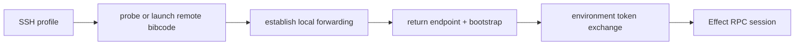

# Remote architecture

A BiBCode server represents one execution environment: the machine, filesystem,
credentials, provider processes, terminals, repositories, and durable server
state reached through that server. Clients may reach the same environment by a
direct endpoint, BiBCode Connect, or desktop-managed SSH without changing the
environment identity.

## Design rules

- One server process represents one environment.
- Access and launch are separate decisions. An endpoint says how to connect;
  SSH may additionally launch or discover a server before creating forwarding.
- `environmentId` is the stable logical routing identity. URLs, tunnel
  hostnames, SSH ports, and labels may change without creating a new logical
  environment, but this ID alone does not identify its persistent store.
- Current servers expose the persistent store UUID as `storageInstanceId` on
  direct and BiBCode Connect descriptors. New clients decode an omitted field
  from an older or third-party server as `null`.
- Remote clients use the same HTTP and Effect RPC APIs as local clients.
- Credentials are exchanged for bounded sessions; raw bootstrap credentials do
  not remain in WebSocket URLs.

## Client targets

The connection runtime defines four target types in
[`connection/model.ts`](../../packages/client-runtime/src/connection/model.ts).

| Target                    | Use                                                                                    |
| ------------------------- | -------------------------------------------------------------------------------------- |
| `PrimaryConnectionTarget` | The server supplied by the current browser or desktop host.                            |
| `BearerConnectionTarget`  | A manually saved HTTP/WSS endpoint plus a separately stored pairing credential.        |
| `RelayConnectionTarget`   | An environment discovered through BiBCode Connect and authorized with Clerk plus DPoP. |
| `SshConnectionTarget`     | A desktop-managed SSH profile that prepares a remote server and local forwarding.      |

Only bearer, relay, and SSH targets are persisted as saved connection targets.
`EnvironmentRegistry` creates one scoped supervisor per catalog entry and keeps
domain state keyed by environment.

## Advertised endpoints

An `AdvertisedEndpoint` is a connection candidate, not an environment. Its
contract records:

- provider kind: core, private network, tunnel, or manual;
- HTTP and derived WebSocket base URLs;
- reachability: loopback, LAN, private network, or public;
- hosted-HTTPS and desktop compatibility;
- source and availability status.

Contracts live in
[`remoteAccess.ts`](../../packages/contracts/src/remoteAccess.ts), and URL
normalization lives in
[`advertisedEndpoint.ts`](../../packages/shared/src/advertisedEndpoint.ts).
Desktop discovery can add host capabilities such as Tailscale endpoints. The
user's default is persisted by stable endpoint ID rather than by array position.

## Access methods

### Direct bearer access

Legacy manual pairing produces a one-time bootstrap credential and advertised
endpoint. A profile without a pinned host key saves the endpoint separately
from the credential, exchanges the bootstrap at `/oauth/token`, verifies the
returned environment identity, and obtains a WebSocket ticket from
`/api/auth/websocket-ticket`. This legacy route remains available for existing
profiles, but its connection presentation is `unencrypted` with guidance to
pair again.

Pairing links may carry a bootstrap in the URL fragment. Fragments are not sent
to the hosting web server. Compatibility parsing accepts older query-form links,
but newly generated links use the fragment form.

### Direct-connection E2EE

New direct pairings pin a server identity and carry RPC over an encrypted
WebSocket. The server generates one static X25519 responder key on first use and
stores the 64-byte private-then-public record as the secret
`host-identity-x25519` (`host-identity-x25519.bin` in the filesystem-backed
store). Public-key encoding is unpadded base64url of the raw 32 bytes. The public
key is distributed only in pairing codes; the unauthenticated descriptor never
publishes it.

The encrypted route is `/ws-e2ee` and uses
`Noise_NK_25519_ChaChaPoly_SHA256`. The client initiator pins the responder
static key from the pairing code. Both handshake messages require empty
payloads. After the handshake, every binary WebSocket message is one Noise
transport ciphertext containing one record:

- byte `0x00` marks the final chunk and byte `0x01` marks a continuation;
- a chunk is at most 65,518 bytes, keeping ciphertext within Noise's 65,535-byte
  message limit; and
- reassembled logical messages are capped at 64 MiB and are exactly the bytes
  consumed by the unchanged RPC protocol.

The first logical message authenticates inside the encrypted channel. A new
device sends `{"type":"e2ee_auth","pairing":"<one-time token>"}`. Only a
successful exchange consumes that token; a wrong host, failed handshake, or
transport loss leaves it retryable. The server returns
`e2ee_authenticated` with the minted string credential plus `environmentId` and
`storageInstanceId`. A returning device sends
`{"type":"e2ee_auth","bearer":"<stored credential>"}` and receives an
`e2ee_authenticated` acknowledgement. Invalid credentials receive
`e2ee_error/unauthorized`; malformed protocol receives `e2ee_error/protocol`;
both paths close the socket.

Sessions minted by this route have the signed token claim `transport: "e2ee"`.
Plain WebSocket and authenticated plain-HTTP surfaces reject that credential;
tokens without a transport claim decode as `plain` for compatibility. Client
preparation also sets `httpAuthorization` to `null` for a pinned profile, so an
E2EE-only credential is not exposed as a usable HTTP authorization capability.

Pre-auth work is bounded independently of normal RPC traffic. The complete
upgrade, handshake, and authentication sequence has one 10-second deadline;
the authentication message is capped at 64 KiB; at most 32 unauthenticated
E2EE connections may be in flight; and non-empty handshake payloads fail the
protocol. Failure to decrypt the first handshake message closes with code 4403,
which a pinned initiator classifies as a host-identity mismatch. Encrypted
writes retain the plain session's five-second write bound and one-second pump
join bound. Transport cipher nonces are monotonically increasing 64-bit
counters. V1 does not rekey: exhaustion or any AEAD/protocol error fails closed
and requires a new connection.

The pairing payload is base64url-unpadded JSON in
`bibcode://pair?code=<payload>` with version, endpoint, display name, one-time
token, host public key, reach intent, and persistent storage identity. An
authenticated caller with `access:write` mints it through
`POST /api/auth/pairing-offer`. `Idempotency-Key` makes identical retries return
the original offer and rejects reuse with different input. The server validates
that `this-computer` uses loopback, `another-device` does not use loopback, and
that no offered endpoint is wildcard or port zero. Reach is embedded in the
code; it is not persisted as connection policy until the Phase 5 sharing UI
owns that state.

The add flow parses and classifies the endpoint, fetches the public descriptor,
performs the pinned handshake and in-channel pairing, and calls authenticated
`server.getConfig` before saving anything. It compares the in-channel
environment and storage identities with both the pairing payload and descriptor.
Failures are classified as `unreachable`, `host-identity-mismatch`,
`pairing-rejected`, `incompatible`, or `duplicate-storage-identity`. Only the
verified credential, profile, and accepted storage identity are then persisted.

A saved direct bearer profile with a non-null `hostKey` always selects
`/ws-e2ee`; no `/oauth/token` or `/api/auth/websocket-ticket` request is made.
A profile whose additively decoded `hostKey` is null is a legacy `/ws` profile.
Relay and SSH selection is unchanged. `connectionTransportSecurity` is the
single presentation policy for `e2ee`, `unencrypted`, `channel-secured`, and
`local` badges.

#### Host-key HTTP audit

Pinned profiles allow one pre-auth HTTP request: the unauthenticated
`/.well-known/bibcode/environment` descriptor, which is only a routing hint and
is re-verified over RPC. The production call-site audit is:

| Call site or surface                                                                                                                      | Host-key verdict                                                                                                                                                                                                                            |
| ----------------------------------------------------------------------------------------------------------------------------------------- | ------------------------------------------------------------------------------------------------------------------------------------------------------------------------------------------------------------------------------------------- |
| `environment/descriptor.ts`, `authorization/service.ts`, and `connection/pairingAdd.ts` descriptor fetches                                | Allowed unauthenticated descriptor request. Pairing and reconnect both re-verify identity inside E2EE.                                                                                                                                      |
| `/oauth/token`, `/api/auth/session`, and `/api/auth/websocket-ticket` helpers in `authorization/remote.ts` and `authorization/service.ts` | Not reachable for a profile with `hostKey`; those helpers serve legacy bearer, primary, relay, and SSH flows.                                                                                                                               |
| `PreparedConnection.httpAuthorization`                                                                                                    | Explicitly `null` whenever `PreparedConnection.e2ee` is non-null. Pinned bearer credentials exist only in the E2EE auth form.                                                                                                               |
| `assets.createUrl` and `apps/web/src/assets/assetUrls.ts`                                                                                 | URL issuance is authenticated RPC over E2EE. The resulting `/api/assets/<signed capability>/<path>` GET is a documented exception: it carries a bounded, expiring, resource-scoped HMAC capability and no bearer authorization.             |
| `apps/web/src/diagnostics/downloadDiagnosticLogs.ts`                                                                                      | Direct authenticated HTTP is primary-environment-only and cannot target a saved bearer profile. Environment-scoped remote diagnostics are therefore unavailable until represented as RPC; an E2EE bearer must not be added to this request. |
| `rpc/http.ts` HTTP API client and primary/cloud-link callers                                                                              | The module is a transport constructor, not an independent request. Its host-key callers are limited to the descriptor row above; primary and Connect control-plane calls are not saved host-key targets.                                    |

### BiBCode Connect

The signed-in client discovers linked environments from the relay. To connect,
it exchanges a Clerk token and client DPoP proof for a relay DPoP token, asks
the relay for environment status or a connection bootstrap, then exchanges that
bootstrap with the environment for a DPoP-bound access token. HTTP requests use
that token and fresh DPoP proofs; the WebSocket URL contains only a short-lived
`wsTicket`.

The relay is a control plane. It verifies user and DPoP authorization, stores
environment links, provisions the managed endpoint, and brokers signed health
and mint requests. It does not become the owner of environment sessions or
provider state. See [BiBCode Connect auth flow](../cloud/bibcode-connect-auth-flow.md).

### Desktop-managed SSH

The Tauri host owns SSH, not the server or React app. It validates the SSH
profile, probes or launches `bibcode` remotely, establishes local forwarding,
and returns a local HTTP/WSS bootstrap plus bearer credential to the connection
runtime. The resulting `SshConnectionTarget` enters the same authorization and
RPC pipeline as other targets.

Fresh setup mints its bootstrap credential by running
`bibcode pairing issue --base-dir "$HOME/.bibcode" --json` on the remote host
(the same data root the launched `serve` uses). The command writes a one-time
administrative pairing link into that root's auth store and prints one JSON
line whose `credential` field the desktop exchanges at `/oauth/token`. Because
the server consumes pairing links from the database and the store runtime lock
is shared, the command works beside the already-running remote server without
a restart.

SSH is a desktop capability. Browser clients cannot assume a local SSH binary,
process supervision, or access to the user's SSH configuration.

The desktop host creates an unpredictable private askpass directory only while
an SSH command or live forwarding tunnel owns it. Passwords are passed only in
the child environment and are never written into the static helper scripts.
Each child reserves bounded cleanup ownership before spawn; cancellation moves
the child and helper lease together into the manager's retained reaper. Desktop
shutdown closes new SSH child admission, terminates live tunnels, and awaits all
retained reaps before releasing the exact helper files. Cleanup never recursively
removes an unexpected foreign entry from an askpass directory.

## Access versus launch

Direct and relay targets expect a server to be reachable through an existing
endpoint. SSH can prepare both the server and the transport, but those remain
separate steps internally:

Keeping launch separate prevents connection code from assuming that every
endpoint can install software, start a process, or use SSH.

## Security boundaries

- Pairing credentials and access tokens are secrets; connection catalog labels
  and endpoint metadata are not authorization.
- Bearer or DPoP authentication is performed over HTTP before a WebSocket is
  opened. Only a single-purpose, short-lived `wsTicket` appears in the socket
  URL.
- DPoP binds Connect-issued relay and environment tokens to the client's proof
  key and the target HTTP request.
- Relay request proofs and environment health/mint responses are independently
  signed and scoped to their nonce and operation.
- A tunnel changes reachability, not the environment's authorization rules.
- The in-process runtime owns its managed tunnel as an exact per-runtime helper
  root with a dedicated Unix process group or Windows Job. Shutdown closes
  tunnel admission, drains that owner, and never signals a peer runtime's tunnel.
- Hosted HTTPS clients must not select plain-HTTP endpoints that browsers would
  block as mixed content.
- Remote descriptors expose storage identity but never requested/effective
  roots, alias diagnostics, or other server filesystem paths.

Storage-identity mismatch protection applies equally to direct bearer,
BiBCode Connect, and desktop-managed SSH targets: a different non-null
`storageInstanceId` is blocked before synchronization. The desktop project-data
recovery screen is intentionally narrower. It can inspect or mutate only a
desktop-owned native or WSL launch plan whose root the Rust host can resolve.
It cannot open, restore, start empty, or export local-path diagnostics for a
bearer, relay, or SSH remote environment. Recovery of a remote store must be
performed on the machine that owns that server and filesystem.

## Current limitations

- OS-backed protection for the desktop connection catalog is implemented on
  Windows; other platforms currently use renderer storage fallback.
- Desktop SSH and some advertised endpoint providers are host capabilities and
  are unavailable in an ordinary browser.
- Endpoint availability is advisory. The connection supervisor still verifies
  identity, authentication, and initial RPC synchronization on every attempt.
