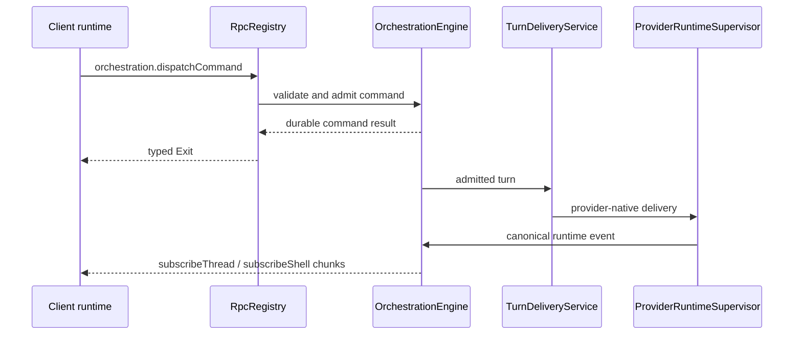

# RPC and orchestration

BiBCode uses Effect RPC over one authenticated WebSocket per connected
environment. The same protocol is used by browser and Tauri clients; the
desktop bridge is reserved for host-native capabilities.

## Session establishment

`ConnectionResolver` first produces a `PreparedConnection`. Remote bearer and
DPoP clients exchange their credential for a short-lived, one-purpose
WebSocket ticket and put only `wsTicket` on the `/ws` URL. `RpcSessionFactory`
then opens the socket, builds the Effect RPC client, and calls
`server.getConfig`. The session is ready only after both steps succeed.

Primary desktop/browser bootstraps may already have a host-authorized socket
URL, but they enter the same session and RPC pipeline.

## Wire protocol

The TypeScript client is built by
[`makeWsRpcProtocolClient`](../../packages/client-runtime/src/rpc/protocol.ts)
from the schema-only `WsRpcGroup`. The Rust mirror is
[`apps/server/src/rpc/message.rs`](../../apps/server/src/rpc/message.rs).

| Direction        | `_tag`                | Purpose                                                                           |
| ---------------- | --------------------- | --------------------------------------------------------------------------------- |
| Client to server | `Request`             | Numeric-string request ID, RPC tag, payload, headers, and optional trace context. |
| Client to server | `Ack`                 | Acknowledge streamed values for flow control.                                     |
| Client to server | `Interrupt`           | Cancel one request and its server work.                                           |
| Client to server | `Ping` / `Eof`        | Probe or close the protocol session.                                              |
| Server to client | `Chunk`               | Deliver one or more stream values.                                                |
| Server to client | `Exit`                | Complete with an Effect success or typed failure cause.                           |
| Server to client | `Defect`              | Report a protocol/session defect not tied to a normal typed failure.              |
| Server to client | `Pong`                | Answer a protocol probe.                                                          |
| Server to client | `ClientProtocolError` | Report malformed or unsupported client protocol input.                            |

Schemas validate payloads at the client boundary. The Rust session validates
request IDs, registered method names, authorization scopes, cancellation, and
stream flow before invoking handlers.

## Server composition

`ProductionRuntime::start` constructs the durable services first, then
registers their RPC adapters in `RpcRegistry`:

- `OrchestrationEngine` owns command admission, persisted events, snapshots,
  and projections;
- `ProviderRuntimeSupervisor` owns provider session processes and native
  protocol adapters;
- `TurnDeliveryService` routes admitted turns to provider runtimes while
  preserving delivery and recovery invariants;
- activity, preview, Git/VCS, terminal, settings, diagnostics, authentication,
  and lifecycle services register their own unary or streaming methods.

The authoritative method inventory is
[`ACTIVE_RPC_METHODS`](../../apps/server/src/rpc/methods.rs). The authoritative
authorization mapping is
[`required_scope`](../../apps/server/src/auth/scope.rs); adding a live method
without exactly one declared scope fails a server test.

## Worktree catalog flow

`subscribeWorktreeCatalog` publishes the server-owned latest catalog snapshot
for one persisted project through a watch-backed RPC stream: the atomic initial
read is marked seen, and acknowledgement lag replaces pending state instead of
queueing stale generations. Request cancellation also cancels bootstrap before
it can retain a catalog view. `vcs.refreshWorktreeCatalog` requests an explicit
bounded observation and returns the resulting snapshot. Both require
`orchestration:read`; clients submit only `projectId`, never baseline or
checkout paths.

`worktree.updateDiscoveryPolicy` requires `orchestration:operate`. An
acknowledgement must name the exact latest authoritative generation. The
server derives the baseline from eligible normalized paths in that snapshot,
deduplicates it, caps it at 512, and persists the complete policy through the
durable `project.meta.update` command. Mutation serialization always acquires
the stable project-identity lock before the optional physical-repository lock.
That order prevents a project from switching mutexes while its durable trust
pin is established while still serializing known cross-project repository
aliases.

`worktree.adopt` also requires `orchestration:operate`. Its public payload
contains an opaque catalog key, expected generation, project ID, command ID,
and ordinary thread defaults; it never accepts a checkout path. The handler
holds the same stable project-then-physical-repository mutation locks. A stale
or non-authoritative generation forces one bounded refresh before the server
rechecks current registration, directory presence, nonprimary/nonbare
eligibility, canonical common-directory membership, and canonical thread
ownership. Present paths are canonicalized only after current Git membership
is proven. Adoption is read-only with respect to Git: it never creates or
repairs a worktree and never auto-runs a worktree-creation script.

After resolution, the server dispatches internal
`worktree.adopt-resolved` planning. The orchestration engine creates an
ordinary workspace thread, returns an existing active owner, or restores an
archived owner while updating the discovery baseline in the same
`persist_command` transaction. The public result is exactly the canonical
thread ID plus `created`, `existing`, or `restored`; replay of an accepted
command returns the original disposition. Resolved adoption and branch
reconciliation command variants are rejected by
`orchestration.dispatchCommand` even though trusted server services may admit
them directly.

Every healthy authoritative catalog publication also compares active adopted
worktrees with durable thread branch metadata. A change dispatches one
idempotent `thread.meta-updated` command whose ID contains the thread ID plus a
versioned hash of the observed branch and HEAD, never a path. Unchanged healthy
observations emit nothing, and refreshing/degraded retained snapshots never
reconcile branch state.

The production runtime owns one catalog service built from the same Git
repository and orchestration repositories used by Git/VCS and project state.
Successful legacy create/remove worktree RPCs verify Git common-directory
identity after the mutation, canonicalize primary/canonical-thread and target
paths, and notify every matching project view with a matching durable pin (or
verified unpinned path), never an arbitrary first match. Pin mismatches and
unverifiable identities fail observation closed. Observation failure never
changes a successful Git response into a failure. Runtime shutdown permanently
closes the service under one lifecycle-registration mutex before draining
pollers, queued mutation refreshes, repository-observation leaders, scans, and
eviction work. Every spawned task registers an abort handle under that mutex
and removes it through a completion guard, so shutdown can abort and wait for
the bounded active set, and a final release racing the terminal transition
cannot register post-drain eviction. Ordinary view detach still permits an
aliased subscribed view to keep an exact-anchor repository observation alive;
terminal shutdown aborts and joins every such leader. Task registration takes
entry state before the short-lived lifecycle mutex. Shutdown holds the
lifecycle mutex only long enough to mark terminal and copy abort handles, then
releases it before acquiring the main registry, entry, or repository locks.
Observation result publication takes the lifecycle mutex before repository
state and skips publication after terminal transition. Later subscribe,
refresh, invalidation, and release paths cannot restart the service.

## Provider turn flow

Unary command acceptance is not a promise that an external provider process
will finish successfully. Provider delivery and completion are reflected by
subsequent durable orchestration events. Streaming subscriptions can be
re-established after reconnect from snapshots or replay methods rather than
depending on connection-local push caches.

### Context-window usage flow

Provider-native usage data is normalized in the server runtime as canonical
`thread.token-usage.updated`. `ProviderRuntimeSupervisor` maps that canonical
event to an informational `context-window.updated` thread activity, which the
`OrchestrationEngine` appends through the same durable event and typed
subscription path as other provider activity.

The append-only event log preserves every accepted context activity for audit
and replay. Durable projections and client snapshots retain only the latest
valid context-window activity for each turn, so a newer valid reading replaces
the prior valid reading for that turn. A malformed row cannot evict a valid row,
and reverting a turn removes only that turn's projected usage; neither behavior
creates a separate usage cache.

## Provider usage refresh

`server.getProviderUsage` reads the server's current provider-usage snapshots.
`server.refreshProviderUsage` accepts an optional provider list and an optional
boolean `force`. Omitting `force`, or sending `false`, uses the normal refresh
throttle; `force: true` starts an explicit fetch even inside that interval.
The default preserves compatibility for older clients.

Forced refresh changes admission only. It does not authorize credential
mutation or account management: provider usage fetchers remain observers of
the local provider CLI's account. The client waits for the refresh command to
settle before refreshing the query, so a committed snapshot is not displayed
one cycle late. Background status-bar polling is single-flighted separately
from a forced manual request; repeated manual activation still shares one
manual request per environment.

## Invariants

- Contracts define the wire; server and client fixtures guard compatibility.
- One connection supervisor owns reconnects. The Effect RPC protocol does not
  retry sockets independently.
- Authorization is checked at each HTTP route or RPC method, not inferred from
  successful authentication alone.
- Cancellation flows from client interrupt or socket closure into registered
  handlers and supervised processes.
- Durable orchestration state, not a WebSocket connection, is the recovery
  boundary.
