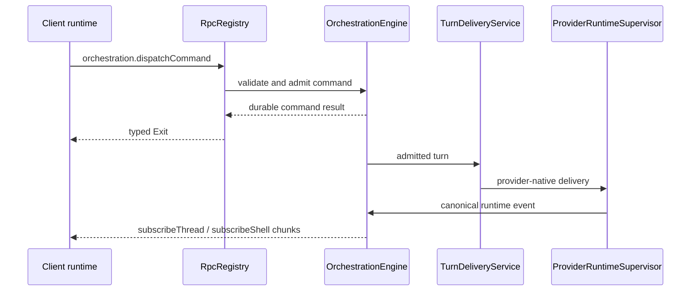
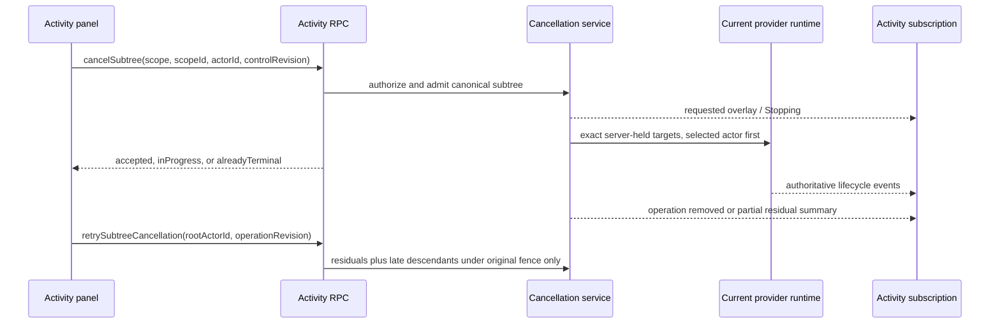

# RPC and orchestration

BiBCode uses Effect RPC over one authenticated WebSocket per connected
environment. The same protocol is used by browser and Tauri clients; the
desktop bridge is reserved for host-native capabilities.

## Session establishment

`ConnectionResolver` first produces a `PreparedConnection`. Remote bearer and
DPoP clients exchange their credential for a short-lived, one-purpose
WebSocket ticket and put only `wsTicket` on the `/ws` URL. `RpcSessionFactory`
then opens the socket, builds the Effect RPC client, and calls
`server.getConfig`. The session is ready only after both steps succeed.

Primary desktop/browser bootstraps may already have a host-authorized socket
URL, but they enter the same session and RPC pipeline.

## Wire protocol

The TypeScript client is built by
[`makeWsRpcProtocolClient`](../../packages/client-runtime/src/rpc/protocol.ts)
from the schema-only `WsRpcGroup`. The Rust mirror is
[`apps/server/src/rpc/message.rs`](../../apps/server/src/rpc/message.rs).

| Direction        | `_tag`                | Purpose                                                                           |
| ---------------- | --------------------- | --------------------------------------------------------------------------------- |
| Client to server | `Request`             | Numeric-string request ID, RPC tag, payload, headers, and optional trace context. |
| Client to server | `Ack`                 | Acknowledge streamed values for flow control.                                     |
| Client to server | `Interrupt`           | Cancel one request and its server work.                                           |
| Client to server | `Ping` / `Eof`        | Probe or close the protocol session.                                              |
| Server to client | `Chunk`               | Deliver one or more stream values.                                                |
| Server to client | `Exit`                | Complete with an Effect success or typed failure cause.                           |
| Server to client | `Defect`              | Report a protocol/session defect not tied to a normal typed failure.              |
| Server to client | `Pong`                | Answer a protocol probe.                                                          |
| Server to client | `ClientProtocolError` | Report malformed or unsupported client protocol input.                            |

Schemas validate payloads at the client boundary. The Rust session validates
request IDs, registered method names, authorization scopes, cancellation, and
stream flow before invoking handlers.

## Server composition

`ProductionRuntime::start` constructs the durable services first, then
registers their RPC adapters in `RpcRegistry`:

- `OrchestrationEngine` owns command admission, persisted events, snapshots,
  and projections;
- `ProviderRuntimeSupervisor` owns provider session processes and native
  protocol adapters;
- `ActivityCancellationService` owns bounded, generation-fenced targeted
  cancellation admission and dispatches only server-held provider targets. The
  provider supervisor accepts those targets only for the matching current live
  session, runtime generation, and control registration, then invokes the
  driver's targeted-cancellation seam outside the ordered root turn-delivery
  lane. Drivers without an exact provider-native adapter fail closed with
  `targetUnavailable`; this path never translates an activity request into a
  root turn interrupt;
- `TurnDeliveryService` routes admitted turns to provider runtimes while
  preserving delivery and recovery invariants;
- activity, preview, Git/VCS, terminal, settings, diagnostics, authentication,
  and lifecycle services register their own unary or streaming methods.

The authoritative method inventory is
[`ACTIVE_RPC_METHODS`](../../apps/server/src/rpc/methods.rs). The authoritative
authorization mapping is
[`required_scope`](../../apps/server/src/auth/scope.rs); adding a live method
without exactly one declared scope fails a server test.

## Worktree catalog flow

The catalog protocol is server-resolved and capability gated:

| RPC                              | Scope                   | Boundary                                                                                    |
| -------------------------------- | ----------------------- | ------------------------------------------------------------------------------------------- |
| `subscribeWorktreeCatalog`       | `orchestration:read`    | Stream the latest project snapshot; the request contains only `projectId`.                  |
| `vcs.refreshWorktreeCatalog`     | `orchestration:read`    | Request one bounded observation and return its snapshot.                                    |
| `worktree.updateDiscoveryPolicy` | `orchestration:operate` | Persist a complete policy derived from an exact authoritative generation.                   |
| `worktree.createManaged`         | `orchestration:operate` | Resolve the project root and checkout path, create Git state, then persist one owner.       |
| `worktree.createPanel`           | `orchestration:operate` | Derive panel project, kind, branch, and path from a persisted host thread.                  |
| `worktree.retarget`              | `orchestration:operate` | Resolve an opaque catalog key/generation before changing a workspace owner path.            |
| `worktree.adopt`                 | `orchestration:operate` | Resolve an opaque catalog candidate and create, restore, or return its canonical workspace. |
| `worktree.getRemovalPlan`        | `orchestration:read`    | Bind current removal facts into an opaque plan token.                                       |
| `worktree.removeFromBibCode`     | `orchestration:operate` | Detach ownership without a Git mutation.                                                    |
| `worktree.remove`                | `orchestration:operate` | Perform the explicitly selected verified Git action and apply its detach rules.             |

The browser never supplies a checkout path to these methods. Repository trust,
path normalization, catalog joins, availability, plan validation, and Git
effects remain server-owned. See [Worktree catalog](./worktree-catalog.md) for
the full lifecycle and resource bounds.

This dedicated surface is exclusive for worktree authority. Generic
`orchestration.dispatchCommand`, over either WebSocket or HTTP, rejects
client-supplied discovery policy, thread kind/worktree path, bootstrap
worktree root, metadata path retargeting, adopted-owner deletion, and project
deletion while an adopted owner exists. Ordinary non-worktree orchestration
continues through the generic surface; the server derives the permitted
default/workspace kind and project working directory. Internal resolved
commands remain unavailable to public dispatch. The orchestration engine
repeats ownership/deletion validation so another in-process caller cannot
bypass the public decoder.

`subscribeWorktreeCatalog` publishes the server-owned latest catalog snapshot
for one persisted project through a watch-backed RPC stream: the atomic initial
read is marked seen, and acknowledgement lag replaces pending state instead of
queueing stale generations. Request cancellation also cancels bootstrap before
it can retain a catalog view. `vcs.refreshWorktreeCatalog` requests an explicit
bounded observation and returns the resulting snapshot. Both require
`orchestration:read`; clients submit only `projectId`, never baseline or
checkout paths.

Catalog entry lifetime is shared by subscriptions and unary users. Refresh,
adoption, retarget, removal, trusted-anchor resolution, and current-snapshot
reads acquire scoped unary ownership alongside subscriber ownership. When the
combined subscriber/unary-user count reaches zero, the view schedules
pointer-checked eviction after 60 seconds; reuse cancels the old timer, and
cancellation cannot evict a newly installed entry or repository observation.

`worktree.updateDiscoveryPolicy` requires `orchestration:operate`. An
acknowledgement must name the exact latest authoritative generation. The
server derives the baseline from eligible normalized paths in that snapshot,
deduplicates it, caps it at 512, and persists the complete policy through the
durable `project.meta.update` command. The policy handler digests the decoded
public payload, acquires its cancellation-aware command claim, and transfers
that claim plus the digest into engine persistence. Receipt lookup remains
cancellable while the claim is local. Mutation serialization then acquires the
stable project-identity lock before the optional physical-repository lock. The
policy mutation task may outlive an interrupted RPC: cancellation wins while
waiting for either lock or before engine-envelope handoff, but a successfully
enqueued envelope retains both mutation locks and the command claim until its
terminal receipt. A different command therefore re-reads the complete policy
after its predecessor commits instead of enqueueing a stale full replacement.
This command-claim, project, repository order is the same order used by
adoption and removal. It prevents both command/project lock cycles and a
project switching mutexes while its durable trust pin is established, while
still serializing known cross-project repository aliases. An opposite-payload
retry fails with typed `command-conflict`. A digest-less accepted legacy
receipt replays only when its project identity, terminal sequence, sole empty-
metadata `project.meta-updated` event, and exact complete policy payload prove
that it was the same policy operation; unrelated project, generic metadata,
adoption, and removal receipts fail closed as `command-conflict`.
Digest-less `reserved` or `prepared` policy receipts still follow the engine's
aggregate-checked restart-resume path; only accepted legacy replay requires the
terminal-event proof.

`worktree.createManaged` accepts project/ref intent, an idempotency command
identity, a thread identity/title, and ordinary thread defaults. It does not
accept `cwd` or a target path. Under the project/repository mutation locks the
server resolves the persisted project root, lets the Git owner select the
managed checkout path, and then hands an internal workspace-thread creation to
orchestration. If owner persistence fails after Git creation, a private
rollback verifies and removes only that exact just-created registered
nonprimary checkout and the actual branch reported as newly created by Git,
including an automatically suffixed branch; the rollback is not registered as
a public RPC. Public `vcs.createWorktree` is also absent. Pull-request worktree
mode resolves the PR branch and then invokes this same atomic owner-creation
boundary, while `git.preparePullRequestThread` remains local-checkout-only.

`worktree.createPanel` accepts only a persisted host thread plus new panel
identity/title/defaults. The server re-reads the host under its mutation lock
and derives project, `panel` kind, branch, and worktree path. Similarly,
`worktree.retarget` accepts project/thread IDs, an opaque worktree key, and an
expected catalog generation. It refreshes and revalidates present
nonprimary/nonbare membership and exclusive ownership before dispatching the
resolved metadata change. Neither operation accepts generic path or kind
authority.

`worktree.adopt` also requires `orchestration:operate`. Its public payload
contains an opaque catalog key, expected generation, project ID, command ID,
and ordinary thread defaults; it never accepts a checkout path. The handler
digests that decoded public payload before server resolution. An existing
receipt is checked before project/catalog lookup: an identical accepted retry
returns its durable result, while reuse of the command ID with any different
public field returns `command-conflict` without resolving or exposing a path.
The final resolved dispatch carries the same admission digest, so concurrent
preflight misses still conflict transactionally. The handler holds the same
stable project-then-physical-repository mutation locks. A stale
or non-authoritative generation forces one bounded refresh before the server
rechecks current registration, directory presence, nonprimary/nonbare
eligibility, canonical common-directory membership, and canonical thread
ownership. Present paths are canonicalized only after current Git membership
is proven. Adoption is read-only with respect to Git: it never creates or
repairs a worktree and never auto-runs a worktree-creation script.

After resolution, the server dispatches internal
`worktree.adopt-resolved` planning. The orchestration engine creates an
ordinary workspace thread, returns an existing active owner, or restores an
archived owner while updating the discovery baseline in the same
`persist_command` transaction. The public result is exactly the canonical
thread ID plus `created`, `existing`, or `restored`; replay of an accepted
command returns the original disposition from immutable result metadata on
the receipt-linked adoption event, without consulting a mutable thread
projection. Present but malformed metadata, or metadata inconsistent with the
transaction's immutable thread event, fails closed as an internal error. A
legacy receipt with no result metadata may recover `created` or `restored`
only from its matching immutable `thread.created` or `thread.unarchived`
event; a project-only legacy receipt cannot reconstruct `existing` from
current ownership and also fails closed. Canonical ownership compares one
server physical identity for create, metadata retarget, adoption, restart, and
replay. Present paths use filesystem canonicalization; a missing leaf uses its
canonical nearest existing ancestor plus normalized suffix. POSIX comparison
remains case-sensitive, while Windows drive and UNC keys normalize separators
and use native invariant uppercase mapping compatible with Windows ordinal
caseless identity. Symlink, macOS alias, lexical, non-ASCII special-fold, and
missing-leaf spellings therefore cannot create a second owner. Resolved
adoption and branch reconciliation command variants are rejected by
`orchestration.dispatchCommand` even though trusted server services may admit
them directly.

Worktree removal is a server-resolved three-method flow. The read-scoped
`worktree.getRemovalPlan` accepts only project and thread IDs and returns a
fresh catalog generation plus an opaque, versioned SHA-256 token. The token
length-frames the physical project, thread, repository identity, current
worktree key or missing-path identity, availability, dirty counts, target lock
state, and sorted normalized `(registration path, exact prune reason)` impact.
The operate-scoped `worktree.remove` accepts that token, generation, one of the
two explicit modes, and explicit dirty/prune confirmations; it never accepts a
path. Under the stable project-then-repository mutation locks, the server
re-resolves the persisted path, installs `Removing`, reruns Git preflight, and
rejects any token drift before mutation. Present deletion uses verified Git
removal and preserves the local branch. Missing cleanup uses the verified
target/prune owners; locked registrations and replacement directories fail
closed, while an attempted cleanup that fails may detach with a bounded
`failed` outcome. `worktree.removeFromBibCode` performs the same atomic detach
without requesting a Git mutation.

Planning and execution resolve the catalog's trusted repository anchor rather
than assuming the primary checkout is reachable. A pinned project may use the
primary, a present adopted sibling, or the lifetime common directory only when
the chosen anchor is not the target and resolves to the durable repository key.
After quiesce and while mutation locks are still owned, execution resolves the
anchor again and rechecks the pin immediately before Git. Missing primary,
anchor substitution, pin drift, or repository mismatch therefore cannot
transfer destructive authority.

After any successful Git decision, internal `worktree.detach-resolved` deletes
same-path panels, the canonical workspace thread, and its discovery baseline
entry in one orchestration transaction. Accepted-command result metadata makes
identical retries exact even after the thread projection is deleted; changed
payload reuse conflicts. A present Git mutation or absence verification
failure does not detach. The `worktreeCatalog` capability is advertised only
with the complete catalog handler set, scopes, and wire fixtures.

The durable detach transaction emits the same-path panel `thread.deleted`
events in stable order, the canonical `thread.deleted`, and one
`project.meta-updated` policy compaction. The receipt-linked immutable removal
result commits with those events. Adoption similarly commits its immutable
result, thread create/unarchive event when needed, and policy compaction in one
transaction. These event groups, rather than the current projection, are the
accepted replay proof.

Every command-ID reservation path first acquires the orchestration engine's
process-local command-admission claim. The engine keeps a weak, bounded registry
of per-ID gates, so exactly one live claimant may inspect or change that ID's
durable receipt or perform external preparation. Same-ID callers wait without
provider, attachment, Git, quiesce, or detach effects; after acquiring the claim
they re-read the receipt and replay, conflict, or resume it. Handing admitted
work to the engine worker transfers a shared claim that remains live after RPC
cancellation and is released only after terminal persistence or exact owned
reservation cleanup. Command claims are acquired before project/catalog and
workspace-admission locks. They are intentionally process-local: a restarted
engine has a fresh registry and may resume durable `reserved` or `prepared`
receipts.

Catalog mutations execute in a runtime-owned operation task. Client
`Interrupt`, socket closure, or request cancellation may win while command
admission, catalog refresh, or mutation-lock acquisition is still before the
engine-envelope handoff. Once the envelope is handed off, caller cancellation
only ends the wait: the server owner retains the command claim,
project/repository/physical-owner locks, removal reservation and cleanup slot,
`Removing` guard, quiesce lease, and any rollback responsibility until a
durable accepted/rejected terminal result exists. Runtime shutdown first stops
accepting these operations and drains their tasks, then shuts down catalog and
process owners. This is the lifecycle boundary tested by post-enqueue
WebSocket-interrupt and socket-close races.

The catalog-operation runtime has one named global bound of 64 in-flight
server-owned lifetimes. It performs non-waiting admission before spawning, so
there is no unbounded waiter queue. Saturation and closed shutdown admission are
typed `WorktreeOperationError` results (`operation-capacity` and
`operation-shutting-down`). Each accepted task owns its permit through the
terminal result; completion releases capacity and shutdown closes admission
before draining all accepted tasks.

With that claim held, an already-accepted retry is replayed first. Every new
removal must then acquire one finite runtime-cleanup lifetime slot before receipt
reservation, `Removing`, quiesce, Git, or detach; saturation returns the retryable
`cleanup-capacity` failure with no removal mutation. The slot follows the request
through foreground cleanup, queued retry, retry backoff, cancellation, or
shutdown. Once admitted, removal atomically inserts an immutable generic command
receipt in `reserved` state. A different payload or project for that command ID
conflicts even when requests hold different physical-repository locks. Generic
commands finalize receipts with compare-and-set semantics: an intervening
removal reservation/preparation cannot be overwritten, and project creation
reserves its identity before directory or Git initialization. After the fresh
plan token and mode-specific preflight pass, the receipt advances to `prepared`
and is re-proved immediately before Git; successful detach upgrades it to
`accepted` in the same transaction as the events. After a live predecessor has
released its claim, matching `reserved` work is safely re-preflighted, while
matching `prepared` work may infer a prior verified Git success only when the
exact target is now missing and unregistered. This makes a crash between Git and
detach resumable without allowing an unvalidated request to claim success.

RPC preparation that can change an external provider or publish attachment
files follows the same durable arbitration rule. A model-changing
`thread.meta.update` reserves the exact command aggregate and canonical payload
digest before calling the provider. A turn start reserves that identity before
attachment publication, provider identity lookup, or delivery-route freezing.
An accepted replay performs none of those effects; a concurrent matching caller
waits for the live claim and then replays without repeating preparation. A
matching reserved receipt is restart-resumable, while a changed payload conflicts
before external work.
Provider failure leaves the matching metadata reservation resumable. Turn
failures before worker enqueue release only the exact matching reserved receipt,
and a failed or canceled worker command performs the same conditional release,
so it cannot delete a replacement, accepted, or rejected receipt. Attachment
publication remains rollback-owned until the command, references, and provider
outbox commit atomically; startup scavenges a final file left by a process crash
after reservation and publication but before that transaction.

Canonical workspace ownership is protected by a server-owned global fence keyed
by physical host identity. Present paths canonicalize through the filesystem;
missing leaves resolve the nearest existing ancestor and append their normalized
suffix. The same key strategy covers Git/catalog joins, owner create/delete/
retarget/adopt/detach, availability, project-root mutations, removal, and
cross-project cleanup. Windows drive and UNC keys use native invariant
uppercase mapping compatible with Windows ordinal caseless identity; POSIX keys
remain case-sensitive. Mutations acquire deterministically
ordered keys before worker enqueue. Generic public creation cannot nominate a
kind or path; trusted resolved commands still acquire every affected physical
owner key. Removal discovers a server-owned candidate key, acquires it, reruns
the authoritative unique-owner preflight, and retains the lease through verified
Git and detach publication. A mutation that waited behind a committed owner
change re-resolves the current old/new keys before reacquiring the fence. A
committed removal invalidates the stale waiter instead of allowing it to publish
ownership, and detach retains the transaction-time ownership check as a defense.

Every healthy authoritative catalog publication also compares active adopted
worktrees with durable thread branch metadata. A change dispatches one
idempotent `thread.meta-updated` command whose ID contains the thread ID plus a
versioned hash of the observed branch and HEAD, never a path. Unchanged healthy
observations emit nothing, and refreshing/degraded retained snapshots never
reconcile branch state.

The production runtime owns one catalog service built from the same Git
repository and orchestration repositories used by Git/VCS and project state.
Successful dedicated managed creation records the exact server-created physical
path for bounded suppression and invalidates its project catalog; dedicated
verified removal invalidates every matching live view of the durably pinned
repository. The public raw-path `vcs.removeWorktree` method is not registered,
typed, scoped, or bridged; the same is true of raw `vcs.createWorktree`. The
only rollback removal is a private server call
for the exact just-created registered checkout when managed owner persistence
fails. Pin mismatches and unverifiable identities fail observation closed.
Observation failure never changes a successful Git response into a failure.
Server-owned destructive Git primitives re-read repository inventory before
and after mutation and never accept a client path as authority. Repository-wide
stale-registration cleanup binds confirmation to a versioned digest of every
sorted normalized registration path and its exact dry-run prune reason; either
kind of drift fails closed before mutation. Runtime shutdown permanently
closes the service under one lifecycle-registration mutex before draining
pollers, queued mutation refreshes, repository-observation leaders, scans, and
eviction work. Every spawned task registers an abort handle under that mutex
and removes it through a completion guard, so shutdown can abort and wait for
the bounded active set, and a final release racing the terminal transition
cannot register post-drain eviction. Ordinary view detach still permits an
aliased subscribed view to keep an exact-anchor repository observation alive;
terminal shutdown aborts and joins every such leader. Task registration takes
entry state before the short-lived lifecycle mutex. Shutdown holds the
lifecycle mutex only long enough to mark terminal and copy abort handles, then
releases it before acquiring the main registry, entry, or repository locks.
Observation result publication takes the lifecycle mutex before repository
state and skips publication after terminal transition. Later subscribe,
refresh, invalidation, and release paths cannot restart the service.

### Missing-workspace runtime guard

The production runtime owns one `WorkspaceAvailabilityRegistry` and injects
that same instance into the catalog, orchestration, terminal, Git/VCS, and
workspace/file/search/review RPC owners. The registry is the server-side source
of truth for whether an adopted workspace may begin new path-dependent work.
It indexes both the durable thread ID and the workspace's physical identity.
Present paths canonicalize through the filesystem; missing paths resolve their
nearest existing ancestor and retain a normalized missing suffix. Path guards
therefore cover the workspace root and descendants across present and missing
symlink/macOS/lexical aliases. The public failure is the structured
`WorkspaceUnavailableError`, including the thread ID, last-known path, and
catalog availability.
If physical identity resolution returns anything other than `NotFound`, the
registry returns typed `WorkspaceIdentityError` and aborts guard admission,
loss/removal installation, recovery, or snapshot reconciliation without
changing existing authority. Only a genuinely missing suffix is resolved
through its nearest existing ancestor.

Only a healthy authoritative catalog snapshot may change this state. Catalog
reconciliation synchronously closes every superseded terminal-signal gate, then
drains already-owned permits asynchronously without retaining availability,
catalog-entry, or catalog-registry locks. The refresh fence is revalidated after
that drain. While the catalog publication lock is held again, reconciliation
commits the guard change before the new snapshot becomes visible or a
runtime-loss callback can run. Bootstrap follows the same close, unlocked
drain, and commit-before-publication order. Degraded scans retain the prior
state and perform no teardown. Loss work is admitted once per `(threadId,
generation, availability)` transition. Exact recovery clears the guard only
when the same physical path is present again in the same physical repository;
an active removal guard takes precedence over catalog loss and recovery.

Missing-path identity also collapses duplicate separators plus lexical `.` and
`..` components without escaping POSIX roots, Windows drive roots, or UNC share
roots; Windows comparison uses native invariant uppercase mapping compatible
with ordinal caseless comparison rather than ASCII or Unicode lowercase.
Public work admission takes a path-scoped lease after resolving the durable
thread projection. This includes panel threads that do not appear in the
workspace catalog: their persisted worktree path, or their project root when
they have no override, is authoritative. File, browse, search, asset, review,
and filesystem-mutation handlers retain that lease for the entire operation,
not just an entry-point check. Mutations acquire its finalization permit before
the filesystem/durable commit boundary. Turn and process handlers retain the
lease through durable command admission or external-process publication. Guard
installation and lease admission are serialized, so loss either waits for work
owned by an earlier lease and finalization permit or rejects a later lease.
Lease drop, including cancellation and error unwinding, releases every
thread/path scope. Every lease also carries the exact loss error and a
cancellation token.
The turn RPC transfers its lease into the queued engine envelope, so client
disconnect only stops the caller wait: an already-admitted command retains its
existing durable-delivery semantics. Authoritative loss cancels that envelope
before persistence and the worker drops the lease only after it has produced
the dispatch result. The same envelope carries a generic commit fence into the
blocking SQLite worker for both accepted commands and persisted plan-error
rejections. Immediately before the real transaction commit, the worker takes
an owned finalization permit. Loss and removal serialize with that permit: if
loss wins, permit acquisition is rejected and dropping the transaction rolls
back its receipt, events, projections, attachment references, and provider
outbox; if commit finalization wins, guard publication waits until the local
commit has completed. Permit drop on success or error always wakes a waiting
loss transition. Gate rejection publishes the exact structured loss on the
admission while holding that same gate, before the SQLite worker can observe
rejection. The RPC therefore reports `WorkspaceUnavailableError` even when the
rejected database result is ready before cancellation notification. The fence
is persistence-generic; neither orchestration nor SQLite imports worktree
availability policy. Nested removal guards retain independent tokens;
arbitrary drop order cannot reveal a pending missing workspace before the last
removal completes, and removal cancels already-admitted matching work just like
authoritative loss.

Removal quiesce uses an exact identity minted by its `RemovalGuard`, not a
synthetic catalog-loss generation. Provider and terminal cleanup resolve
same-path aliases while projections still exist and run under the existing
five-second deadline, global concurrency cap, bounded reaper queue, and runtime
shutdown owner. A failed or timed-out attempt returns
`orphanCleanupPending: true` only after the reaper has retained a distinct
exact removal token and the resolved alias IDs. Durable detach commits that
lease so cleanup may finish after projections disappear; any preflight, Git,
or orchestration failure drops the lease, cancels the queued retry, and releases
its retained guard before it can affect a later session.

The retry supervisor admits removals through the finite lifetime slots described
above. Its nonblocking handoff can therefore contain no more removal jobs than
there are slot holders, including foreground, queued, active, and retry-backoff
work. A round-robin scheduler shares capacity among catalog-loss work, newly
queued removals, and retries. Failed and timed-out removal jobs retain their
exact `Removing` guard and slot, wait a cancellation-aware bounded backoff, and
re-resolve aliases on every attempt instead of hot-looping. The server seeds
retries with preflight-known aliases so same-project panels remain cleanable
after detach. Shutdown cancels and drops active, queued, and backoff work,
releasing both ownership and capacity.
Destructive removal resolution additionally spans live projects durably pinned
to the same repository identity and exact physical checkout path; unrelated
or unpinned repositories are excluded. A verified Git removal/cleanup
invalidates every live catalog view sharing the repository entry, whereas
detach-only and failed cleanup remain scoped to the initiating project.

The guard rejects a new turn before durable admission; terminal open, restart,
write, and restart-on-attach; client Git status and mutations; and project
file, search, mutation, editor, asset, and review operations. It intentionally
allows catalog refresh, conversation/history reads, non-restarting terminal
attach, terminal close, dedicated detach/removal, ordinary non-worktree thread
deletion, and direct internal cleanup Git operations. Generic deletion of an
adopted owner, and project deletion while any adopted owner remains, fails
closed. Guard checks occur before the affected owner starts durable or external
side effects, so a path disappearing between client resolution and handler
execution cannot fall through to a generic filesystem or process failure.

Provider delivery and restart reconciliation repeat the persisted thread/path
admission immediately before provider routing. This closes the gap between a
durable turn commit and asynchronous delivery. Git process boundaries likewise
hold a path lease through command execution or the lifetime of a long-lived
subscription. Loss cancels the operation child token and stream publication
returns the same structured unavailable error. Terminal process publication
checks its lease cancellation after spawn and again under the manager
publication lock; a PTY that finishes spawning after loss is killed by its
uncommitted-process owner and is never inserted as a live session.

Runtime shutdown adds a separate per-runtime process-admission fence before
provider and terminal managers drain. A terminal spawned after that fence is
rejected as shut down and its uncommitted PTY owner kills and waits for the
process tree before the RPC completes. Registered terminal and provider roots
are captured by exact PID and creation time; residual cleanup follows only
their descendant closure and cannot signal children registered to a peer
runtime in the same application process.

For each admitted loss transition, `WorktreeRuntime` resolves every live
ordinary or panel thread in the same persisted project whose physical path
matches the guarded physical workspace. It deduplicates those IDs, appends one
warning activity to the catalog owner with a deterministic transition-derived
ID, requests every affected provider session to stop, and quiesces every
affected terminal. Terminal quiesce
signals all processes before waiting and retains each session as an exited
snapshot with its bounded transcript; it does not use destructive terminal
close. Conversation and thread rows are likewise retained. A warning-write
failure is logged but cannot prevent process cleanup.

Provider cleanup captures the supervisor's exact active runtime identity only
while the loss transition remains current, then asks the supervisor to stop
that identity. The actor rechecks identity against its current thread session;
an old cleanup that resumes after exact recovery and provider replacement is a
no-op. Retry resolution repeats capture only while its transition ownership is
current, and recovery/newer-loss cancellation still short-circuits the whole
attempt. Terminal cleanup applies the same transition-scoped pattern to every
session for the affected thread: it captures the exact session, generation, and
process only while the loss transition is current, then acquires a counted
terminal-signal permit owned by that exact guarded transition. Permit
acquisition revalidates the transition after capture and is the linearization
boundary with recovery or a newer loss. If invalidation wins, the stale cleanup
cannot signal; if cleanup wins, synchronous gate closure prevents later permits
while an asynchronous, lost-wake-safe drain waits for the already-owned permit
covering the terminal lifecycle-lock identity check and process signal.
Concurrent canonical and persisted-alias cleanup calls hold independent
permits, so the drain waits for every signal already authorized without parking
a Tokio worker. Cancellation keeps the old gate closed until those permits
drain, then reopens it only if the prepared catalog transition was not committed.
Registry invalidation never takes a terminal lock, and permit release never
re-enters the registry. A stale cleanup therefore skips both an unchanged
recovered session and a recovered replacement published under the same terminal
key. Exit finalization keeps its existing exact-generation check, so an older
process result cannot overwrite replacement history.

The single graceful cleanup deadline starts when loss quiescence begins and is
five seconds. Warning persistence and known canonical provider/terminal
cleanup start immediately, in parallel with persisted alias resolution. Any
resolved non-canonical aliases are cleaned under that same original deadline;
a stuck resolver therefore cannot delay cleanup of the known owner. Timeout or
cancellation drops an owned terminal-signal permit with the cleanup future, so
the signal gate adds no separate wait beyond the existing cleanup lifetime.
Active admissions are canceled rather than awaited without a bound.

Incomplete, failed, or panicked cleanup is marked as
`orphanCleanupPending` and handed to the runtime-owned reaper. Its queue and
active set are bounded to 64 jobs. One runtime-owned semaphore admits at most
16 cleanup attempts globally across overlapping catalog observers and reaper
work. Each reaper job owns exactly one independently five-second-bounded
attempt, including fresh alias resolution, and always releases its permit on
success, error, timeout, recovery, or shutdown. Failure retains the marker for
later explicit reconciliation; it does not loop and monopolize a permit. The
ownership is keyed to the exact transition. Exact recovery or a newer loss
transition cancels stale queued/active ownership before it can stop recovered
or newer sessions, including ownership retained after queue saturation. Only
confirmed provider-and-terminal success while ownership is still current
clears the marker. Saturation is logged without clearing the workspace guard
or orphan marker. `ProductionRuntime` shuts down the catalog observer first,
then cancels and drains the reaper's queued and active futures before stopping
provider and terminal owners.

## Provider turn flow

Unary command acceptance is not a promise that an external provider process
will finish successfully. Provider delivery and completion are reflected by
subsequent durable orchestration events. Streaming subscriptions can be
re-established after reconnect from snapshots or replay methods rather than
depending on connection-local push caches.

### Assistant message identity

Provider assistant text preserves a native runtime `itemId` when the provider
exposes one. The server converts it to a thread-namespaced orchestration
message ID before persistence. Providers whose protocol does not expose a
message identity use one deterministic assistant message per thread turn.

Terminal turn projection completes every existing streaming assistant message
for that thread and turn and never creates an empty assistant message. The
client therefore receives the same message boundaries from live events and
reloaded SQLite projections; Markdown rendering does not infer or repair
provider message boundaries. A live completion that no longer owns a matching
streaming assistant row is accepted idempotently without appending an event, so
a projector rewind cannot reinterpret that no-op with historical upsert
semantics. Genuine historical message events retain their established replay
behavior.

The turn's final assistant pointer follows durable message chronology, ordered
by message creation time and then message ID. A delayed completion for an older
assistant item therefore cannot replace a later answer, including when provider
events share a timestamp. Startup reconciliation and an unexpected provider
event-stream end settle the exact abandoned turn's existing assistant rows;
they retain provider failure and session error state without inserting fallback
text. This terminal settlement performs one thread-scoped read and no per-delta
database work. If both live settlement attempts fail after an unexpected stream
end, the durable error runtime retains thread-scoped recovery ownership: the
next startup settles the exact stored message and turn identities without
rewriting the original provider or session error.

### Context-window usage flow

Provider-native usage data is normalized in the server runtime as canonical
`thread.token-usage.updated`. `ProviderRuntimeSupervisor` maps that canonical
event to an informational `context-window.updated` thread activity, which the
`OrchestrationEngine` appends through the same durable event and typed
subscription path as other provider activity.

The append-only event log preserves every accepted context activity for audit
and replay. Durable projections and client snapshots retain only the latest
valid context-window activity for each turn, so a newer valid reading replaces
the prior valid reading for that turn. A malformed row cannot evict a valid row,
and reverting a turn removes only that turn's projected usage; neither behavior
creates a separate usage cache.

## Targeted Activity cancellation flow

Targeted Activity control uses typed WebSocket RPC in browser and desktop
modes. It does not cross `DesktopBridge`. Reads and `subscribeActivity` require
`orchestration:read`; `activity.cancelSubtree` and
`activity.retrySubtreeCancellation` are maintenance-classified mutations and
require `orchestration:operate`. Both mutations reject terminal Activity scopes
before provider I/O.

The client supplies canonical scope and actor identities plus concurrency
revisions; it never supplies descendants or provider-native thread, turn, task,
process, or agent identifiers. Admission installs the cancellation fence before
provider dispatch. The selected actor is sent first, descendants use bounded
parallelism, each native attempt has a two-second timeout, and one operation has
a lifecycle-owned ten-second deadline. The deadline finalizes any still-active
residual as `partial` even after dispatch draining has ended; it is fenced by
runtime generation, operation ownership, and a private deadline identity and
cannot terminalize provider observation. Coverage, residual, and public
operation-revision reconciliation leaves that deadline identity unchanged;
retry and absorption create a fresh deadline window. Duplicate and overlapping
requests join or absorb the existing operation without broadening the canonical
boundary.

Observation history and its revision persist in SQLite. Exact handles,
cancellation fences, operation summaries, residuals, and the independently
monotonic control revision are bounded runtime state only. Reconnect can recover
the current server's control snapshot; restart or provider-generation
replacement invalidates it. `Stopping` is server-authoritative intent, while
provider events remain the sole authority for terminal lifecycle. A partial
retry is fenced by its operation revision and cannot recompute parents,
siblings, or unrelated work. Public operation revisions are allocated from one
checked registry-lifetime monotonic high-water counter, so a stable scope/root
pair cannot replay an old retry revision after replacement or bounded scope
eviction; exhaustion fails closed before provider I/O. Runtime cleanup retains
only bounded target-free scope/actor revision tombstones so a stable public
scope cannot reuse a stale pre-restart control fence; no operation or
provider-native identity survives.

## Provider usage refresh

`server.getProviderUsage` reads the server's current provider-usage snapshots.
`server.refreshProviderUsage` accepts an optional provider list and an optional
boolean `force`. Omitting `force`, or sending `false`, uses the normal refresh
throttle; `force: true` starts an explicit fetch even inside that interval.
The default preserves compatibility for older clients.

Forced refresh changes admission only. It does not authorize credential
mutation or account management: provider usage fetchers remain observers of
the local provider CLI's account. The client waits for the refresh command to
settle before refreshing the query, so a committed snapshot is not displayed
one cycle late. Background status-bar polling is single-flighted separately
from a forced manual request; repeated manual activation still shares one
manual request per environment.

## Invariants

- Contracts define the wire; server and client fixtures guard compatibility.
- One connection supervisor owns reconnects. The Effect RPC protocol does not
  retry sockets independently.
- Authorization is checked at each HTTP route or RPC method, not inferred from
  successful authentication alone.
- Cancellation flows from client interrupt or socket closure until the
  operation's documented handoff. After a durable engine handoff, the
  server-owned lifecycle continues to a terminal receipt while only the caller
  wait is canceled.
- Durable orchestration state, not a WebSocket connection, is the recovery
  boundary.
