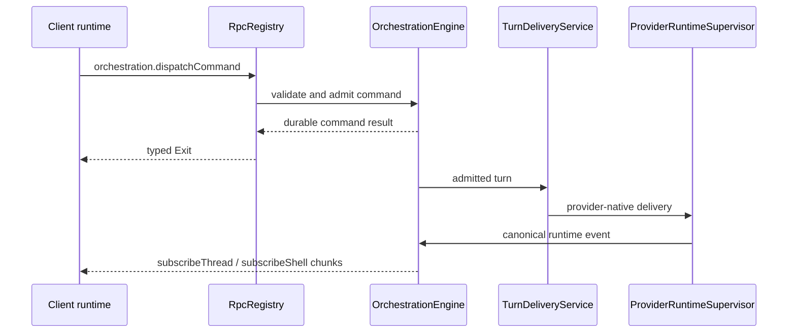

# RPC and orchestration

BiBCode uses Effect RPC over one authenticated WebSocket per connected
environment. The same protocol is used by browser and Tauri clients; the
desktop bridge is reserved for host-native capabilities.

## Session establishment

`ConnectionResolver` first produces a `PreparedConnection`. Remote bearer and
DPoP clients exchange their credential for a short-lived, one-purpose
WebSocket ticket and put only `wsTicket` on the `/ws` URL. `RpcSessionFactory`
then opens the socket, builds the Effect RPC client, and calls
`server.getConfig`. The session is ready only after both steps succeed.

Primary desktop/browser bootstraps may already have a host-authorized socket
URL, but they enter the same session and RPC pipeline.

## Wire protocol

The TypeScript client is built by
[`makeWsRpcProtocolClient`](../../packages/client-runtime/src/rpc/protocol.ts)
from the schema-only `WsRpcGroup`. The Rust mirror is
[`apps/server/src/rpc/message.rs`](../../apps/server/src/rpc/message.rs).

| Direction        | `_tag`                | Purpose                                                                           |
| ---------------- | --------------------- | --------------------------------------------------------------------------------- |
| Client to server | `Request`             | Numeric-string request ID, RPC tag, payload, headers, and optional trace context. |
| Client to server | `Ack`                 | Acknowledge streamed values for flow control.                                     |
| Client to server | `Interrupt`           | Cancel one request and its server work.                                           |
| Client to server | `Ping` / `Eof`        | Probe or close the protocol session.                                              |
| Server to client | `Chunk`               | Deliver one or more stream values.                                                |
| Server to client | `Exit`                | Complete with an Effect success or typed failure cause.                           |
| Server to client | `Defect`              | Report a protocol/session defect not tied to a normal typed failure.              |
| Server to client | `Pong`                | Answer a protocol probe.                                                          |
| Server to client | `ClientProtocolError` | Report malformed or unsupported client protocol input.                            |

Schemas validate payloads at the client boundary. The Rust session validates
request IDs, registered method names, authorization scopes, cancellation, and
stream flow before invoking handlers.

## Server composition

`ProductionRuntime::start` constructs the durable services first, then
registers their RPC adapters in `RpcRegistry`:

- `OrchestrationEngine` owns command admission, persisted events, snapshots,
  and projections;
- `ProviderRuntimeSupervisor` owns provider session processes and native
  protocol adapters;
- `TurnDeliveryService` routes admitted turns to provider runtimes while
  preserving delivery and recovery invariants;
- activity, preview, Git/VCS, terminal, settings, diagnostics, authentication,
  and lifecycle services register their own unary or streaming methods.

The authoritative method inventory is
[`ACTIVE_RPC_METHODS`](../../apps/server/src/rpc/methods.rs). The authoritative
authorization mapping is
[`required_scope`](../../apps/server/src/auth/scope.rs); adding a live method
without exactly one declared scope fails a server test.

## Worktree catalog flow

`subscribeWorktreeCatalog` publishes the server-owned latest catalog snapshot
for one persisted project through a watch-backed RPC stream: the atomic initial
read is marked seen, and acknowledgement lag replaces pending state instead of
queueing stale generations. Request cancellation also cancels bootstrap before
it can retain a catalog view. `vcs.refreshWorktreeCatalog` requests an explicit
bounded observation and returns the resulting snapshot. Both require
`orchestration:read`; clients submit only `projectId`, never baseline or
checkout paths.

`worktree.updateDiscoveryPolicy` requires `orchestration:operate`. An
acknowledgement must name the exact latest authoritative generation. The
server derives the baseline from eligible normalized paths in that snapshot,
deduplicates it, caps it at 512, and persists the complete policy through the
durable `project.meta.update` command. Mutation serialization always acquires
the stable project-identity lock before the optional physical-repository lock.
That order prevents a project from switching mutexes while its durable trust
pin is established while still serializing known cross-project repository
aliases.

`worktree.adopt` also requires `orchestration:operate`. Its public payload
contains an opaque catalog key, expected generation, project ID, command ID,
and ordinary thread defaults; it never accepts a checkout path. The handler
digests that decoded public payload before server resolution. An existing
receipt is checked before project/catalog lookup: an identical accepted retry
returns its durable result, while reuse of the command ID with any different
public field returns `command-conflict` without resolving or exposing a path.
The final resolved dispatch carries the same admission digest, so concurrent
preflight misses still conflict transactionally. The handler holds the same
stable project-then-physical-repository mutation locks. A stale
or non-authoritative generation forces one bounded refresh before the server
rechecks current registration, directory presence, nonprimary/nonbare
eligibility, canonical common-directory membership, and canonical thread
ownership. Present paths are canonicalized only after current Git membership
is proven. Adoption is read-only with respect to Git: it never creates or
repairs a worktree and never auto-runs a worktree-creation script.

After resolution, the server dispatches internal
`worktree.adopt-resolved` planning. The orchestration engine creates an
ordinary workspace thread, returns an existing active owner, or restores an
archived owner while updating the discovery baseline in the same
`persist_command` transaction. The public result is exactly the canonical
thread ID plus `created`, `existing`, or `restored`; replay of an accepted
command returns the original disposition from immutable result metadata on
the receipt-linked adoption event, without consulting a mutable thread
projection. Present but malformed metadata, or metadata inconsistent with the
transaction's immutable thread event, fails closed as an internal error. A
legacy receipt with no result metadata may recover `created` or `restored`
only from its matching immutable `thread.created` or `thread.unarchived`
event; a project-only legacy receipt cannot reconstruct `existing` from
current ownership and also fails closed. Canonical ownership compares the
catalog-owned lexical host-path identity stored in the command model for
create, metadata retarget, and restart/replay; it remains defined for missing
paths and does not perform a second filesystem probe. Resolved adoption and branch
reconciliation command variants are rejected by
`orchestration.dispatchCommand` even though trusted server services may admit
them directly.

Every healthy authoritative catalog publication also compares active adopted
worktrees with durable thread branch metadata. A change dispatches one
idempotent `thread.meta-updated` command whose ID contains the thread ID plus a
versioned hash of the observed branch and HEAD, never a path. Unchanged healthy
observations emit nothing, and refreshing/degraded retained snapshots never
reconcile branch state.

The production runtime owns one catalog service built from the same Git
repository and orchestration repositories used by Git/VCS and project state.
Successful legacy create/remove worktree RPCs verify Git common-directory
identity after the mutation, canonicalize primary/canonical-thread and target
paths, and notify every matching project view with a matching durable pin (or
verified unpinned path), never an arbitrary first match. Pin mismatches and
unverifiable identities fail observation closed. Observation failure never
changes a successful Git response into a failure. Runtime shutdown permanently
closes the service under one lifecycle-registration mutex before draining
pollers, queued mutation refreshes, repository-observation leaders, scans, and
eviction work. Every spawned task registers an abort handle under that mutex
and removes it through a completion guard, so shutdown can abort and wait for
the bounded active set, and a final release racing the terminal transition
cannot register post-drain eviction. Ordinary view detach still permits an
aliased subscribed view to keep an exact-anchor repository observation alive;
terminal shutdown aborts and joins every such leader. Task registration takes
entry state before the short-lived lifecycle mutex. Shutdown holds the
lifecycle mutex only long enough to mark terminal and copy abort handles, then
releases it before acquiring the main registry, entry, or repository locks.
Observation result publication takes the lifecycle mutex before repository
state and skips publication after terminal transition. Later subscribe,
refresh, invalidation, and release paths cannot restart the service.

### Missing-workspace runtime guard

The production runtime owns one `WorkspaceAvailabilityRegistry` and injects
that same instance into the catalog, orchestration, terminal, Git/VCS, and
workspace/file/search/review RPC owners. The registry is the server-side source
of truth for whether an adopted workspace may begin new path-dependent work.
It indexes both the durable thread ID and the host-platform-normalized workspace
path. Path guards cover the workspace root and its descendants; canonical
aliases are checked when the requested path still exists. The public failure is
the structured `WorkspaceUnavailableError`, including the thread ID, last-known
path, and catalog availability.

Only a healthy authoritative catalog snapshot may change this state. While the
catalog publication lock is still held, it installs a missing guard before the
new snapshot is visible or a runtime-loss callback can run. Degraded scans
retain the prior state and perform no teardown. Loss work is admitted once per
`(threadId, generation, availability)` transition. Exact recovery clears the
guard only when the same normalized path is present again in the same physical
repository; an active removal guard takes precedence over catalog loss and
recovery.

Missing-path identity also collapses duplicate separators plus lexical `.` and
`..` components without escaping POSIX roots, Windows drive roots, or UNC share
roots. Public work admission takes a short-lived, path-scoped lease after
resolving the durable thread projection. This includes panel threads that do
not appear in the workspace catalog: their persisted worktree path, or their
project root when they have no override, is authoritative. The lease is held
through durable command admission or external-process publication. Guard
installation and lease admission are serialized, so loss either observes and
quiesces work published by an earlier lease or rejects a later lease. Lease
drop, including cancellation and error unwinding, releases every thread/path
scope. Every lease also carries the exact loss error and a cancellation token.
The turn RPC transfers its lease into the queued engine envelope, so client
disconnect only stops the caller wait: an already-admitted command retains its
existing durable-delivery semantics. Authoritative loss cancels that envelope
before persistence and the worker drops the lease only after it has produced
the dispatch result. Nested removal guards retain independent tokens;
arbitrary drop order cannot reveal a pending missing workspace before the last
removal completes, and removal cancels already-admitted matching work just like
authoritative loss.

The guard rejects a new turn before durable admission; terminal open, restart,
write, and restart-on-attach; client Git status and mutations; and project
file, search, mutation, editor, asset, and review operations. It intentionally
allows catalog refresh, conversation/history reads, non-restarting terminal
attach, terminal close, thread delete/detach, and direct internal cleanup Git
operations. Guard checks occur before the affected owner starts durable or
external side effects, so a path disappearing between client resolution and
handler execution cannot fall through to a generic filesystem or process
failure.

Provider delivery and restart reconciliation repeat the persisted thread/path
admission immediately before provider routing. This closes the gap between a
durable turn commit and asynchronous delivery. Git process boundaries likewise
hold a path lease through command execution or the lifetime of a long-lived
subscription. Loss cancels the operation child token and stream publication
returns the same structured unavailable error. Terminal process publication
checks its lease cancellation after spawn and again under the manager
publication lock; a PTY that finishes spawning after loss is killed by its
uncommitted-process owner and is never inserted as a live session.

For each admitted loss transition, `WorktreeRuntime` resolves every live
ordinary or panel thread in the same persisted project whose normalized path
matches the guarded physical workspace. It deduplicates those IDs, appends one
warning activity to the catalog owner with a deterministic transition-derived
ID, requests every affected provider session to stop, and quiesces every
affected terminal. Terminal quiesce
signals all processes before waiting and retains each session as an exited
snapshot with its bounded transcript; it does not use destructive terminal
close. Conversation and thread rows are likewise retained. A warning-write
failure is logged but cannot prevent process cleanup.

The single graceful cleanup deadline starts when loss quiescence begins and is
five seconds. Warning persistence and known canonical provider/terminal
cleanup start immediately, in parallel with persisted alias resolution. Any
resolved non-canonical aliases are cleaned under that same original deadline;
a stuck resolver therefore cannot delay cleanup of the known owner. Active
admissions are canceled rather than awaited without a bound.

Incomplete, failed, or panicked cleanup is marked as
`orphanCleanupPending` and handed to the runtime-owned reaper. Its queue and
active set are bounded to 64 jobs. One runtime-owned semaphore admits at most
16 cleanup attempts globally across overlapping catalog observers and reaper
work. Each reaper job owns exactly one independently five-second-bounded
attempt, including fresh alias resolution, and always releases its permit on
success, error, timeout, recovery, or shutdown. Failure retains the marker for
later explicit reconciliation; it does not loop and monopolize a permit. The
ownership is keyed to the exact transition. Exact recovery or a newer loss
transition cancels stale queued/active ownership before it can stop recovered
or newer sessions, including ownership retained after queue saturation. Only
confirmed provider-and-terminal success while ownership is still current
clears the marker. Saturation is logged without clearing the workspace guard
or orphan marker. `ProductionRuntime` shuts down the catalog observer first,
then cancels and drains the reaper's queued and active futures before stopping
provider and terminal owners.

## Provider turn flow

Unary command acceptance is not a promise that an external provider process
will finish successfully. Provider delivery and completion are reflected by
subsequent durable orchestration events. Streaming subscriptions can be
re-established after reconnect from snapshots or replay methods rather than
depending on connection-local push caches.

### Context-window usage flow

Provider-native usage data is normalized in the server runtime as canonical
`thread.token-usage.updated`. `ProviderRuntimeSupervisor` maps that canonical
event to an informational `context-window.updated` thread activity, which the
`OrchestrationEngine` appends through the same durable event and typed
subscription path as other provider activity.

The append-only event log preserves every accepted context activity for audit
and replay. Durable projections and client snapshots retain only the latest
valid context-window activity for each turn, so a newer valid reading replaces
the prior valid reading for that turn. A malformed row cannot evict a valid row,
and reverting a turn removes only that turn's projected usage; neither behavior
creates a separate usage cache.

## Provider usage refresh

`server.getProviderUsage` reads the server's current provider-usage snapshots.
`server.refreshProviderUsage` accepts an optional provider list and an optional
boolean `force`. Omitting `force`, or sending `false`, uses the normal refresh
throttle; `force: true` starts an explicit fetch even inside that interval.
The default preserves compatibility for older clients.

Forced refresh changes admission only. It does not authorize credential
mutation or account management: provider usage fetchers remain observers of
the local provider CLI's account. The client waits for the refresh command to
settle before refreshing the query, so a committed snapshot is not displayed
one cycle late. Background status-bar polling is single-flighted separately
from a forced manual request; repeated manual activation still shares one
manual request per environment.

## Invariants

- Contracts define the wire; server and client fixtures guard compatibility.
- One connection supervisor owns reconnects. The Effect RPC protocol does not
  retry sockets independently.
- Authorization is checked at each HTTP route or RPC method, not inferred from
  successful authentication alone.
- Cancellation flows from client interrupt or socket closure into registered
  handlers and supervised processes.
- Durable orchestration state, not a WebSocket connection, is the recovery
  boundary.
