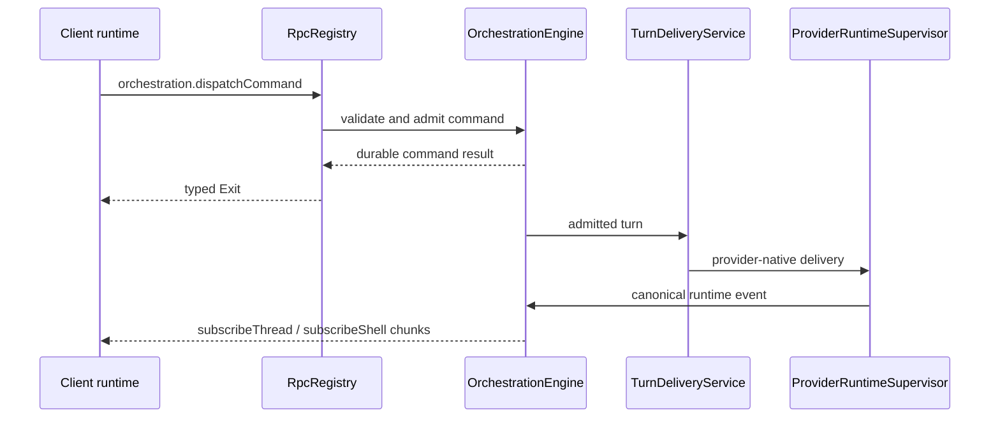

# RPC and orchestration

BiBCode uses Effect RPC over one authenticated WebSocket per connected
environment. The same protocol is used by browser and Tauri clients; the
desktop bridge is reserved for host-native capabilities.

## Session establishment

`ConnectionResolver` first produces a `PreparedConnection`. Remote bearer and
DPoP clients exchange their credential for a short-lived, one-purpose
WebSocket ticket and put only `wsTicket` on the `/ws` URL. `RpcSessionFactory`
then opens the socket, builds the Effect RPC client, and calls
`server.getConfig`. The session is ready only after both steps succeed.

Primary desktop/browser bootstraps may already have a host-authorized socket
URL, but they enter the same session and RPC pipeline.

## Wire protocol

The TypeScript client is built by
[`makeWsRpcProtocolClient`](../../packages/client-runtime/src/rpc/protocol.ts)
from the schema-only `WsRpcGroup`. The Rust mirror is
[`apps/server/src/rpc/message.rs`](../../apps/server/src/rpc/message.rs).

| Direction        | `_tag`                | Purpose                                                                           |
| ---------------- | --------------------- | --------------------------------------------------------------------------------- |
| Client to server | `Request`             | Numeric-string request ID, RPC tag, payload, headers, and optional trace context. |
| Client to server | `Ack`                 | Acknowledge streamed values for flow control.                                     |
| Client to server | `Interrupt`           | Cancel one request and its server work.                                           |
| Client to server | `Ping` / `Eof`        | Probe or close the protocol session.                                              |
| Server to client | `Chunk`               | Deliver one or more stream values.                                                |
| Server to client | `Exit`                | Complete with an Effect success or typed failure cause.                           |
| Server to client | `Defect`              | Report a protocol/session defect not tied to a normal typed failure.              |
| Server to client | `Pong`                | Answer a protocol probe.                                                          |
| Server to client | `ClientProtocolError` | Report malformed or unsupported client protocol input.                            |

Schemas validate payloads at the client boundary. The Rust session validates
request IDs, registered method names, authorization scopes, cancellation, and
stream flow before invoking handlers.

## Server composition

`ProductionRuntime::start` constructs the durable services first, then
registers their RPC adapters in `RpcRegistry`:

- `OrchestrationEngine` owns command admission, persisted events, snapshots,
  and projections;
- `ProviderRuntimeSupervisor` owns provider session processes and native
  protocol adapters;
- `TurnDeliveryService` routes admitted turns to provider runtimes while
  preserving delivery and recovery invariants;
- activity, preview, Git/VCS, terminal, settings, diagnostics, authentication,
  and lifecycle services register their own unary or streaming methods.

The authoritative method inventory is
[`ACTIVE_RPC_METHODS`](../../apps/server/src/rpc/methods.rs). The authoritative
authorization mapping is
[`required_scope`](../../apps/server/src/auth/scope.rs); adding a live method
without exactly one declared scope fails a server test.

## Provider turn flow

Unary command acceptance is not a promise that an external provider process
will finish successfully. Provider delivery and completion are reflected by
subsequent durable orchestration events. Streaming subscriptions can be
re-established after reconnect from snapshots or replay methods rather than
depending on connection-local push caches.

### Assistant message identity

Provider assistant text preserves a native runtime `itemId` when the provider
exposes one. The server converts it to a thread-namespaced orchestration
message ID before persistence. Providers whose protocol does not expose a
message identity use one deterministic assistant message per thread turn.

Terminal turn projection completes every existing streaming assistant message
for that thread and turn and never creates an empty assistant message. The
client therefore receives the same message boundaries from live events and
reloaded SQLite projections; Markdown rendering does not infer or repair
provider message boundaries. A live completion that no longer owns a matching
streaming assistant row is accepted idempotently without appending an event, so
a projector rewind cannot reinterpret that no-op with historical upsert
semantics. Genuine historical message events retain their established replay
behavior.

The turn's final assistant pointer follows durable message chronology, ordered
by message creation time and then message ID. A delayed completion for an older
assistant item therefore cannot replace a later answer, including when provider
events share a timestamp. Startup reconciliation and an unexpected provider
event-stream end settle the exact abandoned turn's existing assistant rows;
they retain provider failure and session error state without inserting fallback
text. This terminal settlement performs one thread-scoped read and no per-delta
database work.

### Context-window usage flow

Provider-native usage data is normalized in the server runtime as canonical
`thread.token-usage.updated`. `ProviderRuntimeSupervisor` maps that canonical
event to an informational `context-window.updated` thread activity, which the
`OrchestrationEngine` appends through the same durable event and typed
subscription path as other provider activity.

The append-only event log preserves every accepted context activity for audit
and replay. Durable projections and client snapshots retain only the latest
valid context-window activity for each turn, so a newer valid reading replaces
the prior valid reading for that turn. A malformed row cannot evict a valid row,
and reverting a turn removes only that turn's projected usage; neither behavior
creates a separate usage cache.

## Provider usage refresh

`server.getProviderUsage` reads the server's current provider-usage snapshots.
`server.refreshProviderUsage` accepts an optional provider list and an optional
boolean `force`. Omitting `force`, or sending `false`, uses the normal refresh
throttle; `force: true` starts an explicit fetch even inside that interval.
The default preserves compatibility for older clients.

Forced refresh changes admission only. It does not authorize credential
mutation or account management: provider usage fetchers remain observers of
the local provider CLI's account. The client waits for the refresh command to
settle before refreshing the query, so a committed snapshot is not displayed
one cycle late. Background status-bar polling is single-flighted separately
from a forced manual request; repeated manual activation still shares one
manual request per environment.

## Invariants

- Contracts define the wire; server and client fixtures guard compatibility.
- One connection supervisor owns reconnects. The Effect RPC protocol does not
  retry sockets independently.
- Authorization is checked at each HTTP route or RPC method, not inferred from
  successful authentication alone.
- Cancellation flows from client interrupt or socket closure into registered
  handlers and supervised processes.
- Durable orchestration state, not a WebSocket connection, is the recovery
  boundary.
