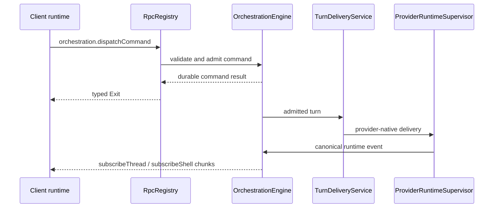
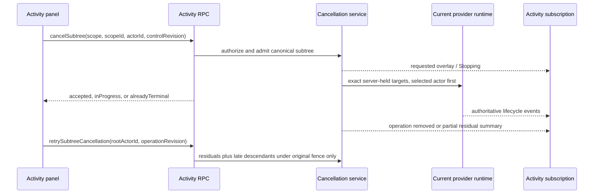

# RPC and orchestration

BiBCode uses Effect RPC over one authenticated WebSocket per connected
environment. The same protocol is used by browser and Tauri clients; the
desktop bridge is reserved for host-native capabilities.

## Session establishment

`ConnectionResolver` first produces a `PreparedConnection`. Remote bearer and
DPoP clients exchange their credential for a short-lived, one-purpose
WebSocket ticket and put only `wsTicket` on the `/ws` URL. `RpcSessionFactory`
then opens the socket, builds the Effect RPC client, and calls
`server.getConfig`. The session is ready only after both steps succeed.

Primary desktop/browser bootstraps may already have a host-authorized socket
URL, but they enter the same session and RPC pipeline.

## Wire protocol

The TypeScript client is built by
[`makeWsRpcProtocolClient`](../../packages/client-runtime/src/rpc/protocol.ts)
from the schema-only `WsRpcGroup`. The Rust mirror is
[`apps/server/src/rpc/message.rs`](../../apps/server/src/rpc/message.rs).

| Direction        | `_tag`                | Purpose                                                                           |
| ---------------- | --------------------- | --------------------------------------------------------------------------------- |
| Client to server | `Request`             | Numeric-string request ID, RPC tag, payload, headers, and optional trace context. |
| Client to server | `Ack`                 | Acknowledge streamed values for flow control.                                     |
| Client to server | `Interrupt`           | Cancel one request and its server work.                                           |
| Client to server | `Ping` / `Eof`        | Probe or close the protocol session.                                              |
| Server to client | `Chunk`               | Deliver one or more stream values.                                                |
| Server to client | `Exit`                | Complete with an Effect success or typed failure cause.                           |
| Server to client | `Defect`              | Report a protocol/session defect not tied to a normal typed failure.              |
| Server to client | `Pong`                | Answer a protocol probe.                                                          |
| Server to client | `ClientProtocolError` | Report malformed or unsupported client protocol input.                            |

Schemas validate payloads at the client boundary. The Rust session validates
request IDs, registered method names, authorization scopes, cancellation, and
stream flow before invoking handlers.

## Server composition

`ProductionRuntime::start` constructs the durable services first, then
registers their RPC adapters in `RpcRegistry`:

- `OrchestrationEngine` owns command admission, persisted events, snapshots,
  and projections;
- `ProviderRuntimeSupervisor` owns provider session processes and native
  protocol adapters;
- `ActivityCancellationService` owns bounded, generation-fenced targeted
  cancellation admission and dispatches only server-held provider targets. The
  provider supervisor accepts those targets only for the matching current live
  session, runtime generation, and control registration, then invokes the
  driver's targeted-cancellation seam outside the ordered root turn-delivery
  lane. Drivers without an exact provider-native adapter fail closed with
  `targetUnavailable`; this path never translates an activity request into a
  root turn interrupt;
- `TurnDeliveryService` routes admitted turns to provider runtimes while
  preserving delivery and recovery invariants;
- activity, preview, Git/VCS, terminal, settings, diagnostics, authentication,
  and lifecycle services register their own unary or streaming methods.

The authoritative method inventory is
[`ACTIVE_RPC_METHODS`](../../apps/server/src/rpc/methods.rs). The authoritative
authorization mapping is
[`required_scope`](../../apps/server/src/auth/scope.rs); adding a live method
without exactly one declared scope fails a server test.

## Provider turn flow

Unary command acceptance is not a promise that an external provider process
will finish successfully. Provider delivery and completion are reflected by
subsequent durable orchestration events. Streaming subscriptions can be
re-established after reconnect from snapshots or replay methods rather than
depending on connection-local push caches.

### Assistant message identity

Provider assistant text preserves a native runtime `itemId` when the provider
exposes one. The server converts it to a thread-namespaced orchestration
message ID before persistence. Providers whose protocol does not expose a
message identity use one deterministic assistant message per thread turn.

Terminal turn projection completes every existing streaming assistant message
for that thread and turn and never creates an empty assistant message. The
client therefore receives the same message boundaries from live events and
reloaded SQLite projections; Markdown rendering does not infer or repair
provider message boundaries. A live completion that no longer owns a matching
streaming assistant row is accepted idempotently without appending an event, so
a projector rewind cannot reinterpret that no-op with historical upsert
semantics. Genuine historical message events retain their established replay
behavior.

The turn's final assistant pointer follows durable message chronology, ordered
by message creation time and then message ID. A delayed completion for an older
assistant item therefore cannot replace a later answer, including when provider
events share a timestamp. Startup reconciliation and an unexpected provider
event-stream end settle the exact abandoned turn's existing assistant rows;
they retain provider failure and session error state without inserting fallback
text. This terminal settlement performs one thread-scoped read and no per-delta
database work. If both live settlement attempts fail after an unexpected stream
end, the durable error runtime retains thread-scoped recovery ownership: the
next startup settles the exact stored message and turn identities without
rewriting the original provider or session error.

### Context-window usage flow

Provider-native usage data is normalized in the server runtime as canonical
`thread.token-usage.updated`. `ProviderRuntimeSupervisor` maps that canonical
event to an informational `context-window.updated` thread activity, which the
`OrchestrationEngine` appends through the same durable event and typed
subscription path as other provider activity.

The append-only event log preserves every accepted context activity for audit
and replay. Durable projections and client snapshots retain only the latest
valid context-window activity for each turn, so a newer valid reading replaces
the prior valid reading for that turn. A malformed row cannot evict a valid row,
and reverting a turn removes only that turn's projected usage; neither behavior
creates a separate usage cache.

## Targeted Activity cancellation flow

Targeted Activity control uses typed WebSocket RPC in browser and desktop
modes. It does not cross `DesktopBridge`. Reads and `subscribeActivity` require
`orchestration:read`; `activity.cancelSubtree` and
`activity.retrySubtreeCancellation` are maintenance-classified mutations and
require `orchestration:operate`. Both mutations reject terminal Activity scopes
before provider I/O.

The client supplies canonical scope and actor identities plus concurrency
revisions; it never supplies descendants or provider-native thread, turn, task,
process, or agent identifiers. Admission installs the cancellation fence before
provider dispatch. The selected actor is sent first, descendants use bounded
parallelism, each native attempt has a two-second timeout, and one operation has
a lifecycle-owned ten-second deadline. The deadline finalizes any still-active
residual as `partial` even after dispatch draining has ended; it is fenced by
runtime generation, operation ownership, and a private deadline identity and
cannot terminalize provider observation. Coverage, residual, and public
operation-revision reconciliation leaves that deadline identity unchanged;
retry and absorption create a fresh deadline window. Duplicate and overlapping
requests join or absorb the existing operation without broadening the canonical
boundary.

Observation history and its revision persist in SQLite. Exact handles,
cancellation fences, operation summaries, residuals, and the independently
monotonic control revision are bounded runtime state only. Reconnect can recover
the current server's control snapshot; restart or provider-generation
replacement invalidates it. `Stopping` is server-authoritative intent, while
provider events remain the sole authority for terminal lifecycle. A partial
retry is fenced by its operation revision and cannot recompute parents,
siblings, or unrelated work. Public operation revisions are allocated from one
checked registry-lifetime monotonic high-water counter, so a stable scope/root
pair cannot replay an old retry revision after replacement or bounded scope
eviction; exhaustion fails closed before provider I/O. Runtime cleanup retains
only bounded target-free scope/actor revision tombstones so a stable public
scope cannot reuse a stale pre-restart control fence; no operation or
provider-native identity survives.

## Provider usage refresh

`server.getProviderUsage` reads the server's current provider-usage snapshots.
`server.refreshProviderUsage` accepts an optional provider list and an optional
boolean `force`. Omitting `force`, or sending `false`, uses the normal refresh
throttle; `force: true` starts an explicit fetch even inside that interval.
The default preserves compatibility for older clients.

Forced refresh changes admission only. It does not authorize credential
mutation or account management: provider usage fetchers remain observers of
the local provider CLI's account. The client waits for the refresh command to
settle before refreshing the query, so a committed snapshot is not displayed
one cycle late. Background status-bar polling is single-flighted separately
from a forced manual request; repeated manual activation still shares one
manual request per environment.

## Worktree removal flow

`vcs.removeWorktree` is a server-held terminal, persistence, and filesystem
critical section. `ownerThreadId` identifies the workspace owner, and the
production server verifies its persisted project and worktree path. `threadIds`
must include that owner and helps invalidate known generations, while the authoritative fence
is also keyed by lexical and canonical target paths (including Windows junction
aliases) and discovers every server-known terminal under it. The server installs
the fence before closing terminals, invalidates
an open already in flight, rejects later open, attach, and restart operations,
and retains the fence until Git removal and its durable receipt settle. Once
admitted, that owned task finishes even if its initiating RPC is interrupted or
disconnected: it retains a clone of the RPC mutation permit, is tracked by the
production runtime, and is drained before maintenance or shutdown can complete.
A failed operation drops the fence so an explicit retry can launch terminals
again.

The server writes a random identity durably into the linked worktree's Git
administrative directory and root, then persists a
`worktree_removal_receipts` row keyed by the owner thread. The repository
revalidates that identity and the exact linked-worktree `.git` backlink inside
the removal transaction. On Windows it atomically moves the admitted directory
through its delete-capable filesystem handle, rather than resolving the source
name a second time, to a
deterministic nonce-bound quarantine and creates a minimal identity-checked
tombstone at the registered path. On Windows tombstone creation atomically
returns the same delete-capable directory handle used by the transaction; there
is no create-then-reopen gap, and its no-delete parent handle remains held while
the marker and Git backlink are initialized. The checkout quarantine,
tombstone, and administrative quarantine handles remain owned continuously
through deregistration and final deletion; path absence after admission is
never accepted as cleanup success. While a no-delete filesystem handle pins that
tombstone, the server atomically moves the nonce-verified administrative
directory out of Git's `worktrees` namespace; it never issues a path-based Git
delete that could target a replacement. Recursive cleanup pins each verified
directory object against name rebinding, verifies every Windows descendant by
file identity before deleting it, never follows reparse points such as
junctions at either the root or descendant level, and deletes the now-empty root
through its bound handle. An empty
registered path without the transaction marker fails closed instead of being
treated as a recoverable tombstone. Durable marker publication still uses a
write-through rename. A terminal or external process that still owns the
checkout as its current directory makes quarantine admission fail without
deleting checkout contents or changing Git registration. Interrupted attempts
recover the deterministic quarantine rather than treating path absence as
success. The browser still performs thread deletion after the VCS result. After
cleanup succeeds, the receipt moves to `removed`; a later retry after a
thread-deletion failure returns success without inspecting or deleting a
replacement that now occupies the old path.

## Invariants

- Contracts define the wire; server and client fixtures guard compatibility.
- One connection supervisor owns reconnects. The Effect RPC protocol does not
  retry sockets independently.
- Authorization is checked at each HTTP route or RPC method, not inferred from
  successful authentication alone.
- Cancellation flows from client interrupt or socket closure into registered
  handlers and supervised processes.
- Worktree removal holds one server terminal-admission fence from terminal
  shutdown through filesystem and Git settlement; client-side teardown alone
  is never the deletion safety boundary.
- Durable orchestration state, not a WebSocket connection, is the recovery
  boundary.
