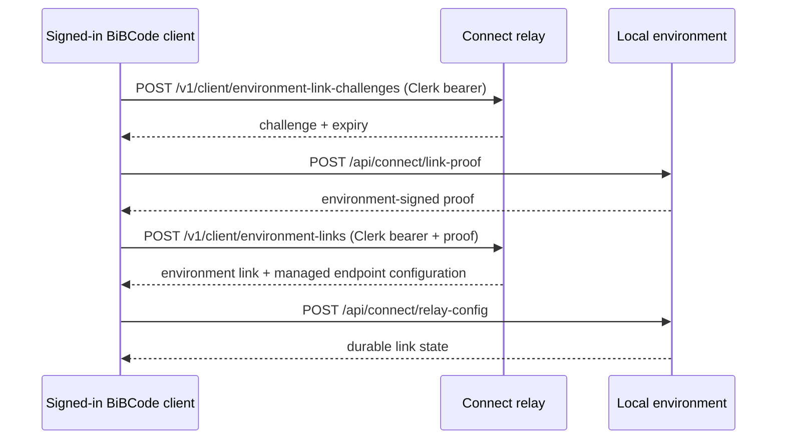
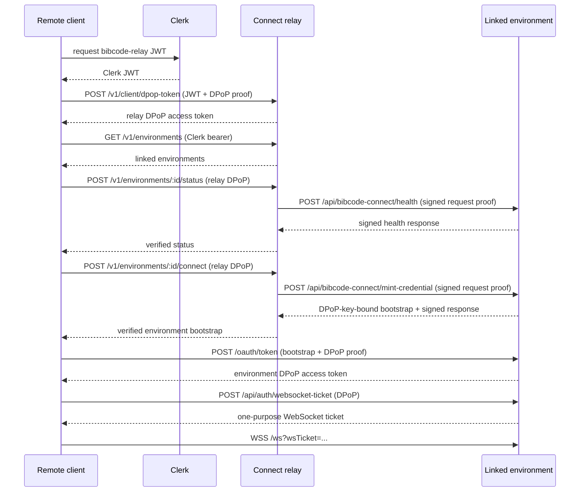

# BiBCode Connect authentication flow

BiBCode Connect has three trust domains:

- Clerk authenticates the cloud user.
- The relay authorizes user-to-environment discovery and connect requests.
- Each environment issues and enforces its own scoped access sessions.

The relay is a control plane and managed-endpoint broker. After a connection
bootstrap is minted, the client authenticates directly to the environment over
the managed HTTPS/WSS endpoint.

## Link an environment

The client first ensures the environment can run the pinned managed relay
binary. The environment proof binds its stable identity, the relay issuer, the
challenge, the advertised endpoint, and the local origin used by the managed
connector. The relay verifies the proof before storing the link or provisioning
the endpoint.

Link-proof and relay-configuration routes require an environment session with
`relay:write`. Reading `/api/connect/link-state` requires `relay:read`;
`POST /api/connect/unlink` requires `relay:write`.

## Discover and connect

Status and connect proofs bind the relay request to a nonce and operation. The
environment's mint response also binds the credential to the client's DPoP key
thumbprint. The relay verifies the environment signature but cannot use the
resulting credential as an environment session itself.

## Relay endpoints

The canonical API is
[`packages/contracts/src/relay.ts`](../../packages/contracts/src/relay.ts).

| Endpoint                                             | Authentication                                      | Purpose                                                  |
| ---------------------------------------------------- | --------------------------------------------------- | -------------------------------------------------------- |
| `GET /.well-known/oauth-authorization-server`        | Public                                              | Relay issuer and token metadata.                         |
| `GET /.well-known/oauth-protected-resource`          | Public                                              | Protected-resource and supported-scope metadata.         |
| `POST /v1/client/dpop-token`                         | Clerk token in the exchange payload plus DPoP proof | Issue a relay DPoP access token.                         |
| `GET /v1/environments`                               | Clerk bearer                                        | List the signed-in user's linked environments.           |
| `POST /v1/client/environment-link-challenges`        | Clerk bearer                                        | Create a bounded link challenge.                         |
| `POST /v1/client/environment-links`                  | Clerk bearer plus environment proof                 | Create or update an environment link.                    |
| `DELETE /v1/client/environment-links/:environmentId` | Clerk bearer                                        | Revoke an environment link.                              |
| `POST /v1/environments/:environmentId/status`        | Relay DPoP                                          | Request and validate signed environment health.          |
| `POST /v1/environments/:environmentId/connect`       | Relay DPoP                                          | Request and validate a DPoP-bound environment bootstrap. |

## Security invariants

- Clerk, relay, and environment credentials have distinct issuers and audiences.
- DPoP access tokens are bound to the client's proof key and request target.
- Relay-to-environment operations use signed, nonce-bound request proofs rather
  than a cloud-user token.
- The environment independently signs health and mint responses.
- Environment bearer or DPoP tokens never appear in WebSocket URLs; only a
  short-lived `wsTicket` does.
- A managed tunnel changes reachability, not environment authorization.
