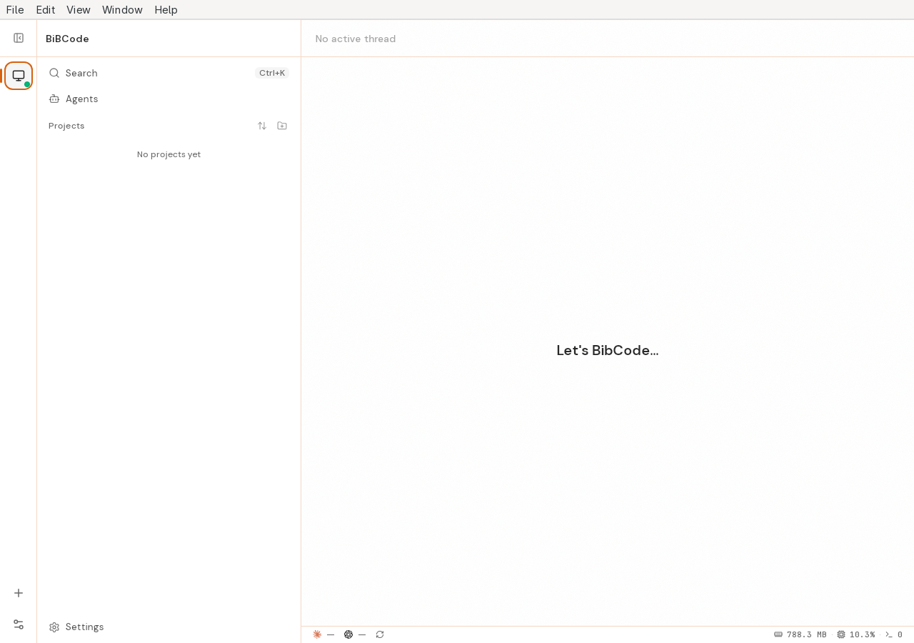

# Arch GdkPixbuf diagnostic and published AppImage qualification

**Result: PASS for the diagnostic and documented fallback in issue 41.** The
real Arch GdkPixbuf/Glycin packages omit the advertised legacy loader directory.
BiBCode refuses that unsupported build layout before modifying its AppDir and
explains the supported Ubuntu build and official AppImage paths. The published
x64 AppImage launched and rendered correctly on the same Arch userspace.

## Environment and provenance

[CI run 36999776420](https://github.com/mubeda/BibCode/actions/runs/36999776420)
executed disposable qualification commit
`f89938dcca36d603c47fc234d5b924e36b26095f`, based on issue-fix source
`9e809fc0e30d3f30285e2194eb7dfa1ee5c9faff`.
The official Arch container image was pinned to
`sha256:b21322c663be387c0ed9cbc7bbbfe18e41633ad4e7b7c77cfad45f128be20040`.
Its Arch rolling build ID was `20260927.0.600689`; the hosting Linux kernel was
`6.17.0-1022-azure`. This qualifies the affected Arch userspace layout, not the
original maintainer's Omarchy kernel.

| Installed package | Observed version |
| ----------------- | ---------------- |
| GdkPixbuf         | 2.44.7-1         |
| Glycin            | 2.1.5-2          |
| librsvg           | 2:2.62.4-1       |
| GTK 3             | 1:3.24.52-1      |
| WebKitGTK 4.1     | 2.52.6-1         |

## Diagnostic proof

The real `pkg-config --variable=gdk_pixbuf_moduledir gdk-pixbuf-2.0` returned
`/usr/lib/gdk-pixbuf-2.0/2.10.0/loaders`; that directory did not exist. No host
library was removed, downgraded, or replaced with an empty loader tree.

The exact pinned upstream GTK plugin was present and its SHA-256 verified as
`cb379f9b0733e9ad9f8bd78f8c2fa038aef2478523bb7d4c8e64ff6a1ea3501a`.
Invoking the current wrapper with an owned `--appdir` exited 1 with the intended
missing-loader diagnostic, the Ubuntu 22.04/official-AppImage guidance, and the
runbook reference. The AppDir's sentinel and file inventory were unchanged.
This is an intentional build refusal with an actionable alternative, not native
Glycin bundling support.

## Actual fallback runtime

The published `BiBCode_0.7.2_amd64.AppImage` was downloaded from the repository's
v0.7.2 release. Its 100,235,768 bytes matched the GitHub asset digest:
`554bfbbe2bcce04ff045e5950726f71ba6e1b6ff0c3126f1679969de8c792a18`.

It ran as a newly created unprivileged container account with private
HOME/application/XDG/TMP directories, disabled provider configurations, and
server port 14841. The authenticated Xvfb display had no TCP listener. The
supported AppImage extraction mode was used; no FUSE or updater-relaunch claim
is made by this run.

The real native descriptor reported version 0.7.2, and an actual application
window rendered. The retained original screenshot was inspected: native menu,
sidebar, connected host badge, empty-project state and main workspace are
visible, with no blank or startup-error surface. This is the published fallback
artifact, not the current branch's final integrated UI sweep.



## Ownership, commands and limits

The native cleanup regression created an escaped-process-group child, let its
original parent exit, and verified the owned subreaper cleaned and reaped the
orphan. The real run then reaped both direct children and observed seven owned
process IDs with no survivors. Process identity checks and a new exclusive
container account scoped cleanup; full application state and authentication
material were excluded from uploaded artifacts.

The immutable workflow and commands are at the qualification commit:

```sh
python3 scripts/qualify-arch-appimage.py --self-test
python3 scripts/qualify-arch-appimage.py
```

They run only inside the disposable Arch job and as its dedicated account.
Local verification covered Python/YAML syntax, permissions/artifact structure,
formatting, diff checks and independent ownership review. The focused Vite+
check had no lintable files because this slice contains Python, YAML and
Markdown; no Python linter result is claimed. Normal main CI passed all nine
jobs at the base source revision, separately from this native qualification.

The artifact `issue41-arch-36999776420-1` contains host/package metadata, the
diagnostic, exact artifact identity, the original screenshot and cleanup
proof. A local copy is retained under
`/tmp/bibcode-issue-fixes-20261001/issue41-arch-native/`.
The Linux runbook was reviewed and remains accurate. Existing Ubuntu packaging,
Wayland/theme and image-loader regression coverage remains separate evidence;
this focused run is not an exhaustive image-format or desktop workflow test.
