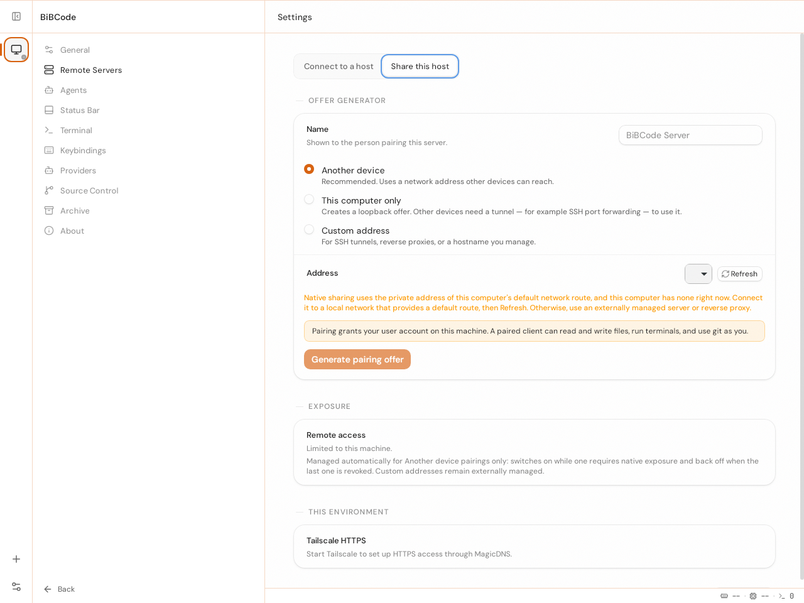
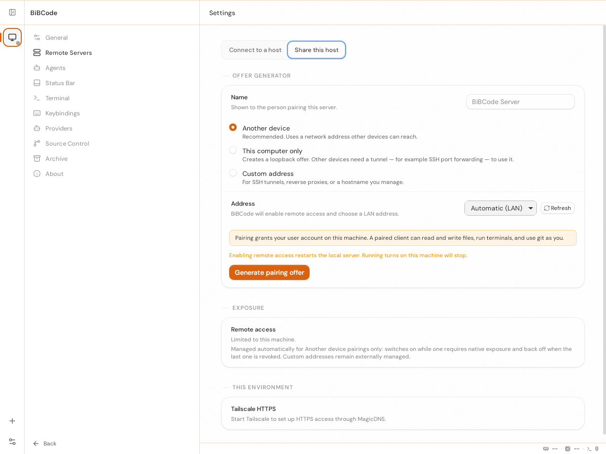
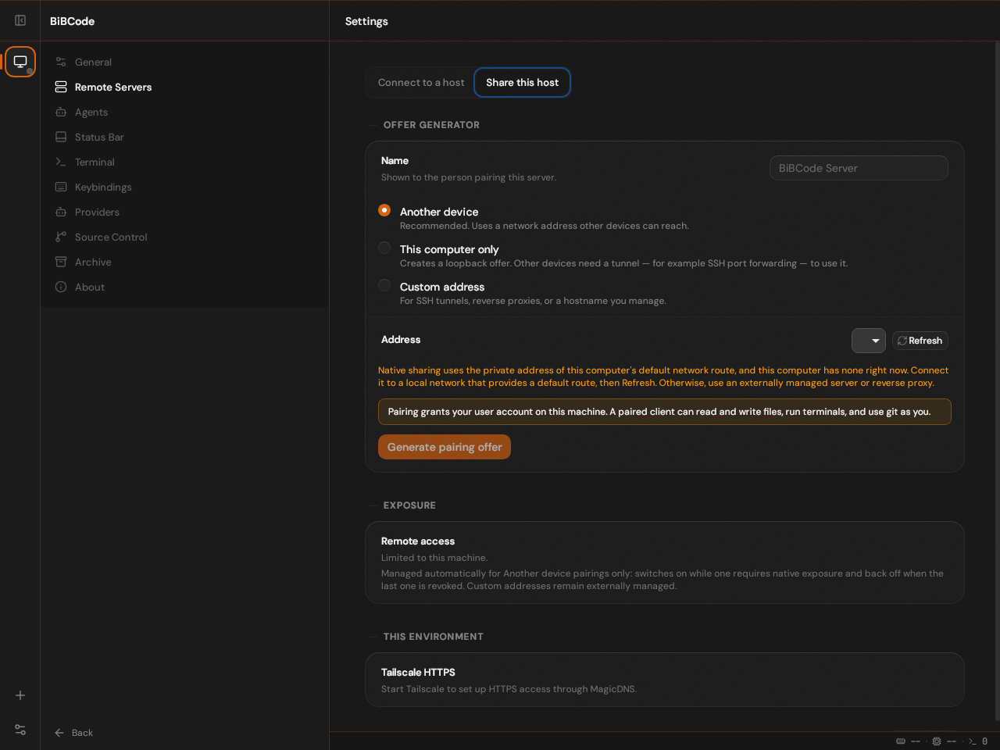
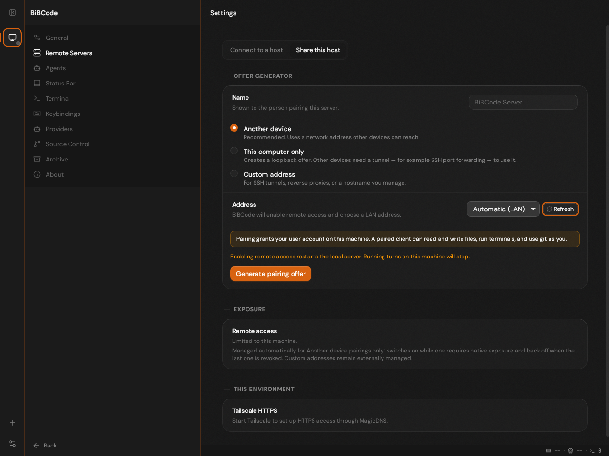

# Packaged desktop without a default network route

**Result: PASS.** Issue 28's existing warning and recovery behavior were
exercised through a packaged Linux AppImage and its real desktop bridge.
The exact warning rendered with no default route. Adding a route inside the
same isolated network namespace and pressing **Refresh addresses** restored
the automatic LAN option and enabled **Generate pairing offer**.

## Source and environment

[CI run 36999911833](https://github.com/mubeda/BibCode/actions/runs/36999911833)
executed qualification commit `4b87bf091298df51364ba297890909188ab27720` on the
Ubuntu 22.04 x64 runner. Its application production source matches issue-fix
head `9e809fc0e30d3f30285e2194eb7dfa1ee5c9faff` across web, native host, server
and packages; the extra changes are disposable qualification tooling.

The maintained E2E build plan produced a guarded debug AppImage with
`desktop-e2e,bibcode-server/hermetic-test-guard`, using the installed pinned
Tauri CLI directly. Artifact size: 116,259,320 bytes. SHA-256:
`c3fdc38c8f57c162fde6138c1f2794e5a5a1b279140beda1c4b424ed8b4c9783`.
The supported extraction mode was used inside private user, PID and network
namespaces. This is packaged native behavior, not a release-signing, FUSE,
updater-relaunch or macOS/Windows qualification.

Private HOME/application/XDG/TMP directories and fixture-local provider paths
kept the test separate from real user state. The real installed Node executable
was resolved before changing HOME: a package-manager shim would otherwise try
to bootstrap Node inside a namespace intentionally lacking network access.
The default host route namespace remained unchanged.

## Native observations

| State            | OS and bridge evidence                                                                     | Actual UI behavior                                                                               |
| ---------------- | ------------------------------------------------------------------------------------------ | ------------------------------------------------------------------------------------------------ |
| No default route | Private veth addresses 10.188.28.1 and 10.188.28.2; neither native endpoint marked default | Exact no-private-default-route copy; Generate pairing offer disabled                             |
| Route added      | Default route via 10.188.28.1 on issue28-in; native 10.188.28.2 endpoint marked default    | Refresh on the same open view removes the warning, selects Automatic (LAN), and enables Generate |

No endpoint list or desktop bridge response was mocked. The driver used actual
Settings controls to switch themes. The recovery assertion occurred immediately
after Refresh, before navigating or reopening the view. The test did not mint a
pairing offer or widen the listener; enabling the action proves the requested
recovery while retaining its explicit user confirmation boundary.

All four original screenshots were visually inspected. The warning is fully
visible and the recovered controls are usable; no clipping, blank surface or
unexpected startup error was observed.

| No default route                                               | Recovered after Refresh                                        |
| -------------------------------------------------------------- | -------------------------------------------------------------- |
|  |  |
|    |    |

## Validation and cleanup

The dedicated native scenario passed. Six real-process supervisor/runtime tests
cover normal exit, timeout, cancellation during steady work and handle
publication, redacted error evidence, and actual Node under a private HOME.
The old cancellation behavior was observed failing in a controlled negative
case before the fixed supervisor passed. Existing fixture/lifecycle checks
passed 56 tests with one intentional platform skip. The qualification source
passed all 11 workspace typechecks and `vp check` with zero errors and existing
warnings; its final small Python-only changes passed focused process/syntax and
diff checks. Independent review resolved both cancellation findings.

The successful job recorded exit 0, no timeout/cancellation, a reaped outer
supervisor, an unchanged host network namespace, and no remaining children in
the private PID namespace. The normal application exit path preceded the
namespace cleanup. Native route manipulation used unprivileged namespace
capabilities; no local Docker restart or host network change was required.

The immutable temporary workflow invokes:

```sh
python3 -B scripts/qualify-no-default-route.test.py
python3 -B scripts/qualify-no-default-route.py preflight
node scripts/build-issue28-app.mjs
python3 -B scripts/qualify-no-default-route.py
```

Earlier attempts failed in qualification tooling: first the standalone build
launcher, then UI startup through a HOME-sensitive Node shim without network
access. A diagnostic rerun exposed the shim's offline bootstrap failure. Those
attempts are not passing UI evidence. The final run used the pinned executable
and retained the same actual missing-route condition.

Artifact `issue28-native-36999911833-1` contains source/artifact identity,
OS routes, real advertised endpoints, screenshots and cleanup metadata. Local
evidence remains at `/tmp/bibcode-issue-fixes-20261001/issue28-native-final/`.
The Linux and shared validation runbooks were reviewed and remain accurate;
the temporary branch documents its additional reproducible procedure.
